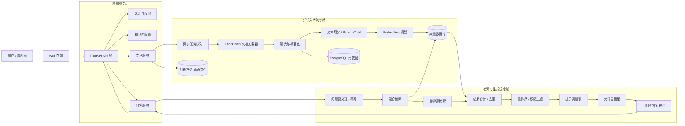
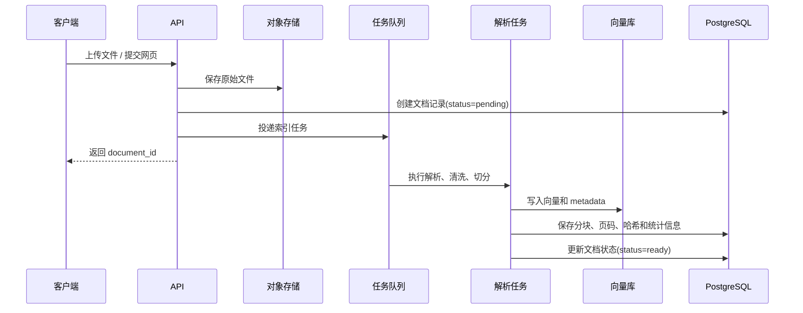
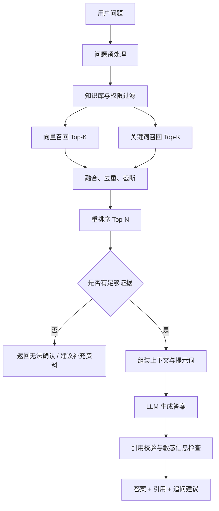

# 基于 LangChain 的知识库实现方案

## 1. 项目目标

建设一个面向企业内部文档的知识库问答系统，用户可以上传或接入 PDF、Word、Markdown、网页等资料，通过自然语言提问获得有依据的答案。

系统第一阶段采用 RAG（Retrieval-Augmented Generation，检索增强生成）架构，重点解决：

- 文档的统一接入、解析、切分和索引。
- 根据问题检索相关知识片段。
- 让大模型基于检索结果生成答案，而不是直接凭记忆回答。
- 返回来源文档、页码、段落等引用信息。
- 支持知识库、文档和用户权限的基本隔离。

## 2. 推荐技术栈

| 层次 | 推荐组件 | 组件版本 | 说明 |
|---|---|---|---|
| Python 运行时 | Python | `3.10+`，建议 `3.12.x` | 项目运行时，开发、测试和生产环境保持一致 |
| API 服务 | FastAPI | `>=0.115,<1.0` | 提供文档、知识库、检索和问答接口 |
| 本地 ASGI 服务 | Uvicorn | `>=0.34,<1.0` | 本地开发和测试启动服务 |
| 生产 ASGI 服务 | Gunicorn + UvicornWorker | Gunicorn `>=23,<24` | 生产环境多进程管理 |
| AI 编排 | LangChain | `>=1.0,<2.0` | Document Loader、Splitter、Embedding、Retriever、LCEL |
| 复杂流程 | LangGraph（可选） | `>=1.0,<2.0` | 多轮检索、问题改写、人工审核等有状态流程 |
| 大语言模型 | OpenAI 兼容模型或企业内部模型 | 按实际模型服务版本固定 | 负责回答生成、问题改写和结构化输出 |
| Embedding | bge-m3、text-embedding-3-small 等 | 按实际模型版本固定 | 将文本转换为向量 |
| 向量数据库 | PostgreSQL + pgvector | PostgreSQL `16.x`；pgvector `0.8.x` | MVP 优先使用，减少基础设施数量 |
| 关系数据库 | PostgreSQL | `16.x` | 用户、知识库、文档、任务和引用元数据 |
| 关键词检索 | PostgreSQL FTS | 随 PostgreSQL `16.x` | 与向量检索组成混合检索；规模扩大后可换 Elasticsearch `8.x` |
| 异步任务 | Arq + Redis | Arq `>=0.26,<1.0`；Redis `7.x` | 执行解析、切分、向量化等耗时任务 |
| 文件存储 | MinIO | `RELEASE.2025-09-07T16-13-09Z` | 保存原始文件和解析后的中间文件；MVP 使用单节点部署 |
| 本地编排 | Docker Compose | Docker Compose `v2.x` | 启动 PostgreSQL、pgvector、Redis、MinIO 等依赖 |
| 生产编排 | Kubernetes（可选） | `1.30+` | 多实例部署、扩容和故障恢复 |

### 2.1 MinIO 的作用

MinIO 在知识库项目中主要承担“原始文件对象存储”的职责，可以理解为自建版的 Amazon S3。它不是 LangChain 的必需组件，而是负责保存知识库文件的基础设施。本方案统一使用 MinIO 开源服务，不再将 OSS / S3 作为默认实现。

版本建议：

```text
MinIO Server: RELEASE.2025-09-07T16-13-09Z
镜像地址：minio/minio:RELEASE.2025-09-07T16-13-09Z
```

版本必须固定到完整的 `RELEASE.YYYY-MM-DDTHH-MM-SSZ` 标签，不建议在生产环境使用 `latest`。当前项目根据本机已拉取的 `minio/minio:latest` 镜像确认版本为 `RELEASE.2025-09-07T16-13-09Z`；后续升级时应先在测试环境验证兼容性，再同步修改 Docker 镜像、部署文档和备份恢复方案。[MinIO Releases](https://github.com/minio/minio/releases)

典型文档入库流程如下：

```text
用户上传 PDF / Word / Markdown
        ↓
MinIO 保存原始文件
        ↓
后台任务读取文件
        ↓
解析、清洗、切片、向量化
        ↓
向量写入向量数据库
文档和分块元数据写入 PostgreSQL
```

MinIO 适合保存：

- 用户上传的 PDF、Word、Markdown 等原始文件。
- 网页采集后的原始 HTML。
- OCR 使用的图片和解析中间文件。
- 文档重新索引时需要读取的源文件。
- 需要下载、预览或追溯的原始证据文件。

三个存储组件的职责应保持清晰：

| 组件 | 主要保存内容 |
|---|---|
| MinIO | 原始文件、图片、附件等大文件。 |
| PostgreSQL | 文档名称、状态、权限、页码、分块元数据、任务记录。 |
| 向量数据库 | 文本分块的向量、分块内容或检索字段。 |

不建议把 PDF、Word 等大文件直接存入 PostgreSQL，也不建议只保存向量而删除原始文件。保留原始文件后，才能支持重新解析、重新切片、重新向量化、文件下载和原文追溯。

当前项目设计中 MinIO 是文档存储的必需组件，不再用本地目录替代 MinIO。本地目录只作为上传到 MinIO 前的临时缓冲目录，以及索引解析时从 MinIO 下载文件的临时目录：

```text
storage/
└─ documents/{kb_id}/   # 上传过程中的临时文件，上传 MinIO 后删除
```

MinIO 支持 S3 兼容接口、分桶管理、对象权限、文件元数据和预签名下载链接，后续也可以较容易迁移到 OSS 或其他云对象存储。

## 3. 总体架构



架构中的关键边界是：API 层不直接处理文档解析和模型调用细节；知识入库是异步流程；问答链只使用已经完成索引且通过权限过滤的知识片段。

## 4. 核心数据流

### 4.1 文档入库流程



建议文档状态至少包括：`pending`、`processing`、`ready`、`failed`、`deleted`。任务必须支持幂等，使用文件哈希或内容哈希避免重复索引。

### 4.2 问答流程



## 5. 模块设计

### 5.1 知识库管理

核心能力：

- 创建、修改、删除知识库。
- 设置知识库描述、可见范围和检索参数。
- 绑定文档来源和索引版本。
- 查看文档数量、索引状态、失败原因和更新时间。

建议实体：

```text
knowledge_base
  id, name, description, owner_id, visibility, embedding_model,
  chunk_size, chunk_overlap, status, created_at, updated_at
```

### 5.2 文档接入与解析

按来源选择 LangChain Loader：

- PDF：`PyPDFLoader`；扫描件增加 OCR 步骤。
- Word：`Docx2txtLoader` 或自定义解析器。
- Markdown / TXT：`TextLoader`。
- HTML：`WebBaseLoader`，生产环境应增加域名白名单和抓取限速。
- Excel：自定义结构化解析，避免简单拼接导致表格语义丢失。

统一转换为内部文档对象：

```python
Document(
    page_content="文本内容",
    metadata={
        "knowledge_base_id": "kb_001",
        "document_id": "doc_001",
        "source_name": "员工手册.pdf",
        "page": 3,
        "section": "请假制度",
        "content_hash": "...",
    },
)
```

解析阶段应完成编码统一、页眉页脚清理、空白归一化、重复内容删除、表格和标题保留、敏感字段识别。

### 5.3 文本切分

推荐按以下顺序设计：

1. 优先按标题、章节和段落进行结构化切分。
2. 单个章节过长时，再使用 `RecursiveCharacterTextSplitter`。
3. 普通文本初始参数可设为 `chunk_size=500~800`、`chunk_overlap=80~120`，再通过评测集调优。
4. 对表格、代码、FAQ 等内容使用专用切分策略。
5. 保存 `parent_id`、`chunk_index`、页码和标题，保证答案可以准确引用原文。

生产环境可采用 Parent-Child Retriever：小分块用于召回，大分块用于给模型提供上下文，兼顾检索精度和语义完整性。

### 5.3.1 文本切片代码示例

安装依赖：

```bash
pip install -U langchain-text-splitters langchain-community pypdf tiktoken
```

#### 普通文本切片

中文文档建议显式配置中文标点分隔符，优先保证段落和句子不被截断：

```python
from langchain_text_splitters import RecursiveCharacterTextSplitter

text = """
员工请假需要提前提交申请。

普通病假需要提供相关证明材料。
病假超过三天时，需要经过部门负责人审批。

年假应当提前五个工作日申请。
"""

splitter = RecursiveCharacterTextSplitter(
    chunk_size=100,
    chunk_overlap=20,
    separators=[
        "\n\n",  # 段落
        "\n",    # 换行
        "。",
        "！",
        "？",
        "；",
        "，",
        " ",
        "",
    ],
)

chunks = splitter.split_text(text)

for index, chunk in enumerate(chunks):
    print(f"--- chunk {index} ---")
    print(chunk)
```

`chunk_size` 是单个片段的最大长度，`chunk_overlap` 是相邻片段重复保留的长度。重叠内容可以减少关键信息刚好位于两个片段边界时的语义丢失。

#### 保留来源和页码元数据

知识库中应使用 `Document`，不要只保存字符串。这样切片后仍然可以返回文档名、页码和章节等引用信息：

```python
from langchain_core.documents import Document
from langchain_text_splitters import RecursiveCharacterTextSplitter

documents = [
    Document(
        page_content="""
员工请假需要提前提交申请。
普通病假需要提供相关证明材料。
病假超过三天时，需要经过部门负责人审批。
""",
        metadata={
            "document_id": "doc_001",
            "source": "员工手册.pdf",
            "page": 3,
            "knowledge_base_id": "kb_001",
        },
    )
]

splitter = RecursiveCharacterTextSplitter(
    chunk_size=100,
    chunk_overlap=20,
    separators=["\n\n", "\n", "。", "！", "？", "；", "，", ""],
    add_start_index=True,
)

chunks = splitter.split_documents(documents)

for index, chunk in enumerate(chunks):
    document_id = chunk.metadata["document_id"]
    chunk.metadata["chunk_index"] = index
    chunk.metadata["chunk_id"] = f"{document_id}_{index}"

    print(chunk.page_content)
    print(chunk.metadata)
```

#### PDF 文档切片

```python
from langchain_community.document_loaders import PyPDFLoader
from langchain_text_splitters import RecursiveCharacterTextSplitter

loader = PyPDFLoader("员工手册.pdf")
documents = loader.load()

splitter = RecursiveCharacterTextSplitter(
    chunk_size=800,
    chunk_overlap=120,
    separators=["\n\n", "\n", "。", "！", "？", "；", "，", ""],
    add_start_index=True,
)

chunks = splitter.split_documents(documents)

for index, chunk in enumerate(chunks):
    chunk.metadata.update({
        "document_id": "doc_001",
        "knowledge_base_id": "kb_001",
        "source_name": "员工手册.pdf",
        "chunk_index": index,
    })

    print({
        "content": chunk.page_content[:80],
        "source": chunk.metadata.get("source"),
        "page": chunk.metadata.get("page"),
        "chunk_index": chunk.metadata["chunk_index"],
    })
```

#### Markdown 先按标题、再按长度切分

Markdown、技术文档和制度文档建议先识别标题，再对过长章节做二次切分：

```python
from langchain_text_splitters import (
    MarkdownHeaderTextSplitter,
    RecursiveCharacterTextSplitter,
)

markdown_text = """
# 员工管理制度

## 请假制度

普通病假需要提供相关证明材料。
病假超过三天时，需要经过部门负责人审批。

## 年假制度

年假应当提前五个工作日申请。
"""

header_splitter = MarkdownHeaderTextSplitter(
    headers_to_split_on=[
        ("#", "一级标题"),
        ("##", "二级标题"),
        ("###", "三级标题"),
    ],
    strip_headers=False,
)

section_documents = header_splitter.split_text(markdown_text)

length_splitter = RecursiveCharacterTextSplitter(
    chunk_size=500,
    chunk_overlap=80,
    separators=["\n\n", "\n", "。", "！", "？", "；", "，", ""],
)

chunks = length_splitter.split_documents(section_documents)

for index, chunk in enumerate(chunks):
    chunk.metadata["chunk_index"] = index
    print(chunk.page_content)
    print(chunk.metadata)
```

#### 按 Token 数控制长度

当需要严格控制模型上下文长度时，可以使用 tokenizer 计算切片长度：

```python
from langchain_text_splitters import RecursiveCharacterTextSplitter

splitter = RecursiveCharacterTextSplitter.from_tiktoken_encoder(
    encoding_name="cl100k_base",
    chunk_size=500,
    chunk_overlap=80,
    separators=["\n\n", "\n", "。", "！", "？", "；", "，", ""],
)

chunks = splitter.split_text(text)
```

#### Parent-Child 切片

当小片段检索精度和大上下文完整性都很重要时，可以使用父片段和子片段两级结构：

```python
from uuid import uuid4
from langchain_core.documents import Document
from langchain_text_splitters import RecursiveCharacterTextSplitter


def create_parent_child_chunks(document: Document):
    parent_splitter = RecursiveCharacterTextSplitter(
        chunk_size=2000,
        chunk_overlap=200,
        separators=["\n\n", "\n", "。", "！", "？", ""],
    )
    child_splitter = RecursiveCharacterTextSplitter(
        chunk_size=400,
        chunk_overlap=60,
        separators=["\n\n", "\n", "。", "！", "？", ""],
    )

    parents = parent_splitter.split_documents([document])
    children = []

    for parent_index, parent in enumerate(parents):
        parent_id = str(uuid4())
        parent.metadata.update({
            "parent_id": parent_id,
            "parent_index": parent_index,
        })

        child_chunks = child_splitter.split_documents([parent])
        for child_index, child in enumerate(child_chunks):
            child.metadata.update({
                "parent_id": parent_id,
                "child_index": child_index,
            })
            children.append(child)

    return parents, children
```

实现时将 `children` 的向量写入向量数据库，将 `parents` 保存到关系数据库或文档存储。检索命中子片段后，根据 `parent_id` 找回父片段，再将父片段作为上下文交给大模型。

推荐第一版先使用普通切片，参数从 `chunk_size=600`、`chunk_overlap=100` 开始；当出现“召回片段很准确但上下文不完整”时，再引入 Parent-Child 结构。

### 5.4 检索策略

建议采用两阶段检索：

- 第一阶段：向量检索 + 关键词检索，召回 20~50 个候选片段。
- 第二阶段：使用 Cross-Encoder 或模型重排序，保留 5~10 个高相关片段。

检索结果必须带上知识库、文档和权限条件。不能先全库召回，再在答案生成阶段做权限判断，否则存在越权泄露风险。

典型 Retriever 组合：

```python
vector_retriever = vector_store.as_retriever(
    search_type="similarity",
    search_kwargs={"k": 20},
)

keyword_retriever = create_keyword_retriever(k=20)
retriever = EnsembleRetriever(
    retrievers=[vector_retriever, keyword_retriever],
    weights=[0.7, 0.3],
)
```

### 5.5 问答链

建议使用 LangChain LCEL 组织链路，使每一步可以单独测试、替换和观测：

```python
from langchain_core.prompts import ChatPromptTemplate
from langchain_core.output_parsers import StrOutputParser
from langchain_core.runnables import RunnablePassthrough

prompt = ChatPromptTemplate.from_template("""
你是企业知识库助手。只能依据下方资料回答问题。
如果资料不足，请明确说“当前知识库无法确认”，不要编造。
回答末尾列出引用，格式为：[文档名，第X页]。

资料：
{context}

问题：{question}
""")

chain = (
    {"context": retriever | format_docs,
     "question": RunnablePassthrough()}
    | prompt
    | llm
    | StrOutputParser()
)
```

对外返回建议使用结构化结果，而不是只返回字符串：

```json
{
  "answer": "...",
  "citations": [
    {"document_id": "doc_001", "source_name": "员工手册.pdf", "page": 3, "snippet": "..."}
  ],
  "retrieval": {"top_k": 5, "confidence": 0.86},
  "conversation_id": "conv_001"
}
```

## 6. 后端目录建议

```text
knowledge-base/                              # 项目根目录
├─ app/                                       # 后端应用代码
│  ├─ main.py                                 # FastAPI 启动入口
│  ├─ api/v1/                                 # v1 版本 HTTP 接口
│  │  ├─ __init__.py                          # Router 统一注册
│  │  ├─ health.py                            # 健康检查
│  │  ├─ knowledge_bases.py                   # 知识库管理接口
│  │  ├─ documents.py                         # 文档上传、删除、索引状态
│  │  └─ chat.py                              # 问答和检索接口
│  ├─ config/                                 # YAML 配置和 Pydantic 校验
│  │  ├─ __init__.py                          # 配置加载入口
│  │  ├─ base.py                              # 配置基类和读取逻辑
│  │  └─ default.py                           # 默认配置项定义
│  ├─ core/                                   # 通用基础能力和业务 Service
│  │  ├─ common/                              # 认证、异常、日志、工具
│  │  │  ├─ auth.py                           # 当前用户和权限上下文
│  │  │  ├─ exception.py                      # 统一业务异常
│  │  │  ├─ logging.py                        # 日志初始化和脱敏
│  │  │  └─ utils.py                          # 通用纯工具函数
│  │  └─ services/                            # 业务流程编排
│  │     ├─ ingestion.py                      # 文档入库流程
│  │     ├─ retrieval.py                      # 检索、过滤、重排序
│  │     └─ chat.py                           # 问答和会话管理
│  ├─ rag/                                    # LangChain RAG 能力封装
│  │  ├─ loaders.py                           # PDF、Word、Markdown 加载
│  │  ├─ splitters.py                         # 文本清洗和切片
│  │  ├─ embeddings.py                        # 文本向量化
│  │  ├─ retrievers.py                        # 向量、关键词、混合检索器
│  │  └─ chains.py                            # Prompt、LLM 和问答链
│  ├─ db/                                     # 数据库和向量库访问
│  │  ├─ api.py                               # 数据库连接检查装饰器
│  │  ├─ base.py                              # 异步连接池和事务上下文
│  │  ├─ models.py                            # PostgreSQL 表结构定义
│  │  ├─ knowledge_base.py                    # 知识库数据访问
│  │  ├─ document.py                          # 文档和分块元数据访问
│  │  └─ vector_store.py                      # 向量库适配和查询
│  ├─ schemas/                                # 请求、响应数据模型
│  │  ├─ knowledge_base.py                    # 知识库协议模型
│  │  ├─ document.py                          # 文档协议模型
│  │  └─ chat.py                             # 问答、引用和会话模型
│  └─ types/                                  # 常量和枚举
│     └─ constants.py                         # 状态、类型、API 前缀等常量
├─ workers/                                   # 异步任务代码
│  └─ tasks.py                                # 文档解析、切片、向量化任务
├─ docs/                                      # API、架构和运行文档
├─ etc/                                       # 配置和部署文件
│  ├─ app.yaml.example                        # 配置模板，不含真实密钥
│  └─ gunicorn.conf.py                        # 生产服务配置
├─ scripts/                                   # 运维和数据库脚本
│  └─ db/data_table_ddl.sql                   # 统一维护数据库 DDL
├─ tests/                                     # unittest / 异步测试
├─ requirements.txt                           # Python 依赖版本
├─ docker-compose.yml                         # 本地依赖服务编排
├─ AGENTS.md                                  # 项目协作约定（可选）
└─ README.md                                  # 项目说明和启动方式
```

### 6.0.1 `requirements.txt` 依赖清单

项目依赖清单单独维护在根目录的 `requirements.txt`。当前建议按功能分为以下几组：

```text
# Web 服务
fastapi
uvicorn[standard]
gunicorn
python-multipart

# 配置、数据校验和 HTTP 客户端
pydantic
PyYAML
httpx

# 异步数据库访问
SQLAlchemy
databases[postgresql]
asyncpg

# LangChain 核心能力
langchain
langchain-core
langchain-community
langchain-text-splitters

# 模型和 Embedding 适配
langchain-openai
tiktoken

# 文档解析
pypdf
docx2txt
beautifulsoup4
lxml

# PostgreSQL 向量能力
pgvector
psycopg[binary]

# 异步任务和 Redis
arq
redis
```

各依赖的作用如下：

| 依赖 | 用途 |
|---|---|
| `fastapi` | 提供知识库、文档、检索和问答 HTTP API。 |
| `uvicorn` | 本地开发和测试环境启动 ASGI 服务。 |
| `gunicorn` | 生产环境管理多个 Uvicorn Worker。 |
| `python-multipart` | 支持 FastAPI 文件上传。 |
| `pydantic` | 校验配置、请求参数和响应数据。 |
| `PyYAML` | 读取 `etc/app.yaml` 配置文件。 |
| `httpx` | 调用外部模型、Embedding 和网页服务。 |
| `SQLAlchemy` | 定义 PostgreSQL 表结构和 SQL 查询。 |
| `databases[postgresql]` | 提供异步数据库访问能力。 |
| `asyncpg` | PostgreSQL 异步驱动。 |
| `langchain` | LangChain 应用编排和 RAG 组件入口。 |
| `langchain-core` | Document、Prompt、Runnable 等核心抽象。 |
| `langchain-community` | PDF Loader 等社区集成。 |
| `langchain-text-splitters` | `RecursiveCharacterTextSplitter` 等文本切片器。 |
| `langchain-openai` | OpenAI 兼容的大模型和 Embedding 适配。 |
| `tiktoken` | 按 Token 估算和控制文本切片长度。 |
| `pypdf` | 解析 PDF 文档。 |
| `docx2txt` | 解析 Word 文档。 |
| `beautifulsoup4`、`lxml` | 清洗和解析 HTML 页面。 |
| `pgvector` | 在 PostgreSQL 中执行向量存储和相似度检索。 |
| `psycopg[binary]` | PostgreSQL 同步或管理工具连接驱动。 |
| `arq` | 基于 Redis 的异步任务队列。 |
| `redis` | 任务队列、缓存和限流数据存储。 |

安装方式：

```bash
python -m venv .venv

# Windows PowerShell
.\.venv\Scripts\Activate.ps1

# Linux / macOS
# source .venv/bin/activate

python -m pip install --upgrade pip
pip install -r requirements.txt
```

如果第一阶段只使用 SQLite 和同步索引，可以暂时不安装 `databases[postgresql]`、`asyncpg`、`pgvector`、`psycopg[binary]`、`arq` 和 `redis`。如果使用 Qdrant、Milvus 或其他向量数据库，应再增加对应的 LangChain 集成包，而不是同时安装所有向量数据库驱动。

### 6.1 目录和文件职责

#### 项目根目录

| 路径 | 具体作用 |
|---|---|
| `knowledge-base/` | 项目根目录，存放应用代码、异步任务、测试、配置和部署文件。 |
| `requirements.txt` | 固定 Python 运行依赖版本，例如 FastAPI、LangChain、SQLAlchemy、databases 和 httpx。 |
| `docker-compose.yml` | 本地或测试环境编排 PostgreSQL、pgvector、Redis、MinIO 等基础设施，不负责业务代码。 |
| `etc/app.yaml.example` | 非敏感运行配置模板，例如服务端口、切片参数、召回数量、文件大小限制等。密码、Token 和 API Key 不放在这里。 |
| `README.md` | 项目介绍、本地启动、配置说明和常见运维命令。 |
| `docs/` | 保存架构、API、数据库和评测等项目文档。 |
| `scripts/db/data_table_ddl.sql` | 集中维护知识库、文档、分块、会话和引用相关的 DDL。 |

#### `app/`：应用主代码

`app` 是后端应用的主体，按照“API → Service → RAG / DB”的方向调用。API 层不应该直接操作向量数据库，也不应该在接口函数中编写长链路的模型调用逻辑。

| 路径 | 具体作用 |
|---|---|
| `app/main.py` | FastAPI 启动入口。创建 `FastAPI` 实例，注册路由、中间件、异常处理、启动和关闭事件。这里只做应用装配，不写具体问答逻辑。 |
| `app/api/v1/` | v1 版本 HTTP 接口层。负责解析请求参数、获取当前用户、调用 Service、转换响应和返回状态码。 |
| `app/core/services/` | 业务服务层。负责业务校验、流程编排、事务边界和调用 RAG、DB、对象存储等组件。 |
| `app/rag/` | LangChain 相关能力封装层。负责 Loader、文本切片、Embedding、Retriever 和问答链。业务接口不直接依赖 LangChain 的具体实现细节。 |
| `app/db/` | 数据访问层。负责 PostgreSQL 表结构、数据库连接、Repository 和向量库适配，不向 API 层泄露底层查询细节。 |
| `app/schemas/` | 请求和响应模型。使用 Pydantic 定义 API 入参、出参、分页参数、任务状态和问答结果结构。 |
| `app/config/` | YAML 配置和 Pydantic 类型校验，负责启动阶段读取并校验配置。 |
| `app/core/common/` | 跨模块基础能力，例如认证、日志、统一异常和纯工具函数。 |
| `app/types/` | 枚举、状态值、API 前缀等共享常量。 |

#### `app/api/v1/`：接口文件

| 文件 | 具体作用 | 典型接口 |
|---|---|---|
| `app/api/v1/knowledge_bases.py` | 知识库管理接口。负责创建知识库、修改描述、查询列表、配置检索参数和删除知识库。 | `POST /knowledge-bases`、`GET /knowledge-bases` |
| `app/api/v1/documents.py` | 文档管理接口。负责上传文件、接收网页地址、查询索引状态、删除文档和触发重新索引。 | `POST /knowledge-bases/{id}/documents`、`GET /documents/{id}` |
| `app/api/v1/chat.py` | 问答和检索接口。负责接收问题、会话 ID、知识库 ID，调用问答 Service，并返回答案、引用和检索信息。 | `POST /chat`、`POST /search` |
| `app/api/v1/health.py` | 健康检查接口。检查应用进程和数据库等关键依赖是否可用。 | `GET /health` |

接口文件中可以有路由定义和参数校验，但不建议出现以下代码：

```python
# 不建议直接写在 api/chat.py 中
embedding = OpenAIEmbeddings(...)
retriever = vector_store.as_retriever(...)
answer = llm.invoke(...)
```

这些内容应该由 `services/` 和 `rag/` 负责，便于测试和替换模型。

#### `app/core/services/`：业务服务文件

| 文件 | 具体作用 |
|---|---|
| `app/core/services/ingestion.py` | 文档入库业务编排。检查文件类型和大小、保存原文件、创建文档记录、提交索引任务、更新索引状态和处理失败重试。 |
| `app/core/services/retrieval.py` | 检索业务。根据用户和知识库权限构造过滤条件，调用向量检索、关键词检索、结果合并和重排序，输出标准化的检索片段。 |
| `app/core/services/chat.py` | 问答业务。处理问题改写、调用检索 Service、组装上下文、调用问答链、校验引用、保存会话和返回最终结果。 |

一次问答的调用关系通常是：

```text
app/api/v1/chat.py
    → app/core/services/chat.py
        → app/core/services/retrieval.py
            → app/rag/retrievers.py
        → app/rag/chains.py
        → app/db/                     保存会话和引用
```

一次文档入库的调用关系通常是：

```text
app/api/v1/documents.py
    → app/core/services/ingestion.py
        → workers/tasks.py             异步执行
            → app/rag/loaders.py
            → app/rag/splitters.py
            → app/rag/embeddings.py
            → app/db/                  保存索引元数据
```

#### `app/rag/`：LangChain 能力封装

| 文件 | 具体作用 |
|---|---|
| `app/rag/loaders.py` | 文档加载器统一入口。根据文件类型选择 PDF、Word、Markdown、HTML 等 Loader，并把结果转换成统一的 `Document`。 |
| `app/rag/splitters.py` | 文本清洗和切片。封装 `RecursiveCharacterTextSplitter`、`MarkdownHeaderTextSplitter` 或 Parent-Child 切片，并统一写入 `document_id`、页码、章节和 `chunk_id`。 |
| `app/rag/embeddings.py` | Embedding 模型初始化和批量向量化。屏蔽 OpenAI、本地 BGE、企业内部 Embedding 服务之间的差异。 |
| `app/rag/retrievers.py` | Retriever 构建。负责向量检索、关键词检索、混合检索、元数据过滤、去重和重排序。 |
| `app/rag/chains.py` | LangChain LCEL 链定义。负责 Prompt、模型调用、结构化输出、引用格式化和答案生成，不负责用户权限和数据库事务。 |

例如，`splitters.py` 可以只暴露一个项目内部接口：

```python
from langchain_core.documents import Document
from langchain_text_splitters import RecursiveCharacterTextSplitter


def split_documents(documents: list[Document]) -> list[Document]:
    splitter = RecursiveCharacterTextSplitter(
        chunk_size=600,
        chunk_overlap=100,
        separators=["\n\n", "\n", "。", "！", "？", "；", "，", ""],
        add_start_index=True,
    )
    return splitter.split_documents(documents)
```

这样 Service 层只需要调用 `split_documents()`，将来更换切片策略时不需要修改 API 和业务代码。

#### `app/db/`：数据访问层

建议继续拆分为以下文件：

```text
app/db/
├─ session.py              # PostgreSQL / SQLAlchemy 连接和事务
├─ models.py               # ORM 或表结构定义
├─ repositories.py         # 知识库、文档、会话等数据访问
├─ vector_store.py         # 向量数据库适配和相似度查询
└─ migrations/             # 数据库迁移脚本，例如 Alembic
```

职责边界如下：

- `repositories.py` 查询文档状态、保存会话和引用元数据。
- `vector_store.py` 保存和查询向量，不负责生成答案。
- `session.py` 管理数据库连接、事务和连接池。
- `models.py` 描述数据表字段，不放业务流程。

#### `app/schemas/`：数据模型

建议拆分为：

```text
app/schemas/
├─ knowledge_base.py       # 创建知识库、知识库列表和配置模型
├─ document.py             # 上传结果、文档详情和索引状态模型
├─ chat.py                 # 问答请求、答案、引用和会话模型
└─ common.py               # 分页、错误响应和通用枚举
```

示例：

```python
from pydantic import BaseModel, Field


class ChatRequest(BaseModel):
    knowledge_base_id: str
    question: str = Field(min_length=1, max_length=2000)
    conversation_id: str | None = None


class Citation(BaseModel):
    document_id: str
    source_name: str
    page: int | None = None
    snippet: str


class ChatResponse(BaseModel):
    answer: str
    citations: list[Citation]
    conversation_id: str
```

#### `app/config/`、`app/core/common/` 和 `app/types/`：基础能力

建议拆分为：

```text
app/config/
├─ __init__.py              # 配置加载入口
├─ base.py                  # YAML 路径、环境变量和配置基类
└─ default.py               # 默认配置组和 Pydantic 模型

app/core/common/
├─ auth.py                  # JWT、API Key 和当前用户上下文
├─ exception.py             # 业务异常和统一错误码
├─ logging.py               # 日志格式、请求 ID 和结构化日志
└─ utils.py                 # 时间、JSON、脱敏等纯工具函数

app/types/
└─ constants.py             # API 前缀、状态枚举和项目常量
```

这里放的是多个模块都会使用的基础能力，不放具体的“请假制度检索”或“问答流程”等业务代码。

#### `workers/`：异步任务

| 文件 | 具体作用 |
|---|---|
| `workers/tasks.py` | 定义异步任务，例如文档解析、切片、批量 Embedding、索引删除和失败重试。由 Celery、Arq 或其他任务框架调用。 |

文档上传接口只负责快速返回 `document_id` 和任务状态，耗时的解析和向量化放入 Worker：

```python
def index_document_task(document_id: str):
    documents = loader_service.load(document_id)
    chunks = splitter_service.split(documents)
    vector_store_service.upsert(chunks)
    document_repository.mark_ready(document_id)
```

#### `tests/`：测试代码

建议按模块划分：

```text
tests/
├─ test_splitters.py         # 切片数量、重叠、元数据和中文边界
├─ test_retrieval.py         # 检索过滤、去重和 Top-K
├─ test_chat_service.py      # 问答编排、拒答和引用
├─ test_documents_api.py     # 文档上传和状态接口
└─ fixtures/                 # 测试文档、模拟模型和测试数据
```

模型调用测试不应每次都请求真实大模型，可以使用 Mock LLM、固定 Embedding 和内存向量库；真实模型只用于少量集成测试和离线评测。

### 6.2 目录之间的依赖规则

```text
API (`app/api/v1`) → Services (`app/core/services`) → RAG / DB / 外部服务
Workers → Services (`app/core/services`) / RAG / DB
Schemas → API、Services
Config / Common / Types → 所有应用层
```

建议遵守以下规则：

- `api/` 不直接调用向量数据库和 LLM。
- `rag/` 不直接决定当前用户是否有权限访问知识库。
- `db/` 不拼接 Prompt，也不生成自然语言答案。
- `workers/` 负责异步执行，但业务流程由 Service 统一定义。
- `schemas/` 只描述数据结构，不执行外部调用。

## 7. 建议 API

| 方法 | 路径 | 用途 |
|---|---|---|
| POST | `/api/v1/knowledge-bases` | 创建知识库 |
| GET | `/api/v1/knowledge-bases` | 查询知识库 |
| POST | `/api/v1/knowledge-bases/{id}/documents` | 上传文档 |
| GET | `/api/v1/documents/{id}` | 查询文档和索引状态 |
| DELETE | `/api/v1/documents/{id}` | 删除文档及向量 |
| POST | `/api/v1/chat` | 发起知识库问答 |
| POST | `/api/v1/search` | 仅检索，不生成答案 |
| GET | `/api/v1/conversations/{id}` | 查询会话记录 |
| POST | `/api/v1/evaluations` | 提交问答反馈或评测结果 |

## 8. 配置与运行边界

配置项至少包括：模型名称和地址、Embedding 模型、向量库连接、切分参数、召回数量、重排序开关、最大上下文长度、文件大小限制、允许的文件类型和日志级别。

密钥只放在环境变量或密钥管理服务中，不写入 YAML、代码和提交记录。模型调用应配置超时、重试、限流和成本统计。

## 9. 评测与验收

不要只用“回答看起来正确”验收，应建立固定评测集，每条包含问题、标准答案、期望来源和允许的表述差异。

建议关注：

- 检索召回率：正确片段是否出现在 Top-K。
- 引用准确率：答案引用是否真实支持结论。
- 忠实度：答案是否超出给定上下文进行编造。
- 拒答准确率：知识库没有依据时是否拒答。
- 端到端延迟：文档问答的 P50/P95。
- 索引成功率：不同格式文档的解析和向量化成功比例。

## 10. 分阶段实施

### 阶段一：MVP

- 支持 PDF、Markdown、TXT。
- 单知识库、单租户、单轮问答。
- pgvector + Embedding + 相似度检索。
- 返回答案和来源片段。
- 完成 30~50 条固定问题评测。

### 阶段二：可用版本

- 增加 Word、网页、表格解析。
- 增加混合检索和重排序。
- 增加异步索引、失败重试和增量更新。
- 增加会话、多轮问题改写和权限过滤。
- 增加管理后台、反馈闭环和可观测性。

### 阶段三：生产版本

- 多租户与细粒度权限。
- 索引版本、灰度切换和回滚。
- OCR、表格理解、图片和多模态内容。
- 模型路由、缓存、限流、成本控制。
- 评测集自动回归和人工审核流程。

## 11. 主要风险与处理建议

| 风险 | 处理建议 |
|---|---|
| 文档解析质量差 | 保留标题、页码、表格结构；对关键格式增加专用解析器 |
| 切分导致语义断裂 | 采用结构化切分和 Parent-Child Retriever |
| 检索结果相关但不完整 | 混合检索、问题改写、重排序和邻近片段扩展 |
| 大模型编造 | 强制引用、证据不足拒答、输出后校验 |
| 权限越权 | 在检索查询阶段执行租户和 ACL 过滤 |
| 知识过期 | 文档版本、更新时间、失效日期和增量索引 |
| 成本或延迟过高 | 缓存、模型分层、限制上下文、异步化和批量 Embedding |
| 依赖版本变化 | 固定 LangChain 相关版本，封装 Loader、Retriever 和 Model 接口 |

## 12. 推荐的第一步

先用 20~50 份真实文档搭建最小闭环：上传文件 → 解析切分 → 向量入库 → 相似度检索 → 带引用问答 → 固定评测。只有当评测证明基础召回质量可接受后，再引入混合检索、重排序、问题改写和多租户权限，避免过早堆叠组件。
