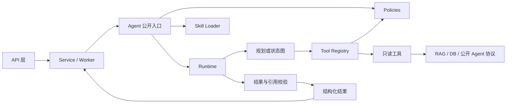

# 三个 Agent Harness 工程整改方案

> 实施状态：已于 2026年08月01日完成全部整改并通过验收。实现与测试证据见 [`三个 Agent Harness 整改实施记录`](三个Agent%20Harness整改实施记录.md)。

## 方案概述

### 项目背景

当前后端包含三个独立 Agent：

- 知识库问答 Agent：`app/agents/knowledge/`。
- 知识库问答评测 Agent：`app/agents/evaluation/`。
- 自主监控 Agent：`app/agents/monitoring/`。

三个目录均已具备不同程度的 Harness 外形，但真实运行链路与项目 `AGENTS.md`、`app/agents/AGENTS.md` 中定义的入口、Runtime、Policies、工具注册、Skill、结构化协议和可追溯要求仍有差距。本方案以现有代码为基线，统一三个 Agent 的工程边界，不把 Harness 简化为目录模板，也不把 Harness 等同于无限工具循环。

### 整改结论

| Agent | 当前形态 | 主要问题 | 整改方向 |
| --- | --- | --- | --- |
| 知识库问答 Agent | Harness 外壳下的确定性 RAG 主链 | Deep Agent 未进入生产入口，工具与 Runtime 被绕过，Skill 内容过薄 | 保留确定性单检索能力，但所有模型和工具调用统一经过 Runtime、Policy、Registry 和结果校验 |
| 自主评测 Agent | 批处理评测编排器 | Graph、Policy、Registry 未进入 Worker 主链，租户上下文传递不完整 | Worker 只调公开入口，Agent 使用真实状态图编排，通过评测工具适配器调用知识 Agent |
| 自主监控 Agent | 自研规划执行 Harness | 缺少 Skill，跨层协议大量使用字典，工具实现位于 Service | 增加分析与回答 Skill，协议模型化，工具实现归入监控 Harness，保留结构化计划和确定性安全边界 |

### 整改目标

1. 三个 Agent 均具有真实生效的独立入口、Runtime、Policies、工具注册表和 Skill。
2. 所有生产调用只经过一个公开 Agent 入口，不保留未使用或旁路的第二套执行主链。
3. 模型调用、工具调用、超时、重试、预算、停止和结果校验均由对应 Runtime 统一控制。
4. 工具调用必须经过注册、白名单、权限、租户、组织、资源范围和预算校验。
5. 跨 Service、Worker 和 Agent 的核心输入输出统一使用 `app/schemas/` 中的 Pydantic 模型。
6. Agent 之间只通过公开结构化协议协作，不导入对方私有 Prompt、Skill、模型、Runtime 或内部状态。
7. 保持现有 HTTP API、数据库表和前端响应兼容，不因 Harness 整改扩大业务范围。
8. 建立可以证明 Harness 实际生效的自动化门禁，不能只检查目录是否存在。

### 范围边界

本次整改不新增 `contracts/`、`prompts/`、`guardrails/`、`tracing/` 或 `evals/` 目录；相关职责继续由 `app/schemas/`、Agent、Runtime、Policies、工具注册、Skill、结构化日志和 `tests/agents/` 承担。本次不新增 Agent 运行数据库表，不修改现有前端交互，不开放写操作工具。

## 现状审计

### 公共现状

三个 Agent 均位于独立目录，且都具备 `agent.py`、`runtime.py`、`policies.py` 和 `tools/registry.py`。知识 Agent 和评测 Agent 已有 Skill，自主监控 Agent 没有 `skills/`。目录合规只是基础，当前主要问题集中在真实执行链是否经过这些文件。

### 问答现状

知识库问答 Agent 已配置 `create_deep_agent()`、受限文件权限、禁用子 Agent、结构化回答和两个 Skill，但生产入口 `run_knowledge_agent()` 没有调用该 Deep Agent。当前生产路径直接执行检索函数、直接调用单次回答模型，最后才创建 Runtime 检查已经发生的调用次数。

具体差距：

1. `get_knowledge_agent()` 没有生产调用者，且创建时 `tools=[]`。
2. `retrieve_knowledge_result()`、历史读取和引用整理存在绕过 Runtime 的直接调用。
3. Runtime 没有实际包裹工具执行和模型执行，无法在调用前统一实施预算。
4. `validate_agent_result()` 已定义但没有进入最终返回路径。
5. 检索工具主要校验知识库是否存在，没有在工具边界重新证明租户、组织和用户访问范围。
6. `query-analysis`、`answer-writing` 两个 Skill 只有一句原则，无法承担可审查的分析和回答指导。
7. `choose_mode()` 依赖少量中文词标记，且标记出的 `tool_loop` 当前并不对应真实工具循环。

### 评测现状

自主评测 Agent 已具备配置、数据集、生成、执行器、指标、报告、状态、Graph 和 Runtime 等领域模块。Worker 会实例化 `EvaluationAgent`，Runtime 能控制逐题并发、超时和重试，结构化日志也较完整。

具体差距：

1. Worker 直接调用 `EvaluationAgent.run()`，没有经过 `EvaluationGraph`。
2. `EvaluationGraph` 只是包装函数，不是可恢复、可分支、可观测的真实 LangGraph 工作流。
3. `EvaluationToolRegistry` 只有注册和名称查询，没有 `get()`、`invoke()`、输入输出约束及权限联动，也没有生产调用者。
4. `authorize_evaluation()` 已定义但未进入 Agent 或 Worker 主链。
5. `KnowledgeAgentExecutor` 直接持有知识 Agent 函数，调用没有经过评测 Agent 自己的 Registry 和 Runtime 工具预算。
6. 传给知识 Agent 的 `AgentContext` 只有 `kb_id`、`user_id`，没有租户、组织、索引版本和问答配置快照。
7. Worker 负责的任务状态与 Agent 图状态没有形成明确的节点映射，恢复和取消主要依赖外围状态字段。
8. 评测 Skill 已存在，但没有可验证的加载点和运行记录。

### 监控现状

自主监控 Agent 已形成当前最完整的自研 Harness：结构化计划负责识别目标、时间和工具；Runtime 控制总体超时、工具超时、步数和次数；Policies 校验角色、工具白名单和可信字段；Registry 显式注册 Service 注入的五类只读工具；回答编排器负责结构化中文 Markdown 和降级。

具体差距：

1. 缺少项目标准结构要求的 `skills/`。
2. 规划规则和回答规则分别硬编码在 `planner.py`、`answering.py`、`planning.py` 和 `agent.py`，模型指导与编排代码耦合。
3. Agent 的 `context`、事实、工具结果和最终结果大量使用 `dict[str, Any]`，跨层约束不足。
4. 工具处理器位于 `app/core/services/monitoring/analysis_tools.py`，监控 Harness 的 `tools/` 只有 Registry，专属工具边界不完整。
5. 工具失败使用 `BusiException` 或普通异常，缺少统一的 Agent 错误码、停止原因和失败阶段。
6. `build_overview()` 与 `analyze()` 返回松散字典，Service 只能依靠字段约定保存消息元数据。
7. Runtime 没有工具级可配置重试和明确的取消状态。

## 整改原则

### 单一入口

每个 Agent 只保留一个生产公开入口：

| Agent | 公开入口 | 调用者 |
| --- | --- | --- |
| 知识库问答 | `run_knowledge_agent(task, context)` | Chat Service、评测 Agent 的公开适配工具、受控监控探针 |
| 自主评测 | `EvaluationAgent.run(task, context)` | Evaluation Worker |
| 自主监控 | `MonitoringAgent.analyze(task, context)`、同入口下的总览操作 | Monitoring Service |

同一 Agent 内部可以根据任务选择确定性单步模式或受控多步模式，但两种模式必须共享 Runtime、Policy、Registry、Skill 加载、日志和结果校验，不能形成两套独立安全边界。

### 技能必备

本项目规定每个 Agent 至少具有一个专属 Skill，并满足以下条件：

1. Skill 位于 `app/agents/<agent>/skills/<skill-name>/SKILL.md`。
2. Skill 必须被规划或回答阶段显式加载，不能只存在于目录。
3. 运行日志记录加载的 Skill 名称和版本摘要，但不记录完整 Skill 内容。
4. Skill 负责分析方法、领域步骤和表达规范，不负责权限、租户、预算和工具白名单。
5. Python 代码保留确定性安全规则和业务状态判断，不能把关键安全约束迁入自然语言 Skill。
6. 测试必须证明删除、未加载或非法 Skill 会被启动检查发现。

### 结构协议

核心协议统一放在现有 Schema 模块：

- 通用知识 Agent 协议继续放在 `app/schemas/agent.py`。
- 自主评测跨 Worker 协议放在 `app/schemas/evaluation.py`。
- 自主监控跨 Service 协议放在 `app/schemas/monitoring.py`。

Agent 目录内的 `models.py` 只保存规划器、状态机、指标计算等私有领域模型；凡是被 Service、Worker、其他 Agent 或 API 使用的模型必须迁移到 `app/schemas/`。

### 安全确定

Harness 不允许模型决定权限。运行顺序固定为：

```text
可信上下文构造
  → Agent 入口校验
  → Skill 选择
  → 计划生成
  → 工具注册检查
  → Policy 权限与范围检查
  → Runtime 预算检查
  → 工具执行
  → 结果与引用校验
  → 结构化返回
```

模型可以决定“用哪个已授权工具”和“如何组织回答”，不能修改租户、用户、角色、知识库、组织、索引版本、时间范围上限或工具白名单。

### 有限运行

不引入无限循环。三个 Runtime 都必须具备：

- 总体超时。
- 模型调用次数。
- 工具调用次数。
- 最大执行步数。
- 单工具超时。
- 有限重试次数。
- 最大上下文条数或长度。
- 取消检查。
- 明确停止原因。
- 失败阶段和可展示降级结果。

## 目标架构



三个 Agent 不共享私有 Runtime、Policy、Registry 或 Skill。可以共享 `app/schemas/` 中的公开协议、公共日志设施和纯工具函数。

## 公共整改

### 目录门禁

统一目标目录如下：

```text
app/agents/<agent_name>/
├── __init__.py
├── agent.py
├── runtime.py
├── policies.py
├── tools/
│   ├── __init__.py
│   ├── registry.py
│   └── ...
└── skills/
    └── <skill_name>/SKILL.md
```

在 `tests/agents/` 增加 Harness 结构测试，机械检查三个目录均存在必需文件、至少一个 Skill、Registry 可执行接口和唯一公开入口。检查只作为基础门禁，不能替代运行链路测试。

### 运行协议

三个 Agent 的运行结果至少统一表达以下语义，具体业务字段分别扩展：

| 字段 | 说明 |
| --- | --- |
| `status` | `completed`、`failed`、`stopped` 或业务允许的受控降级状态 |
| `termination_reason` | 完成、证据不足、超时、预算耗尽、取消、权限拒绝、输出非法等 |
| `tool_calls` | 工具名、状态、耗时、结果数量和脱敏错误类型 |
| `model_call_count` | 本次模型调用次数 |
| `duration_ms` | 总耗时 |
| `limitations` | 证据或能力边界，不包含内部异常堆栈 |
| `skill_refs` | 实际加载的 Skill 名称和版本摘要 |

### 错误规范

每个 Runtime 定义本 Agent 的结构化错误类型，至少覆盖：上下文非法、权限拒绝、工具未注册、工具超时、工具失败、模型超时、模型输出非法、预算耗尽和用户取消。Service 负责映射 HTTP 错误，Agent 不抛出 `HTTPException`。

### 日志规范

结构化日志必须能够还原：Agent 开始、上下文校验、Skill 加载、规划结果、每次工具调用、重试、模型调用、结果校验、停止原因和最终状态。日志只记录 ID、数量、状态、耗时和脱敏摘要，不记录完整问题、答案、文档片段、Token 或 API Key。

## 问答整改

### 目标链路

```text
Chat Service
  → run_knowledge_agent
  → KnowledgeRuntime 初始化预算
  → 加载 query-analysis / answer-writing Skill
  → 选择 single_retrieval 或 tool_loop
  → Runtime.execute_tool
  → Policy + Registry + 检索/历史/引用工具
  → Runtime.invoke_model
  → validate_agent_result
  → AgentResult
```

`single_retrieval` 继续保留，但它是 Harness 内的确定性执行策略，而不是绕过 Harness 的独立 Chain。`tool_loop` 只用于确实需要多来源比较或上下文补充的场景，并受最大步数和工具次数限制。

### 文件调整

| 文件 | 整改内容 |
| --- | --- |
| `knowledge/agent.py` | 保留唯一入口和任务编排；删除直接工具调用、事后预算检查和未使用 Harness 路径 |
| `knowledge/runtime.py` | 统一包裹工具和模型调用，负责预算、总体超时、重试、停止和运行摘要 |
| `knowledge/policies.py` | 增加租户、组织、知识库、会话、索引版本和结果引用校验；最终返回前必须调用结果校验 |
| `knowledge/tools/registry.py` | Registry 返回带输入输出 Schema、只读属性和权限要求的工具定义 |
| `knowledge/tools/retrieval.py` | 工具边界重新校验知识库归属与用户授权，不只校验知识库是否存在 |
| `knowledge/tools/history.py` | 只读取当前用户、当前租户、当前会话允许访问的有限历史 |
| `knowledge/tools/citations.py` | 引用只接受本次检索缓存中的分块 ID，不允许模型传入完整分块伪造引用 |
| `knowledge/skills/query-analysis/SKILL.md` | 补充追问消解、检索意图、多文档比较、资料不足和工具选择指导 |
| `knowledge/skills/answer-writing/SKILL.md` | 补充中文表达、事实约束、引用规则、客户展示和不同问题复杂度下的排版指导 |
| `app/schemas/agent.py` | 补充运行摘要、停止原因、Skill 引用、结构化错误和受信数据范围 |

### Harness 取舍

保留 `deepagents` 时，必须满足以下二选一结论，不得继续保持“已创建但未调用”：

1. `tool_loop` 真实调用受限 Deep Agent，并注册三个只读工具；或
2. 删除未使用的 Deep Agent 构造，完全使用项目自研的有限状态 Runtime。

结合现有设计文档已经确认采用 `create_deep_agent()`，本方案选择第一种：复杂模式使用受限 Deep Agent，简单模式使用同一 Runtime 下的确定性单检索策略，两种模式共享 Policy、Registry、Skill 和结果校验。

### 验收标准

- 生产调用能够证明 Runtime 在首次工具和模型调用前已建立预算。
- `get_knowledge_agent()` 存在真实调用者，且注册工具不为空。
- 所有检索、历史和引用调用都经过 Registry 与 Policy。
- 越权知识库、组织或会话请求在工具执行前拒绝。
- 模型返回不存在的引用 ID 时拒绝结果或受控修复。
- 简单问答最多一次检索和一次回答模型调用；复杂问答不超过配置预算。
- 现有 Chat API 和引用展示保持兼容。

## 监控整改

### 目标链路

```text
Monitoring Service
  → MonitoringTask + MonitoringContext
  → MonitoringAgent
  → 加载 monitoring-analysis Skill
  → Structured Planner
  → MonitoringRuntime
  → Policy + Registry + 监控只读工具
  → 确定性事实评估
  → 加载 answer-writing Skill
  → 回答模型或确定性降级
  → MonitoringResult
```

结构化计划继续作为主路径，有限规则只作为模型不可用或输出非法时的降级路径。事实健康判断继续由确定性代码完成，Skill 和回答模型不得改变告警状态或把缺少数据解释为正常。

### 技能补齐

新增：

```text
app/agents/monitoring/skills/
├── monitoring-analysis/SKILL.md
└── answer-writing/SKILL.md
```

`monitoring-analysis` 包含时间语义、分析目标、监控维度、工具选择、证据充分性、影响边界和身份问题处理；`answer-writing` 包含中文回答、中国标准时间、动态 Markdown、表格使用、结论编码一致性、证据引用和禁止扩大结论。Planner 只加载分析 Skill，Answer Composer 只加载回答 Skill，并在运行摘要记录实际 Skill。

### 文件调整

| 文件 | 整改内容 |
| --- | --- |
| `monitoring/agent.py` | 输入输出改为 Schema，保留总览与对话的统一公开操作，不直接拼装跨层字典 |
| `monitoring/runtime.py` | 增加结构化错误、停止原因、有限重试、取消检查、模型调用计数和 Skill 记录 |
| `monitoring/policies.py` | 校验角色之外，增加租户范围、平台范围、最大时间窗口和输出敏感字段规则 |
| `monitoring/tools/registry.py` | 工具定义包含输入 Schema、输出 Schema、只读属性和权限要求 |
| `monitoring/tools/*.py` | 从 Service 迁入健康、告警、指标、事件和任务五类只读工具实现 |
| `monitoring/planner.py` | 从分析 Skill 构造模型指导；保留 Schema 校验、工具白名单归一和规则降级 |
| `monitoring/answering.py` | 从回答 Skill 构造回答指导；保留结论编码、证据 ID、中国标准时间和输出安全校验 |
| `app/schemas/monitoring.py` | 增加任务、上下文、工具输入输出、事实集合、分析结果和运行摘要模型 |
| `monitoring_analysis_tools.py` | 删除具体工具实现，只保留 Service 需要的依赖装配或完全移除 |

### 验收标准

- 监控 Harness 至少存在两个 Skill，Planner 和 Answer Composer 均有真实加载记录。
- Service 不再实现监控 Agent 专属查询工具。
- 所有五类工具只能通过 Registry 调用，模型无法覆盖租户、用户、角色或授权范围。
- Agent 公开结果通过 Pydantic 校验后才交给 Service 保存。
- 显式时间优先于会话默认时间，客户时间统一为中国标准时间。
- 无证据、部分失败、全部失败、模型超时和规则降级均有结构化停止原因。
- 不改变现有分析总览和分析对话接口字段。

## 评测整改

### 目标链路

```text
Evaluation Worker
  → EvaluationTask + EvaluationContext
  → EvaluationAgent.run
  → Policy 入口校验
  → 加载 evaluation Skill
  → 编译并执行 EvaluationGraph
  → Runtime 控制总预算、并发、逐题超时、重试和取消
  → EvaluationToolRegistry.call_knowledge_agent
  → 知识 Agent 公开结构化协议
  → 指标节点
  → 报告节点
  → EvaluationResult
  → Worker 事务持久化
```

Worker 继续负责领取任务、数据库状态、事务、结果持久化和终态处理；评测 Agent 负责配置校验、问题准备后的执行图、逐题调度、指标和报告结构结果。Agent 不直接写数据库。

### 图形改造

`EvaluationGraph` 改为真实 LangGraph，至少包含以下节点：

```text
validate_config
  → load_skill
  → prepare_questions
  → dispatch_cases
  → execute_case
  → calculate_metrics
  → build_report
  → finalize
```

逐题失败进入单题失败结果后继续汇总；配置非法、权限拒绝、问题集无法解析和运行预算耗尽进入任务失败；取消状态进入 `cancelled`，不生成伪造成功报告。Graph 的状态使用 `evaluation/state.py`，跨 Worker 的任务与结果使用 `app/schemas/evaluation.py`。

### 工具边界

评测 Agent 第一阶段只注册一个外部执行工具：`call_knowledge_agent`。该工具封装知识 Agent 公开入口，输入包含问题及可信的用户、租户、组织、知识库、索引版本和问答配置快照，输出使用公开 `AgentResult`。问题生成、指标计算和报告生成属于评测图领域节点，不伪装成可由模型任意选择的工具。

### 文件调整

| 文件 | 整改内容 |
| --- | --- |
| `evaluation/agent.py` | 接收结构化任务和上下文，执行 Policy、Skill 和 Graph，返回结构化结果 |
| `evaluation/graph.py` | 使用真实 LangGraph 节点和条件边，不再反向导入 `EvaluationAgent` |
| `evaluation/state.py` | 定义运行状态、节点状态、完成数量、失败数量、停止原因和取消标记 |
| `evaluation/runtime.py` | 同时控制运行总预算和逐题预算，工具调用统一经过 Registry，周期检查取消状态 |
| `evaluation/policies.py` | 入口校验用户、租户、知识库、任务授权和配置边界；工具调用时再次校验范围 |
| `evaluation/tools/registry.py` | 增加 `get()`、`invoke()`、工具 Schema、只读属性和权限要求 |
| `evaluation/tools/knowledge.py` | 新增知识 Agent 公开协议适配器，禁止导入知识 Agent 私有实现 |
| `evaluation/executor.py` | 改为逐题领域执行器，不直接持有裸函数，不自行构造缺字段的 AgentContext |
| `evaluation/skills/evaluation/SKILL.md` | 补充执行阶段、失败收敛、证据采集、指标边界和禁止直接生成客户答案 |
| `app/schemas/evaluation.py` | 增加评测 Agent Task、Context、Result、运行摘要和知识 Agent 调用上下文 |
| `app/workers/evaluation.py` | 只调用评测 Agent 公开入口，传入完整可信上下文，按结构化结果持久化 |

### 验收标准

- Worker 不再直接调用 `EvaluationAgent.run(config, questions)` 旧签名，也不直接注入裸 `run_knowledge_agent` 函数。
- Graph 是生产主链，有节点级日志和状态测试，不存在未调用的包装 Graph。
- `authorize_evaluation()` 在 Agent 入口真实执行。
- `EvaluationToolRegistry.invoke()` 是调用知识 Agent 的唯一通路。
- 租户、组织、知识库、用户、索引版本和问答配置完整传递，模型或问题文件不能覆盖。
- 单题错误、超时和降级不阻断其他题；任务超时和取消能停止后续调度。
- 评测 Agent 不直接调用聊天模型生成客户答案，不复制知识 Agent 检索链路。
- 现有任务、运行、逐题结果、指标和报告接口保持兼容。

## 协作协议

### 调用关系

三个 Agent 的允许关系固定为：

```text
自主评测 Agent ──公开协议──> 知识库问答 Agent
自主监控 Agent ──只读事实──> 评测运行与结果 Repository
自主监控 Agent ──监控探针──> 知识库问答 Agent 公开协议（仅明确设计的探针场景）
```

禁止关系：

- 评测 Agent 导入知识 Agent 的 Prompt、Skill、Runtime、模型或检索私有函数。
- 监控 Agent 导入评测 Agent 的 Graph、状态、模型实例或报告私有函数。
- 知识 Agent 根据监控或评测内部状态改变用户授权范围。
- 任一 Agent 绕过 Service/Worker 提供的可信身份，自行从用户输入推断租户或角色。

### 上下文传递

所有跨 Agent 上下文必须区分可信字段和模型字段：

| 类型 | 字段示例 | 来源 |
| --- | --- | --- |
| 可信身份 | 用户、租户、组织、角色 | 认证上下文、任务快照 |
| 资源范围 | 知识库、索引版本、会话、监控范围 | Service 或 Worker 校验结果 |
| 运行预算 | 超时、步数、工具次数、并发、重试 | 后端配置与任务快照 |
| 用户意图 | 问题、时间表达、分析目标 | 用户输入，经结构化解析 |
| 模型建议 | 工具选择、回答布局、关注维度 | 模型输出，经白名单和 Schema 校验 |

可信身份、资源范围和运行预算不能由模型输出覆盖。

## 实施计划

### 基线固化

1. 保存三个 Agent 当前正常、超时、权限拒绝、无数据和降级行为的回归测试。
2. 增加调用探针，证明当前哪些函数进入生产链，防止整改后继续存在死代码 Harness。
3. 固定 Chat、Evaluation、Monitoring 现有对外响应快照。
4. 不修改数据库和前端协议。

### 公共契约

1. 扩展现有 `app/schemas/agent.py`、`evaluation.py` 和 `monitoring.py`。
2. 统一停止原因、工具调用摘要、Skill 引用和结构化错误语义。
3. 增加 Harness 目录与真实调用链测试。
4. 增加 Skill 完整性、加载和安全边界测试。

### 问答整改

1. 先让 Runtime 接管现有确定性单检索路径，不改变回答行为。
2. 将检索、历史和引用调用统一切换到 Registry。
3. 补齐工具级租户、组织、知识库和会话权限校验。
4. 扩充并加载两个 Skill。
5. 接入受限 Deep Agent 的复杂模式，删除未使用路径。
6. 最终结果统一执行引用与 Schema 校验。

### 监控整改

1. 增加两个 Skill，并先通过现有 Planner、Composer 显式加载。
2. 在 `app/schemas/monitoring.py` 增加结构化 Agent 协议。
3. 将五类工具迁移到监控 Harness，Service 只装配可信上下文。
4. 扩展 Runtime 错误、重试、停止原因和运行摘要。
5. 保持结构化计划主路径及有限规则降级路径。

### 评测整改

1. 先完善评测 Task、Context 和 Result Schema，补全租户与资源范围。
2. 将知识 Agent 调用封装为评测 Registry 工具。
3. 让 Policy 进入 Agent 入口与工具调用。
4. 将现有顺序编排迁移为真实 LangGraph 节点，保持逐题结果兼容。
5. Worker 切换到新的评测 Agent 公开入口。
6. 增加取消、恢复、任务级超时和节点级日志验证。

### 联调收敛

1. 执行三个 Agent 的单元、合同、安全、故障注入和真实模型测试。
2. 执行 Chat、评测 Worker、自主监控分析的现有接口与浏览器回归。
3. 检查生产代码不存在未调用 Harness、裸模型调用、裸工具调用和跨 Agent 私有导入。
4. 更新三个业务域原有实施文档、联调记录和测试状态。

## 兼容策略

### 接口兼容

- Chat API 请求、回答和引用字段保持不变。
- 自主评测任务、运行、报告和逐题结果接口保持不变。
- 自主监控总览、会话、消息、回答证据元数据保持不变。
- 新增运行摘要只作为内部字段或消息元数据扩展，不要求前端立即展示。

### 数据兼容

本次不新增 DDL。现有会话、消息、评测任务、评测运行、逐题结果、监控事件和告警数据继续复用。新协议读取历史元数据时必须提供默认值，不因缺少 `skill_refs`、停止原因或工具摘要导致历史数据不可读。

### 灰度回退

每个 Agent 按独立配置开关切换新 Runtime；回退只能切换执行适配器，不得跳过 Policy 和权限校验。整改期间保留旧响应转换器，验证稳定后删除旧执行实现和无调用代码，避免长期维护双主链。

## 风险控制

| 风险 | 影响 | 控制措施 |
| --- | --- | --- |
| Harness 接入增加延迟 | 问答和分析响应变慢 | 简单问题保持确定性单检索；复杂模式限制模型与工具次数 |
| Skill 改变回答风格 | 客户展示不稳定 | Skill 进入版本化评测集，结论和引用继续由确定性校验保护 |
| 工具迁移改变数据范围 | 越权或漏数 | 迁移前后执行租户、组织、平台范围合同测试和结果对比 |
| 评测图迁移影响任务状态 | 运行卡住或重复执行 | 节点幂等、取消检查、任务快照和 Worker 故障注入测试 |
| 双路径长期共存 | 行为漂移和维护成本上升 | 每个 Agent 只允许一个生产入口，整改完成后机械检查无调用旧代码 |
| 结构化协议变严格 | 历史元数据解析失败 | 所有新增字段提供兼容默认值，使用版本化解析与旧数据回归 |

## 验收门禁

### 结构门禁

- 三个 Agent 均存在必需目录和至少一个 Skill。
- `app/agents/` 根目录没有 Agent 主入口、工具或 Skill。
- 不新增项目禁止的旁路目录。
- Agent 专属工具不再放在通用 Service 中。

### 运行门禁

- Runtime 在任何模型或工具调用前初始化并执行预算检查。
- 未注册工具、越权工具和可信字段覆盖全部被拒绝。
- Skill 有真实加载证明，不存在仅占位的 Skill。
- 最终结果经过 Schema、引用和敏感字段校验。
- 超时、重试、取消和预算耗尽均形成明确终态。

### 隔离门禁

- 评测 Agent 只调用知识 Agent 公开协议。
- 监控 Agent 只读取评测结构化事实，不导入评测私有模块。
- 三个 Agent 不共享 Runtime、Policy、Registry、Skill 和模型实例。
- 跨租户、跨组织、跨知识库和跨会话测试全部通过。

### 质量门禁

- 原有后端自动化全部通过。
- 三个 Agent 新增 Harness 测试全部通过。
- 知识问答引用准确率和越权拦截率不下降。
- 评测逐题数量、状态、指标和报告保持一致。
- 监控结论编码、证据范围和中国标准时间保持一致。
- 真实模型测试覆盖正常输出、非法结构、超时和降级。

详细测试场景见 [`三个Agent Harness整改测试用例.md`](测试用例/三个Agent%20Harness整改测试用例.md)。

## 交付清单

1. 三个 Agent 的入口、Runtime、Policies、Registry 和 Skill 整改代码。
2. `app/schemas/agent.py`、`evaluation.py`、`monitoring.py` 的结构化协议。
3. 监控五类只读工具迁移和评测知识 Agent 工具适配器。
4. 评测真实 LangGraph 工作流和状态模型。
5. Harness 结构、运行、权限、预算、Skill、故障和跨 Agent 合同测试。
6. 三个业务域实施文档、联调记录和测试用例状态更新。

完成标准不是“目录已经补齐”，而是生产请求能够被自动化测试证明依次经过入口、Skill、Runtime、Policy、Registry、工具和结果校验，并且三个 Agent 的权限、数据和内部实现保持隔离。
