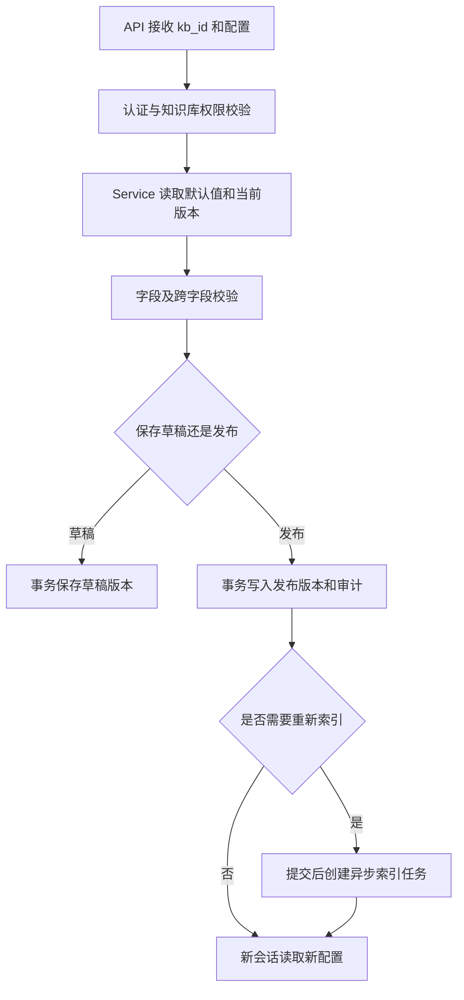

# 知识库问答配置后端开发实施方案

## 1. 实施目标

依据《知识库问答配置需求设计文档》和《知识库问答配置后端配合改造方案》，完成知识库级问答配置的版本、草稿、发布、审计、测试和问答链路接入能力，为前端右侧配置滑块提供真实接口。

当前文档只描述后端开发实施，需求、接口和数据设计评审通过前不得开始业务编码。

## 2. 后端开发范围

- 配置版本、草稿和审计数据表。
- 索引代次表、当前索引指针和会话索引快照。
- 配置查询、草稿保存、变更摘要、发布和恢复默认接口。
- 配置字段、跨字段、平台边界和权限校验。
- 文档处理配置发布与异步索引任务联动。
- Retriever、Rerank、Agent、回答策略读取知识库已发布配置。
- 检索测试、Rerank 连接测试和 Prompt 预览接口。
- 版本冲突、发布失败、索引失败和服务超时处理。

## 3. 开发约束

- 遵守 `API → Service → DB / RAG / 外部服务` 调用方向。
- 表名使用 `t_` 前缀，例如 `t_knowledge_base_qa_config_version`。
- DDL 只维护在 `scripts/db/data_table_ddl.sql`。
- Service 层数据库写操作必须使用事务。
- API 层不直接访问数据库、向量库或模型服务。
- DB 层不拼接 Prompt、不生成自然语言答案、不处理 HTTP 展示文案。
- 服务地址、模型连接和密钥来自 `app.yaml` / 环境变量，不能由知识库配置覆盖。

## 4. 后端开发阶段

### 阶段 1：Schema、DDL 和错误码确认

- 确认 `t_knowledge_base_qa_config_version` 和 `t_knowledge_base_qa_config_audit` 表结构。
- 确认配置 JSON 结构、版本号、状态和默认值。
- 确认配置查询、草稿、发布、恢复默认、变更摘要和测试接口 Schema。
- 确认权限码、错误码、字段错误格式和版本冲突响应。

完成标准：前端可以依据稳定的接口契约开发，数据库命名符合项目规范。

### 阶段 2：DB 模块和配置服务实现

- 按表新增 DB 模块，提供 `get`、`list`、`insert_`、`update_` 等通用方法。
- 实现系统默认配置、已发布配置和草稿合并读取。
- 在 `document` 配置组增加 `embedding_model` 文本值，查询时默认回填当前知识库向量模型，并由服务端校验模型标识有效性。
- 实现当前知识库唯一草稿、唯一已发布版本和版本递增规则。
- 实现租户边界、知识库权限和操作权限校验。
- 实现字段级和跨字段配置校验。

完成标准：可以查询配置、保存草稿，并对非法参数返回字段级错误。

### 阶段 3：API 实现

建议接口：

| 方法 | 路径 | 说明 |
|---|---|---|
| `GET` | `/api/v1/knowledge-bases/{kb_id}/qa-config` | 查询配置和权限状态 |
| `PUT` | `/api/v1/knowledge-bases/{kb_id}/qa-config/draft` | 保存草稿 |
| `GET` | `/api/v1/knowledge-bases/{kb_id}/qa-config/changes` | 查询变更摘要 |
| `POST` | `/api/v1/knowledge-bases/{kb_id}/qa-config/publish` | 发布配置 |
| `POST` | `/api/v1/knowledge-bases/{kb_id}/qa-config/reset` | 恢复默认草稿 |
| `POST` | `/api/v1/knowledge-bases/{kb_id}/qa-config/retrieval-test` | 临时检索测试 |
| `POST` | `/api/v1/knowledge-bases/{kb_id}/qa-config/rerank-test` | Rerank 连接测试 |
| `POST` | `/api/v1/knowledge-bases/{kb_id}/qa-config/prompt-preview` | Prompt 预览 |

API 层只负责参数解析、认证上下文、Service 调用和响应转换。

完成标准：接口能返回统一响应和统一异常结构，测试接口不写正式会话数据。

### 阶段 4：发布事务和索引任务联动

- 发布前重新执行服务端全部校验。
- 使用事务写入配置版本、审计记录和发布状态。
- 生成参数前后差异、是否重新入库、是否重新索引和受影响文档数量。
- 发布提交后创建新的索引代次，例如 `generation-002`，并创建异步索引任务，不在 HTTP 请求中执行全量处理。
- 发布向量模型变更时，在同一事务中记录目标模型、创建新索引代次和异步索引任务；索引成功后再切换 `t_knowledge_base.embedding_model`，失败时保留旧模型和旧索引。
- 新 Chunk 写入新的 `index_version_id` 和独立向量集合，不能覆盖旧索引的数据。
- 新索引构建并校验成功后，原子更新 `t_knowledge_base.active_index_version_id`。
- 创建新会话时保存当前 `index_version_id` 和 `qa_config_version_id`；旧会话继续读取自身保存的索引版本。
- 发布失败保留草稿并继续使用旧发布版本。
- 索引失败保留旧索引，支持记录失败原因和后续重试。

完成标准：配置发布和索引任务状态可追溯，旧问答链路不会因发布异常中断。

### 阶段 5：问答链路接入

- Retriever 读取 Top-K、相似度阈值、检索方式和混合权重。
- Rerank 读取启用状态、模型选择、候选数量、返回数量、超时和失败策略。
- Agent 读取最大步骤、工具调用次数、总超时、重试和 Graph recursion limit。
- 回答链路读取回答风格、引用数量、资料不足策略、降级策略和 Prompt。
- 每次问答记录使用的配置版本，不保存敏感配置内容。
- 配置缺失时使用平台默认值并记录异常日志。

完成标准：不同知识库和不同配置版本不串用参数，问答可追溯到配置版本。

### 阶段 6：临时测试能力

- 检索测试返回文档、分数、章节、摘要和排序信息。
- Rerank 测试使用平台 Ollama 配置，返回连接状态、模型和错误原因。
- Prompt 预览使用草稿配置和临时问题，不写入正式会话、评测数据或审计版本。
- 所有测试接口设置超时、取消和资源限制。
- 测试日志不得输出密钥、完整敏感 Prompt 或本机绝对路径。

完成标准：测试失败不会改变已发布配置，也不会污染正式问答数据。

### 阶段 7：后端测试和上线准备

- 执行 DB、Service、API 单元测试和集成测试。
- 测试跨租户、跨知识库、只读角色、发布权限和版本冲突。
- 测试默认配置、边界值、索引联动、发布失败和重试。
- 测试向量模型草稿读回、发布后的待重建索引状态、索引成功生效和索引失败回退。
- 测试 Retriever、Rerank、Agent、引用和降级策略配置是否生效。
- 测试模型服务不可用、超时、Graph recursion limit 和异常日志。
- 准备 DDL、迁移和回滚清单。

## 5. 后端关键流程

## 6. 后端验收标准

1. 配置数据、草稿、发布版本和审计记录完整可追溯。
2. 所有数据库表名和 DDL 符合项目统一命名规范。
3. Service 写操作使用事务，发布失败不会覆盖旧版本。
4. 配置发布按知识库隔离，并正确联动索引任务。
5. Retriever、Rerank、Agent 和回答策略能够读取已发布配置。
6. Ollama 服务地址和模型连接信息不由前端配置覆盖。
7. 权限、异常、超时、降级和日志安全检查通过。
8. 后端测试和接口联调通过后，才进入代码合并和上线流程。
