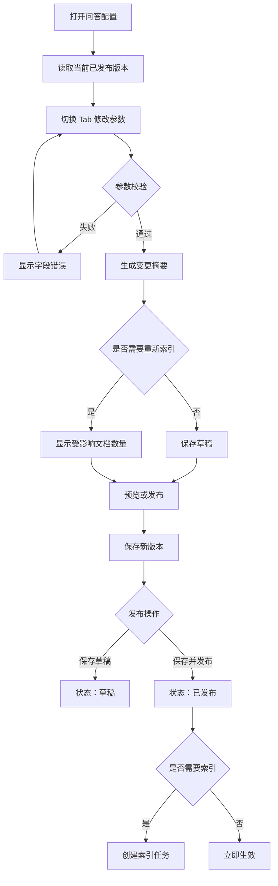

# 知识库问答配置需求设计文档

交互原型：[知识库问答配置交互原型.html](知识库问答配置交互原型.html)。

## 1. 需求概述

### 1.1 背景

知识库问答效果由文档质量、分块、Embedding、检索、Rerank、Agent 和 Prompt 共同决定。当前这些能力缺少统一的知识库级配置入口，调优人员需要修改配置文件或代码，无法直观看到参数影响，也无法保存配置版本和验证结果。

### 1.2 建设目标

在知识库工作区的“问答”模块中增加问答配置入口，按功能分组维护问答参数，支持：

- 查看当前已发布配置和配置版本。
- 按 Tab 管理文档处理、检索、重排、回答策略和高级参数。
- 展示参数作用、默认值、修改影响和生效方式。
- 保存草稿、查看变更摘要、发布配置和恢复默认配置。
- 对检索参数执行在线检索测试。
- 对 Rerank 服务执行连接测试。
- 对 Prompt 执行回答预览。
- 对需要重新入库或重新索引的修改展示影响范围。

### 1.3 非目标

- 不在本页面维护数据库、存储、API Key、Token 和真实服务密钥。
- 不在本页面替代文档上传、删除和索引任务页面。
- 不在本页面直接执行完整自主评测任务。
- 不允许知识库配置突破平台级安全上限。

## 2. 页面入口和角色

页面入口：

```text
知识库管理 → 知识库列表 → 知识库工作区 → 问答
```

工作区 Tab：

```text
知识库工作区
├── 概览
├── 文档
└── 问答
    └── 配置（右侧滑块）
        ├── 文档处理
        ├── 检索配置
        ├── 重排配置
        ├── 回答策略
        └── 高级参数
```

角色规则：

| 角色 | 查看 | 编辑 | 发布 | 检索测试 | Prompt 预览 |
|---|---:|---:|---:|---:|---:|
| 平台超级管理员 | 是 | 是 | 是 | 是 | 是 |
| 知识库管理员 | 是 | 是 | 是 | 是 | 是 |
| 普通成员 | 按知识库权限 | 否 | 否 | 按权限 | 按权限 |
| 访客 | 否 | 否 | 否 | 否 | 否 |

## 3. 配置承载边界

| 参数类别 | 界面配置 | `app.yaml` 配置 |
|---|---|---|
| 文档质量 | 文档清洗、去重、版本和解析结果检查 | 不配置 |
| 分块参数 | 分块大小、分块重叠、标题保留、表格处理 | 默认值、上下限 |
| Embedding 参数 | 选择已发布的模型 | 服务地址、密钥、模型连接和向量维度 |
| 检索参数 | Top-K、阈值、检索方式和混合权重 | 默认值、最大 Top-K、总开关 |
| Rerank 参数 | 启用、候选数量、返回数量和失败策略 | 服务地址、密钥、模型连接和超时上限 |
| Agent 参数 | 安全范围内的超时、步骤数和工具次数 | 默认值、最大上限、递归上限和重试上限 |
| Prompt 参数 | 知识库 Prompt、回答风格、引用规则和资料不足策略 | 全局默认 Prompt 和降级 Prompt |

界面配置只能在 `app.yaml` 定义的全局边界内生效。

## 4. 页面总体设计

问答页面顶部展示：

- 当前知识库名称。
- 当前配置状态：草稿、已发布、待重建索引。
- 当前配置版本。
- 最近发布时间和发布人。
- 当前使用的 Embedding、Rerank 和 Chat Model 摘要。
- “配置”文本按钮，点击后从页面右侧打开问答配置滑块。

问答配置滑块内展示：

- 配置标题、知识库名称、当前发布版本和配置状态。
- 文档处理、检索配置、重排配置、回答策略和高级参数五个配置 Tab。
- 配置内容区域独立滚动，避免覆盖问答页面。
- 点击关闭按钮或滑块外遮罩区域关闭滑块。

配置滑块底部操作栏：

- 恢复默认配置。
- 保存草稿。
- 查看变更摘要。
- 保存并发布。

页面原型：

```text
┌──────────────────────────────────────────────────────────────┐
│ 知识库工作区 / 问答                                          │
│ 医签通产品知识库                         [已发布 v3] [配置]   │
├──────────────────────────────────────────────────────────────┤
│ 概览                 文档                 问答                  │
├──────────────────────────────────────────────────────────────┤
│ 问答会话区                         参考资料                    │
│                                                              │
│                         点击“配置”后                          │
│                                      ┌───────────────────────┐ │
│                                      │ 问答配置          关闭 │ │
│                                      │ 文档处理 检索配置 ... │ │
│                                      │ 当前 Tab 的配置表单   │ │
│                                      │                       │ │
│                                      │ [恢复默认] [保存] [发布]│ │
│                                      └───────────────────────┘ │
└──────────────────────────────────────────────────────────────┘
```

配置入口不作为知识库工作区的独立 Tab，避免用户离开问答上下文后再寻找参数。配置仍然属于问答模块，只在需要调优时通过右侧滑块展开。

## 5. Tab 需求设计

### 5.1 文档处理

| 配置项 | 控件 | 默认值 | 生效方式 | 影响 |
|---|---|---:|---|---|
| `chunk_size` 分块大小 | 数字输入框 | 600 | 重新索引 | 过小可能上下文不完整，过大可能混入无关内容 |
| `chunk_overlap` 分块重叠 | 数字输入框 | 100 | 重新索引 | 过大会增加重复内容和向量数量 |
| `embedding_model` 向量模型 | 文本输入框 | 当前知识库已发布模型 | 重新索引 | 输入文档分块和查询问题使用的 Embedding 模型标识；模型维度和服务地址由平台统一管理 |
| 标题保留 | 开关 | 开启 | 重新入库 | 提升章节识别和引用可读性 |
| 空白清洗 | 开关 | 开启 | 重新入库 | 清理空行、连续空格和解析乱码 |
| 表格处理 | 下拉框 | 保留文本 | 重新入库 | 决定表格字段关系是否保留 |
| 重复内容处理 | 下拉框 | 标记重复 | 重新入库 | 减少重复资料对召回结果的干扰 |

校验：

- `chunk_size` 必须大于 0。
- `chunk_overlap` 必须大于等于 0 且小于 `chunk_size`。
- `embedding_model` 必须填写平台已发布且可用的 Embedding 模型标识；不允许填写服务地址、密钥或向量维度。
- 切换 `embedding_model` 必须重新生成全部文档分块向量；新索引完成前继续使用旧的 active 索引。
- 向量模型切换需要在发布确认中明确提示受影响文档数量、索引状态和当前问答使用的索引版本。
- 修改后显示受影响文档数量。
- 发布后创建索引任务，不能直接删除旧索引。

### 5.2 检索配置

| 配置项 | 控件 | 默认值 | 生效方式 | 影响 |
|---|---|---:|---|---|
| 检索 Top-K | 数字输入框 | 5 | 即时生效 | 控制初步召回数量 |
| 相似度阈值 | 数字输入框 | 按模型分数 | 即时生效 | 过滤低相关性结果 |
| 检索方式 | 下拉框 | 向量检索 | 即时生效 | 向量、关键词或混合检索 |
| 混合检索 | 开关 | 关闭 | 即时生效 | 兼顾语义和专有名词召回 |
| 关键词权重 | 滑块 | 30% | 即时生效 | 控制混合检索中的关键词影响 |
| 查询改写 | 开关 | 关闭 | 即时生效 | 优化复杂问题和追问的检索表达 |
| 空结果处理 | 下拉框 | 资料不足提示 | 即时生效 | 决定空结果时拒答或进入降级 |

交互：

- 开启混合检索后才启用关键词权重。
- 提供“检索测试”区域，展示文档名、分数、章节和摘要。
- 检索测试不写入正式会话和评测结果。

### 5.3 重排配置

| 配置项 | 控件 | 默认值 | 生效方式 | 影响 |
|---|---|---:|---|---|
| 启用重排 | 开关 | 开启 | 即时生效 | 增加一次模型调用，改善候选排序 |
| 重排模型 | 服务选择框 | bge-reranker-v2-m3 | 即时生效 | 决定候选相关性判断能力 |
| 候选数量 | 数字输入框 | 20 | 即时生效 | 进入重排前的候选数量 |
| 最终返回数量 | 数字输入框 | 5 | 即时生效 | 送入回答模型的资料数量 |
| 请求超时 | 数字输入框 | 10 秒 | 即时生效 | 控制 Rerank 等待时间 |
| 失败策略 | 下拉框 | 使用向量结果 | 即时生效 | Rerank 失败时继续问答或终止 |

校验：

- 最终返回数量不能大于候选数量。
- 重排模型必须从平台已发布模型中选择。
- 页面提供“测试连接”，失败时显示降级提示。

### 5.4 回答策略

| 配置项 | 控件 | 默认值 | 生效方式 | 影响 |
|---|---|---|---|---|
| 回答风格 | 下拉框 | 专业自然 | 新问答生效 | 控制语气和结构化程度 |
| 最大回答长度 | 数字输入框 | 300 字 | 新问答生效 | 控制回答长度 |
| 必须引用资料 | 开关 | 开启 | 新问答生效 | 要求答案绑定检索资料 |
| 最大引用数量 | 数字输入框 | 3 条 | 新问答生效 | 控制展示引用数量 |
| 资料不足处理 | 下拉框 | 明确说明资料不足 | 新问答生效 | 防止模型根据常识补充 |
| 高风险问题处理 | 下拉框 | 谨慎回答 | 新问答生效 | 处理价格、交付和合规问题 |
| 降级回答 | 开关 | 开启 | 新问答生效 | Agent 失败时生成资料摘要 |
| 知识库 Prompt | 多行文本 | 系统默认 | 新问答生效 | 维护知识库专属回答规则 |

交互：

- Prompt 支持草稿、预览、发布和历史版本。
- “预览回答”使用当前草稿配置，不影响正式问答。
- 发布后记录 Prompt 版本，评测结果保存所使用的版本号。

### 5.5 高级参数

| 配置项 | 控件 | 默认值 | 生效方式 | 影响 |
|---|---|---:|---|---|
| 最大执行步骤 | 数字输入框 | 8 | 新会话生效 | 过小可能提前终止 |
| 最大工具调用次数 | 数字输入框 | 5 | 新会话生效 | 限制检索和引用工具调用 |
| Agent 总超时 | 数字输入框 | 60 秒 | 即时生效 | 影响等待时间和降级率 |
| 工具调用超时 | 数字输入框 | 20 秒 | 即时生效 | 控制单个工具调用等待 |
| 重试次数 | 数字输入框 | 1 次 | 即时生效 | 提高偶发失败成功率但增加耗时 |
| Graph recursion limit | 数字输入框 | 20 | 新会话生效 | 防止 LangGraph 无限循环 |
| 降级回答超时 | 数字输入框 | 15 秒 | 即时生效 | 控制降级摘要等待时间 |

高级参数默认折叠，只对有权限的管理员展示，并必须受系统全局上限限制。

## 6. 保存和发布流程



发布前必须展示：

- 修改前后的参数值。
- 立即生效的配置。
- 需要重新入库的配置。
- 需要重新索引的文档数量。
- 当前发布人和版本号。

向量模型特别规则：

- “保存草稿”只保存输入结果，不改变当前线上向量模型。
- “保存并发布”成功后，配置状态变为“待重建索引”，不能直接提示向量模型已经完成生效。
- 只有新索引构建成功并切换为 `active` 后，页面才显示“向量模型已生效”。
- 新索引失败时保留旧向量模型和旧索引可用，显示失败原因并提供“重新索引”入口。

## 7. 页面状态和异常

| 状态 | 页面表现 |
|---|---|
| 加载中 | Tab 内容显示加载状态，不显示空表单 |
| 无权限 | 显示无权限提示，不展示配置值 |
| 无配置 | 使用系统默认值并提示尚未发布知识库专属配置 |
| 草稿 | 显示草稿版本和未发布提示 |
| 待重建索引 | 显示索引进度和受影响文档数量 |
| 向量模型切换中 | 显示旧模型、目标模型、索引进度和当前问答仍使用旧索引的提示 |
| 向量模型切换失败 | 保留旧模型和旧索引，显示失败原因与重试入口，不显示保存成功即已生效 |
| 服务不可用 | Rerank 或检索测试区域显示连接错误 |
| 参数错误 | 字段下方显示具体校验提示 |
| 发布失败 | 保留草稿，显示失败原因，不覆盖当前已发布版本 |

## 8. 原型评审范围

原型评审需要确认：

1. 问答配置是否归属于问答模块，并通过问答页面右上角“配置”打开右侧滑块，而不是作为工作区独立 Tab。
2. 5 个 Tab 的字段和分组是否清晰。
3. 分块参数修改后的重新索引提示是否明确。
4. 检索测试、Rerank 连接测试和 Prompt 预览是否满足调优需要。
5. 草稿、发布、版本和异常状态是否完整。
6. 高级参数是否默认折叠并限制权限。
7. 原型评审通过后，再进入接口、数据和前端编码阶段。
