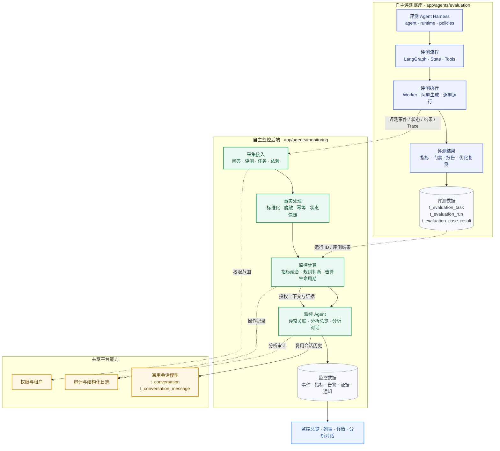
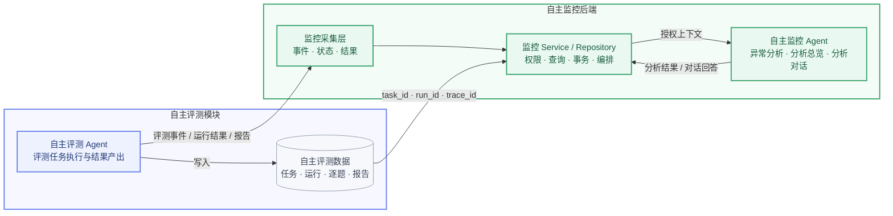
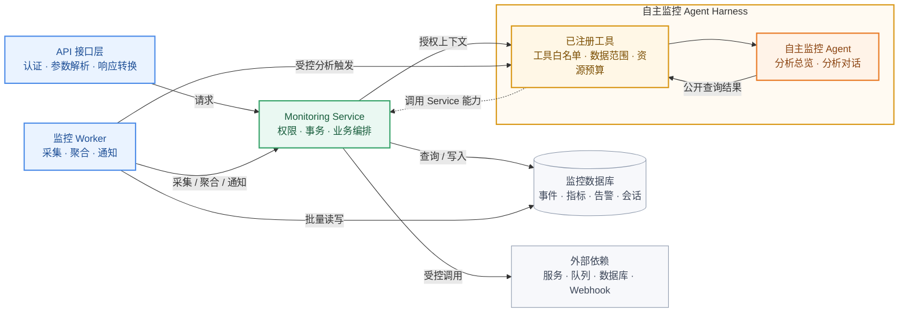

# 自主监控后端开发实施方案

## 1. 文档定位

本文档依据《自主监控需求设计文档》《自主监控数据采集方案》和《自主监控数据表设计》编写，用于指导自主监控后端、监控 Agent、采集器、指标聚合、告警、通知、分析对话和接口联调实施。

本文档只定义后端实施边界、开发顺序、接口分层、数据复用和验收计划，不直接生成 DDL，不直接开始业务编码。数据库 DDL 仍统一维护在 `scripts/db/data_table_ddl.sql`；当前自主监控数据表设计仍处于评审阶段。

自主监控与自主评测是两个独立能力：自主评测负责评测任务执行和结果产出，自主监控负责读取这些结构化事实，完成监控、告警、分析总览和分析对话。

## 2. 建设边界

### 2.1 监控职责

自主监控后端负责：

- 采集问答、任务、评测、文档处理、Worker、依赖和资源运行事实。
- 标准化事件、状态快照和指标结果。
- 根据确定性规则生成、去重、恢复和关闭告警。
- 关联告警、指标、事件、任务、评测运行、版本和 Trace ID。
- 调用自主监控 Agent 生成分析总览、处理建议和分析对话回答。
- 保存自主监控分析会话、消息和证据上下文。
- 提供总览、列表、详情、规则、通知和审计接口。

### 2.2 非职责

- 不重新实现自主评测 Agent 的问题生成、评测编排、LangGraph、逐题执行、指标计算和评测报告。
- 不在监控 Agent 中复制知识库问答 Agent 或自主评测 Agent 的私有 Prompt、Runtime、模型实例和工具。
- 不通过监控结果自动创建、重试、暂停或终止评测任务。
- 不把自然语言分析结果直接作为告警触发条件。
- 不提供用户配置采集目标的业务页面；采集目标由系统发布或运维流程维护。

## 3. 底座划分

### 3.1 总体架构

下图明确标出哪些模块属于自主评测底座。带有“评测底座”边框的模块属于 `app/agents/evaluation/` 及其配套的评测任务链路；自主监控只消费其公开结果，不重新实现这些模块。



图例：

- 蓝紫色：自主评测底座，负责评测任务执行和评测结果产出。
- 绿色：自主监控后端，负责采集、统计、告警、分析总览和分析对话。
- 黄色：共享平台能力，提供权限、通用会话和审计能力。
- 虚线：跨模块的公开结构化数据或公共能力调用，不表示导入对方私有实现。

### 3.2 模块归属

| 模块 | 归属 | 本次是否开发 | 监控侧处理方式 |
| --- | --- | --- | --- |
| 评测 Agent Harness | 自主评测底座 | 由评测模块负责，监控侧仅接入 | 调用公开结果协议，读取结构化执行证据 |
| 评测 LangGraph | 自主评测底座 | 由评测模块负责，监控侧仅接入 | 读取阶段、状态、失败和完成事件 |
| 评测 Worker | 自主评测底座 | 由评测模块负责，监控侧仅接入 | 采集 Worker 心跳、任务状态和运行事件 |
| 评测任务/运行/逐题/报告表 | 自主评测底座 | 不新增替代表 | 通过 `task_id`、`run_id` 和事件关联 |
| 监控采集器 | 自主监控 | 开发 | 采集问答、评测、任务、依赖和资源事实 |
| 指标聚合 | 自主监控 | 开发 | 从标准事件和状态快照计算监控指标 |
| 规则与告警 | 自主监控 | 开发 | 确定性触发、去重、恢复和生命周期管理 |
| 监控 Agent | 自主监控 | 开发 | 生成异常总览、处理建议和分析对话 |
| 分析会话 | 自主监控 | 复用模型 | 复用 `t_conversation`、`t_conversation_message` 和消息 `metadata` |
| 通知与审计 | 自主监控/平台公共能力 | 开发或复用 | 告警通知、发送记录和操作审计 |

### 3.3 调用边界



#### 关系说明

| 数据方向 | 含义 |
| --- | --- |
| 自主评测 Agent → 监控采集层 | 上报评测阶段事件、运行状态、逐题结果摘要、评测指标、报告状态和 Trace ID |
| 自主评测数据 → 监控 Service / Repository | 通过 `task_id`、`run_id`、`trace_id` 等逻辑关联 ID 查询评测详情，不创建数据库外键 |
| 监控 Service → 自主监控 Agent | 传入经过权限校验、脱敏和范围限制的告警、指标、事件、任务和评测证据 |
| 自主监控 Agent → 监控 Service | 返回异常分析、分析总览、处理建议和分析对话回答，由 Service 负责保存和返回页面 |

- 自主评测 Agent 不负责分析对话。
- 自主监控 Agent 负责分析总览和分析对话。
- 监控 Agent 不直接导入评测 Agent 的私有代码，只使用公开结构化协议。
- 评测结果不可用时，监控显示数据状态或分析不可用，不伪造健康结论。

## 4. 后端分层

### 4.1 目录规划

```text
app/
├── agents/
│   ├── monitoring/
│   │   ├── __init__.py
│   │   ├── agent.py              # 监控分析总览和分析对话入口
│   │   ├── runtime.py            # 预算、超时、重试和失败收敛
│   │   ├── policies.py           # 租户、数据范围、脱敏和工具策略
│   │   ├── tools/
│   │   │   ├── __init__.py
│   │   │   └── registry.py       # 监控 Agent 显式工具注册
│   │   └── skills/               # 监控分析技能
│   └── evaluation/               # 已有自主评测底座，不由监控重复实现
├── api/v1/monitoring.py          # HTTP 请求解析和响应转换
├── schemas/monitoring.py         # 监控请求、响应和 Agent 协议
├── core/services/
│   ├── monitoring.py             # 总览、指标、任务、事件和告警查询编排
│   ├── monitoring_rule.py        # 指标规则引擎：触发、恢复、去重和生命周期
│   ├── monitoring_analysis.py    # 分析总览和分析对话编排
│   ├── monitoring_notification.py # 通知渠道、策略和发送记录编排
│   └── monitoring_access.py      # 租户、平台和资源范围校验
├── db/
│   ├── monitor_event.py          # t_monitor_event
│   ├── monitor_state_snapshot.py # t_monitor_state_snapshot
│   ├── monitor_metric_definition.py # t_monitor_metric_definition
│   ├── monitor_metric_value.py   # t_monitor_metric_value
│   ├── monitor_gather_target.py  # t_monitor_gather_target
│   ├── monitor_gather_action.py  # t_monitor_gather_action
│   ├── monitor_metric_rule.py    # t_monitor_metric_rule
│   ├── monitor_alert.py           # t_monitor_alert
│   ├── monitor_alert_evidence.py # t_monitor_alert_evidence
│   ├── monitor_notification_channel.py # t_monitor_notification_channel
│   ├── monitor_notification_policy.py # t_monitor_notification_policy
│   ├── monitor_notification_policy_channel.py # 策略渠道关联
│   ├── monitor_notification_record.py # t_monitor_notification_record
│   ├── audit_log.py              # 复用现有审计 Repository
│   └── conversation.py           # 复用现有通用会话 Repository
└── workers/
    ├── monitoring_collect.py     # 周期状态和主动探针采集
    ├── monitoring_aggregate.py  # 指标聚合并调用规则引擎
    └── monitoring_notify.py     # 通知发送和失败重试
```

目录完整性检查结果：

| 能力 | 对应目录/文件 | 状态 |
| --- | --- | --- |
| 监控 Agent Harness | `app/agents/monitoring/` | 已规划，需新增 |
| 自主评测底座 | `app/agents/evaluation/` | 已有模块，监控侧只接入 |
| HTTP 接口 | `app/api/v1/monitoring.py` | 已规划，需新增 |
| 请求响应协议 | `app/schemas/monitoring.py` | 已规划，需新增 |
| 总览、列表和详情编排 | `app/core/services/monitoring.py` | 已规划，需新增 |
| 指标规则引擎 | `app/core/services/monitoring_rule.py` | 已补充，需新增 |
| 分析总览和分析对话 | `app/core/services/monitoring_analysis.py` | 已规划，需新增 |
| 通知编排 | `app/core/services/monitoring_notification.py` | 已规划，需新增 |
| 权限范围 | `app/core/services/monitoring_access.py` | 已规划，需新增 |
| 监控数据 Repository | `app/db/monitor_*.py` | 已按数据表逐表补齐 |
| 通用会话 Repository | `app/db/conversation.py`、`app/db/conversation_message.py` | 复用，不新增分析会话表 |
| 审计 Repository | `app/db/audit_log.py` 或现有审计模块 | 复用，不新增监控专用审计表 |
| 周期采集 | `app/workers/monitoring_collect.py` | 已规划，需新增 |
| 指标聚合和规则执行 | `app/workers/monitoring_aggregate.py` + `monitoring_rule.py` | 已明确职责边界 |
| 通知发送 | `app/workers/monitoring_notify.py` | 已规划，需新增 |

其中，`monitoring_aggregate.py` 只是 Worker 执行入口，不承载规则业务逻辑；规则判断统一放在 `app/core/services/monitoring_rule.py`，供 Worker、接口和测试复用。

### 4.2 调用方向



调用约束：

- API 只负责认证上下文、请求参数解析和响应转换。
- Monitoring Service 负责权限范围、事务、统计编排和 Agent 调用。
- Worker 可直接批量读写监控数据，但调用 Agent 必须经过受控分析流程。
- Agent 不直接访问数据库、外部依赖或 HTTP 接口，只能调用已注册且经过权限、范围和预算校验的工具。
- Agent 工具只能访问 Service 暴露的公开查询能力。

API 不直接查询数据库、调用 Agent 或计算统计值；Agent 不直接处理 HTTP、数据库事务和页面文案；Service 负责权限、事务、状态编排和结果转换。

## 5. 核心实施

### 5.1 事件采集

实现统一事件协议和采集入口：

- 业务事件：问答、文档处理、索引、评测阶段、任务状态和配置变更。
- 通用事件：API、DB、Worker、依赖和服务健康状态。
- 周期快照：服务、Worker、队列、容量和主动探针。
- 事件字段白名单、租户范围、Trace ID、幂等 ID 和脱敏策略。
- 采集失败与业务主流程隔离；监控不可用不能阻断问答、评测和文档处理。

系统发布的采集配置统一写入 `scripts/db/data_table_dml.sql`，数据库为唯一配置源。首版目标基线包括：

| 采集方式 | 目标编码 | 代码入口或探针范围 |
| --- | --- | --- |
| 方法采集 | `knowledge.qa` | `app.agents.knowledge.agent.run_knowledge_agent` |
| 方法采集 | `evaluation.run` | `app.workers.evaluation.run_evaluation` |
| 方法采集 | `document.ingestion` | `app.core.services.document.upload` |
| 方法采集 | `document.indexing` | `app.core.services.ingestion.run_claimed_task` |
| 公共适配 | `api.http` | FastAPI HTTP 中间件 |
| 公共适配 | `db.execute` | 统一数据库访问封装 |
| 公共适配 | `worker.lifecycle` | Indexing、Evaluation、Monitoring Worker 公共生命周期 |
| 周期探针 | `probe.api`、`probe.database` | API 进程和数据库连通状态 |
| 周期探针 | `probe.llm`、`probe.embedding`、`probe.rerank` | 模型类外部依赖状态 |
| 周期探针 | `probe.vector`、`probe.storage` | 向量能力和对象存储状态 |
| 周期探针 | `probe.worker`、`probe.task_backlog` | Worker 心跳和任务积压 |
| 容量探针 | `capacity.database`、`capacity.queue` | PostgreSQL 实例连接和任务队列真实使用率；单进程连接池数据仅作为采集详情 |
| 容量探针 | `capacity.file_storage`、`capacity.vector_storage` | MinIO 文件实际字节和 pgvector 实际字节；配置配额后计算使用率 |
| 主动探针 | `probe.qa` | 专用监控租户、知识库和用户下的问答链路；隔离资源未配置前保持禁用 |
| 自身状态 | `collector.self` | 采集器成功、失败、过期和不可用状态 |

目标定位只保存稳定模块路径、公共适配器编码、配置组名称、采集周期和超时，不保存密码、Token、API Key、完整连接地址或任意表达式。采集动作只允许使用预置 Collector、受控字段路径和事件白名单。

### 5.2 指标聚合

实现固定 5 分钟时间桶和可查询时间窗口：

- 请求量、成功率、错误率、P95、引用率。
- 待处理任务、最老等待、评测运行数和执行证明完整率。
- 资源容量、服务状态、Worker 心跳和依赖可用率。
- 样本不足、无数据、部分采集、过期和查询失败必须独立表达。
- 指标结果由后端统计接口提供，前端不得由列表数据自行推算。

### 5.3 告警状态

实现规则版本、触发类型、触发窗口、最小样本、恢复条件和生命周期：

- 事件和状态快照先经过指标聚合，再由规则引擎确定性判断。
- 支持阈值、连续周期、无数据/过期、任务超时和多条件组合触发。
- 规则先校验数据状态和最小样本数，无样本、采集失败和过期数据不得伪装成正常值。
- 没有任务、Worker 空闲和单次低流量失败不得单独触发业务告警。
- 告警实例按规则、范围、资源和指标去重。
- 同一告警未恢复前重复满足条件只更新次数和最近发生时间，不创建新实例。
- 恢复条件满足后更新为 `resolved`，保存恢复指标、时间和证据。
- 支持触发、确认、抑制、恢复、关闭和备注。
- 告警证据关联事件、指标、任务、评测运行、版本和 Trace ID。
- 监控 Agent 分析失败不能删除或改变规则告警结果。

### 5.4 监控分析

监控 Agent 提供两个公开能力：

| 能力 | 输入 | 输出 | 持久化 |
| --- | --- | --- | --- |
| 分析总览 | 告警、指标、事件、任务、评测运行和 Trace | 异常摘要、影响范围、证据链、建议和可信度 | 告警摘要及分析结果，不能代替告警事实 |
| 分析对话 | 当前异常范围、历史消息和授权证据 | 自主监控 Agent 的回答、引用和分析状态 | 复用通用会话和消息表 |

分析总览响应增加稳定的展示合同：`presentation_state` 取 `normal`、`warning`、`alert`、`unknown`；`impact_overview` 返回影响等级、中文名称、标题和说明；`action_overview` 返回建议等级、中文名称、标题和说明。四态由 Service 基于授权事实确定后交给自主监控 Agent 组织，不由前端推断，也不由语言模型自由改写状态编码。

判定优先级为：分析执行失败或事实不足进入 `unknown`；存在活动告警进入 `alert`；没有活动告警但存在预警或不达标指标进入 `warning`；存在有效且达标的运行事实进入 `normal`。空数据不等于正常，正常也不等于页面空白。

分析对话要求：

- 程序先确定结论、事实、限制和授权范围，再由回答编排模型生成中文 Markdown；模型只能改变表达和版式，不能改变事实判断。
- 回答编排支持标题、引用块、强调、列表、编号步骤和紧凑表格，结构按问题动态选择；调用失败或校验失败时使用确定性中文 Markdown 降级回答。
- 所有客户可见时间统一表述为“中国标准时间”，内部时区计算继续使用稳定时区编码。
- 回答模型通过 `answer_markdown`、`conclusion_ack`、`evidence_refs`、`fact_refs` 和 `layout_reason` 返回结构化结果；程序校验结论编码和证据引用，不要求固定标题或固定结论句。
- 首次输出存在轻微问题时在总预算内自动修复一次；降级回答根据证据数量、数据类型和意图选择表格、引用块、证据链或简短列表，不使用单一固定四段式。

- 由自主监控 Agent 负责，不由自主评测 Agent 负责。
- 历史会话复用 `t_conversation`，消息复用 `t_conversation_message`。
- 会话类型区分知识库问答和监控分析，监控会话不强制绑定 `kb_id`。
- 消息 `metadata` 保存 `agent_code=monitoring`、上下文快照、证据引用、运行 ID、Trace ID 和消息状态。
- 不直接复用 `t_message_citation`，因为该表专用于知识库文档分块引用。
- 会话恢复先进行用户、租户和监控范围校验，再将限定历史消息传给 Agent。
- Agent 在每轮问题中重新解析显式时间；只有问题未指定时间时才继承会话默认范围。自然日使用 `Asia/Shanghai`，入库和查询使用带时区时间。
- Agent 通过显式注册的 `query_health_snapshots`、`query_alerts`、`query_metrics`、`query_events` 和 `query_tasks` 工具读取事实，不得在 Agent 主入口直接访问 DB。
- Runtime 对步骤、工具次数、单工具超时和上下文数量进行限制；Policies 拒绝工具输入覆盖可信租户和用户范围。
- 健康状态由确定性规则生成，回答层只能组织语言；空数据、样本不足、采集失败或工具失败必须降为 `unknown`，不能伪装成正常。
- Monitoring Agent 使用自身模型实例和 Structured Output Schema 生成计划，不导入知识库 Agent 的私有模型、Prompt 或 Runtime。规划模型只提出意图、目标、时间、分析维度和候选只读工具，Policies 与 Runtime 负责最终授权和执行。
- 关键词意图和本地时间解析仅作为模型不可用时的降级路径；消息元数据记录 `planning.mode`、规划置信度和歧义，不允许无限增加关键词代替语义规划。

### 5.5 通知发送

通知渠道表示告警发送到哪里，至少支持站内通知和 Webhook；通知策略表示什么告警、何时发送、发给谁；通知记录保存实际发送结果。

通知发送器必须：

- 对渠道配置进行权限和敏感字段校验。
- 对触发、持续、恢复和失败事件执行策略匹配。
- 支持幂等键、失败重试、退避和最大重试次数。
- 不因通知发送失败删除或回滚告警实例。
- 不在日志中记录 Webhook 密钥、Token 或完整地址凭证。

## 6. 数据实施

### 6.1 复用模型

本轮数据库实施优先复用现有通用会话模型：

| 现有表 | 监控用途 | 设计动作 |
| --- | --- | --- |
| `t_conversation` | 分析会话 | 增加会话类型、监控范围和会话级元数据语义；评审监控会话 `kb_id` 可为空 |
| `t_conversation_message` | 用户追问和监控 Agent 回复 | 复用 `metadata` 保存上下文、证据、运行标识和状态 |
| `t_message_citation` | 知识库文档引用 | 本轮不承载告警、指标、事件和 Trace 引用 |
| `t_evaluation_task` / `t_evaluation_run` | 被监控的评测任务和运行 | 不复制，不写入分析对话历史 |

如果通用会话模型无法通过字段扩展满足监控范围、权限隔离或历史恢复要求，再单独提交新增表评审；本实施方案不预设新增分析会话表。

### 6.2 事务幂等

- 事件写入使用 `event_id` 幂等。
- 指标写入使用指标、范围、时间桶和规则版本幂等。
- 告警写入使用 `alert_key` 幂等。
- 会话创建、消息写入和引用元数据保存按会话 Service 事务边界处理。
- 告警状态变化、规则变更、通知配置和分析会话敏感操作写入审计。

### 6.3 DDL 边界

数据库表设计评审通过后，才能将确认的字段、索引和约束落入 `scripts/db/data_table_ddl.sql`。本阶段禁止直接执行 DDL、创建监控业务表或修改现有会话表结构。

## 7. 接口规划

### 7.1 总览接口

| 方法 | 路径 | 用途 |
| --- | --- | --- |
| `GET` | `/api/v1/monitoring/overview` | 总览摘要、告警状态、资源容量和异常传播 |
| `GET` | `/api/v1/monitoring/health` | 服务、依赖、Worker 和采集健康 |
| `GET` | `/api/v1/monitoring/metrics/overview` | 指标趋势、状态和监控域汇总 |
| `GET` | `/api/v1/monitoring/metrics/page` | 指标名称、监控域、数据状态分页查询 |
| `GET` | `/api/v1/monitoring/tasks/overview` | 任务、积压和 Worker 状态汇总 |
| `GET` | `/api/v1/monitoring/tasks/page` | 任务名称、任务类型、当前状态分页查询 |
| `GET` | `/api/v1/monitoring/evaluations` | 评测运行和 Agent 执行证据 |
| `GET` | `/api/v1/monitoring/events/page` | 事件类型、资源名称、事件状态分页查询 |
| `GET` | `/api/v1/monitoring/audits/page` | 操作人员、操作类型、操作结果、资源标识分页查询 |

`GET /api/v1/monitoring/overview` 除总览数据外，必须返回模块级状态：

- `section_statuses`：按 `unresolved_alerts`、`runtime_status`、`business_status`、`alert_status_trend`、`resource_capacity`、`propagation` 返回 `ready`、`empty`、`partial` 或 `error`。
- `section_errors`：仅为查询失败或部分失败的模块返回稳定、脱敏的错误说明，不返回 SQL、参数、异常堆栈和底层连接信息。
- 告警摘要和告警趋势依赖告警数据；业务状态和异常传播依赖事件数据；资源容量依赖运行快照。
- 运行状态以运行快照为基础；运行快照失败时为 `error`，快照成功但事件查询失败时为 `partial`，表示仍可展示快照但事件覆盖可能不完整。
- `runtime_status` 每项必须返回稳定的 `resource_code` 和四字中文 `resource_name`；后端按风险等级和系统预置优先级筛选 TOP5，前端不得自行翻译、排序或截断资源。
- `runtime_status.timeline[].time` 返回带时区的 ISO 8601 时间桶起点。时间桶以总览查询的 `window_start`、`window_end` 为边界，粒度按 `15m/1h=5m`、`6h=30m`、`24h=2h`、`7d=12h` 生成；历史格只使用桶内真实探针事件，无事件返回 `unknown`，不得用当前快照状态填充整段历史。
- `resource_capacity` 固定返回数据库连接、队列容量、文件存储和向量存储四项。数据库连接的 `used` 来自 PostgreSQL `pg_stat_activity` 当前连接总数，`capacity` 来自 `max_connections`，不得使用执行探针进程的 asyncpg `get_max_size()` 作为总览分母；单进程连接池数据保留在采集事件详情。文件或向量配额未配置时保留实际已用字节并返回 `usage=null`、`data_status=empty`，前端显示“无法判定”；禁止用本地暂存目录磁盘占用替代文件存储配额。
- `business_updated_at` 返回当前范围和时间窗口内业务事件的最近发生时间；`resource_capacity_updated_at` 返回四类容量快照的最近采集时间。两者不得使用总览全局 `last_updated_at` 相互替代。
- 事件、告警和运行快照必须独立查询、独立收敛失败。单一数据源失败不得清空其他成功模块，也不得导致整个总览接口直接失败。
- 全部数据源成功但没有记录时，总览和对应模块返回 `empty`；部分数据源失败时总览返回 `partial`；全部数据源失败时总览返回 `error`。
- 接口必须接收前端的 `time_range`，支持 `15m`、`1h`、`6h`、`24h`、`7d`，分别过滤事件 `occurred_at`、告警 `last_fired_at` 和状态快照 `updated_at`。窗口外历史数据不得继续作为当前总览数据展示。
- 接口必须接收 `scope_key=platform|tenant`。租户管理员只能使用当前租户范围；平台超级管理员选择 `tenant` 时必须存在当前租户上下文。
- 数据库中的演示、评审或测试数据不得作为真实总览兜底；没有窗口内真实数据时必须返回 `empty`。

### 7.2 告警接口

| 方法 | 路径 | 用途 |
| --- | --- | --- |
| `GET` | `/api/v1/monitoring/alerts/page` | 告警级别、告警状态、资源名称分页查询 |
| `GET` | `/api/v1/monitoring/alerts/{id}` | 告警详情和证据 |
| `POST` | `/api/v1/monitoring/alerts/{id}/acknowledge` | 确认告警 |
| `POST` | `/api/v1/monitoring/alerts/{id}/suppress` | 抑制告警 |
| `POST` | `/api/v1/monitoring/alerts/{id}/close` | 关闭告警 |
| `GET` | `/api/v1/monitoring/rules` | 规则查询 |
| `GET` | `/api/v1/monitoring/rules/page` | 规则名称和启停状态分页查询 |
| `POST` | `/api/v1/monitoring/rules` | 新增规则 |
| `PUT` | `/api/v1/monitoring/rules/{id}` | 修改规则并生成版本 |
| `POST` | `/api/v1/monitoring/rules/{id}/toggle` | 启停规则 |

### 7.3 分析接口

| 方法 | 路径 | 用途 |
| --- | --- | --- |
| `GET` | `/api/v1/monitoring/analysis/overview` | 查询当前异常分析总览 |
| `GET` | `/api/v1/monitoring/analysis/conversations` | 查询监控分析会话列表 |
| `POST` | `/api/v1/monitoring/analysis/conversations` | 创建监控分析会话 |
| `GET` | `/api/v1/monitoring/analysis/conversations/{id}/messages` | 查询历史消息 |
| `POST` | `/api/v1/monitoring/analysis/conversations/{id}/messages` | 发送追问并调用监控 Agent |
| `GET` | `/api/v1/monitoring/analysis/messages/{id}/evidence` | 查询消息证据引用 |

所有列表接口必须支持查询和分页。分析消息接口必须校验会话类型、用户、租户、监控范围和当前证据授权；不能只凭会话 ID 读取历史。

`GET /api/v1/monitoring/analysis/overview` 的四态字段属于正式响应合同。兼容字段 `impacts`、`suggestions` 继续保留；没有明细时使用 `impact_overview`、`action_overview` 表达语义，不创建无证据明细。

报告式总览响应同时返回 `report_no`、`generated_at`、`checks` 和 `judgment_boundary`。`checks` 固定覆盖活动告警、核心指标、运行事件和任务运行四个维度，每项包含维度编码、维度名称、状态编码、中文状态、核查结果和证据数量。报告编号由本次分析范围和生成时间形成稳定可追踪编号，不在前端随机生成；核查结果只能来自实际查询事实，不能使用演示数量或前端推算。

分析消息响应和助手消息元数据新增 `intent`、`conclusion`、`data_status`、`time_range`、`scope`、`limitations` 和 `tool_calls`。旧客户端仍可继续读取 `answer`、`status`、`agent` 和 `evidence`。

### 7.4 通知接口

| 方法 | 路径 | 用途 |
| --- | --- | --- |
| `GET` | `/api/v1/monitoring/notifications/channels` | 查询通知渠道 |
| `GET` | `/api/v1/monitoring/notifications/channels/page` | 按渠道名称分页查询通知渠道 |
| `POST` | `/api/v1/monitoring/notifications/channels` | 新增通知渠道 |
| `PUT` | `/api/v1/monitoring/notifications/channels/{id}` | 修改通知渠道 |
| `GET` | `/api/v1/monitoring/notifications/policies` | 查询通知策略 |
| `GET` | `/api/v1/monitoring/notifications/policies/page` | 按策略名称分页查询通知策略 |
| `POST` | `/api/v1/monitoring/notifications/policies` | 新增通知策略 |
| `PUT` | `/api/v1/monitoring/notifications/policies/{id}` | 修改通知策略 |
| `GET` | `/api/v1/monitoring/notifications/records/page` | 按发送状态分页查询发送记录 |

## 8. 安全异常

### 8.1 权限隔离

- 自主监控只允许平台超级管理员和租户管理员访问和操作；平台级监控只允许平台超级管理员访问和操作。
- 租户管理员只能查看和操作当前租户的事件、指标、告警、会话和证据。
- 普通角色、组织角色和访客统一拒绝访问，不返回监控资源是否存在的信息。
- 会话读取同时校验用户、租户、会话类型和监控范围。
- 评测运行、评测报告和监控分析会话不能通过 ID 越权读取。
- 权限配置不是自主监控业务页面，但权限校验仍由 API、Service 和 Repository 执行。

### 8.2 敏感保护

- 消息、事件、告警和证据默认保存脱敏内容和关联 ID。
- 不保存密码、Token、API Key、完整问题、完整答案和完整文档片段。
- Agent 日志记录运行 ID、Trace ID、状态、耗时和错误分类，不记录完整 Prompt 或回答。
- Webhook 凭证只保存外部密钥引用，不保存明文密钥。

### 8.3 异常收敛

| 场景 | 处理方式 |
| --- | --- |
| 监控采集失败 | 标记 `error` 或 `partial`，不阻断业务主流程 |
| 指标无样本 | 返回 `empty`，不显示为 0 或健康 |
| 监控 Agent 分析失败 | 保留告警和事件，返回“分析暂不可用” |
| 分析对话失败 | 保存失败消息状态，不删除历史会话 |
| 通知发送失败 | 记录失败和重试状态，不回滚告警实例 |
| 自主评测数据暂不可用 | 标记评测证据缺失，不推断评测健康或失败 |
| Worker 重启 | 依据幂等 ID 和已有状态恢复，不重复计数或重复告警 |

## 9. 实施计划

### 9.1 前置评审

1. 评审自主监控需求、原型、接口和测试用例。
2. 确认自主评测底座的消费协议、事件字段和监控关联 ID。
3. 确认 `t_conversation` 和 `t_conversation_message` 的复用字段，不先执行 DDL。
4. 确认指标公式、数据状态、告警阈值、通知渠道和保留周期。

本轮已根据确认后的方案进入后端开发，监控表模型与统一 DDL 已创建；分析对话复用通用会话表的调整也已同步到模型和 DDL。

### 9.2 当前实现

| 层次 | 当前产出 |
| --- | --- |
| 数据库 | 13 张监控表模型与 `scripts/db/data_table_ddl.sql`，并补充通用会话表兼容迁移 |
| Repository | 事件、快照、指标、采集目标、规则、告警、证据、通知渠道、通知策略和发送记录表模块 |
| Service | 事件/快照幂等写入、总览、分页查询、规则配置、告警处理、通知配置和租户范围校验 |
| Agent | 独立 `app/agents/monitoring/` Harness，包含入口、运行时、策略和工具注册边界 |
| Analysis | 分析对话由自主监控 Agent 负责，历史复用 `t_conversation` 与 `t_conversation_message` |
| Worker | 采集、聚合、通知三个独立入口，聚合 Worker 调用统一规则引擎 |
| Test | 规则、表结构、DDL 约束和会话复用自动化测试，当前全量测试通过 |

### 9.2 开发顺序

| 阶段 | 工作内容 | 主要产出 |
| --- | --- | --- |
| 1 | 公共协议和数据字典 | 事件、状态、指标、告警、错误码和 Agent 输入输出协议 |
| 2 | 监控基础设施 | 监控配置、数据库访问模块、权限范围、审计和结构化日志 |
| 3 | 采集标准化 | 事件接收、状态快照、脱敏、幂等和采集失败隔离 |
| 4 | 指标聚合 | 5 分钟时间桶、统计接口、数据状态和样本不足处理 |
| 5 | 告警规则 | 规则版本、触发恢复、去重、生命周期和告警证据 |
| 6 | 总览与查询 Service | 总览、指标、任务、事件、告警和详情接口 |
| 7 | 监控 Agent | Harness、异常关联、分析总览、分析对话和历史恢复 |
| 8 | 通知审计 | 渠道、策略、发送记录、重试和审计闭环 |
| 9 | 联调验收 | 接入自主评测底座、真实事件、故障注入和前端联调 |

### 9.3 依赖顺序

```text
数据字典
   ↓
事件采集与数据库访问
   ↓
指标聚合与规则判断
   ↓
告警、通知和总览接口
   ↓
监控 Agent 分析总览与分析对话
   ↓
前端真实接口联调与验收
```

自主评测底座作为已有依赖接入，不纳入自主监控重复开发计划；接入前需要完成事件字段、运行 ID、Trace ID、租户范围和报告状态的协议确认。

## 10. 测试计划

### 10.1 后端测试

- 事件写入、重复事件、乱序事件和采集失败。
- 指标公式、时间桶、租户/知识库维度、无样本和样本不足。
- 告警触发、去重、确认、抑制、恢复、关闭和通知失败。
- 自主评测 Worker、Agent 阶段、运行结果和质量门禁的监控采集。
- 监控 Agent 分析总览、分析对话、历史消息和证据引用。
- 告警全流程：事件采集、5 分钟指标聚合、规则判断、告警去重、确认、恢复、通知发送/失败重试、审计和 Agent 分析。
- 复用通用会话模型后的会话类型隔离和 `kb_id` 为空场景。
- 平台、租户、用户和监控范围权限隔离。
- 敏感字段脱敏、结构化日志和审计完整性。

### 10.2 联调测试

- 自主评测正常完成时，监控能展示完整执行证据。
- 自主评测质量门禁不通过时，监控能区分质量问题和基础设施故障。
- 自主评测 Worker 心跳过期时，监控能产生运行异常告警。
- 评测报告暂不可用时，监控显示数据不完整，不伪造结论。
- 分析对话能够引用评测运行数据，但由自主监控 Agent 负责回答。
- 切换历史分析会话后，消息、上下文和证据引用保持一致。

## 11. 交付验收

- 自主评测底座和自主监控模块边界在代码目录、接口和日志中清晰可追踪。
- 监控不重复实现评测 Agent，不导入评测 Agent 私有 Prompt、Runtime 或模型。
- 总览、指标、任务、事件、告警、通知和分析接口均使用真实数据库和 Service 结果。
- 分析总览和分析对话均由自主监控 Agent 提供。
- 分析历史复用通用会话和消息模型，不新增独立分析会话表。
- 所有列表具备查询和分页，所有敏感数据按权限和脱敏规则展示。
- DDL、接口、Service、Agent、Worker 和前端联调均有对应测试用例和审计记录。

## 12. 评审事项

1. 是否确认图中标注的 `app/agents/evaluation/`、评测 Worker、评测 LangGraph 和评测结果表属于自主评测底座。
2. 是否确认自主监控只消费自主评测底座的公开结构化结果，不重复实现评测能力。
3. 是否确认分析对话由自主监控 Agent 负责，历史归自主监控域管理。
4. 是否确认分析会话复用 `t_conversation`、`t_conversation_message` 和消息 `metadata`。
5. 是否确认监控会话不强制绑定 `kb_id`，并通过会话类型和 `scope_key` 隔离范围。
6. 已完成：统一 DDL、表模型、Repository、Service、Agent Harness、API、Worker 和自动化测试已按本方案落地；后续以联调测试结果继续修复实现问题。

## 13. 汇总接口

- `GET /api/v1/monitoring/metrics/overview` 按真实指标时间桶返回结论、状态趋势和监控域汇总，不再复用事件趋势。
- `GET /api/v1/monitoring/tasks/overview` 返回最新任务状态、5 分钟状态趋势、最老等待时长和最新 Worker 状态；任务列表不混入 Worker 心跳。
- `GET /api/v1/monitoring/tasks/page` 直接关联索引任务和自主评测运行，返回页面所需的规范化状态、进度、等待时长和起止时间，不再把原始监控事件作为任务行。
- `GET /api/v1/monitoring/tasks/{task_key}/detail` 返回只读任务详情和脱敏执行证据；任务处置仍由原业务模块负责。
- `GET /api/v1/monitoring/events/overview` 返回事件总数、异常数、告警相关数、最新事件、趋势和来源分布。
- `GET /api/v1/monitoring/alerts/overview` 返回告警总数、未恢复数、待确认数、严重数、最长持续时间、趋势和优先级分布。

以上统计均按权限范围和查询时间窗口读取真实数据库。无数据返回 `data_status=empty` 和空数组，不补零值点；分页接口只负责明细，不作为总览统计来源。
