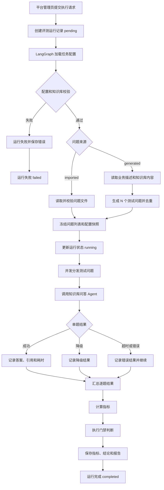
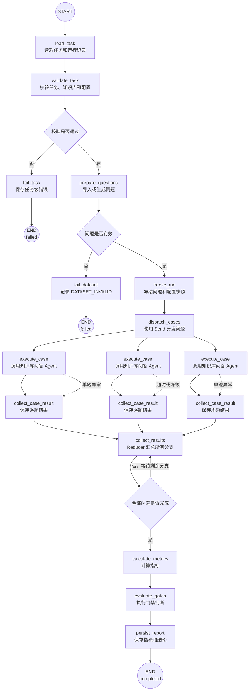

# 知识库问答评测 Agent 需求与实施方案

## 1. 项目概述

### 1.1 背景

当前项目已经具备知识库问答 Agent、检索接口和离线评测指标，但评测仍主要依赖人工执行脚本和查看 JSON 报告。需要新增一个独立的“知识库问答评测 Agent”，让用户导入 N 个问题，系统批量执行问答，统计响应、错误、降级、引用和耗时等指标，并给出“合格/不合格”结论。

本方案将“问题列表回归测试”和“Agent 自主生成问题测试”都作为基础需求。标准答案、期望文档、必答要点和人工标注属于后续高级评测能力，不作为基础测试的必填内容。

### 1.2 定位

评测 Agent 是评测编排和结果分析 Agent，不是知识库问答 Agent 的替代品。

```text
知识库问答 Agent：负责回答用户问题
知识库问答评测 Agent：负责组织测试、采集结果、计算指标和判断是否合格
```

评测 Agent 放在 `app/agents/evaluation/` 目录下，知识库问答 Agent 放在 `app/agents/knowledge/` 目录下。两个 Agent 必须使用两个独立目录、独立入口和独立职责边界。评测 Agent 不直接拼接业务答案，不修改知识库内容，不绕过知识库问答 Agent 直接调用 LLM 生成客户答案。

## 2. 目标与非目标

### 2.1 建设目标

1. 支持导入只包含问题文本的 JSON、JSONL 或 TXT 文件。
2. 支持评测 Agent 根据外部业务描述或指定知识库内容自主生成 N 个测试问题。
3. 支持指定知识库、测试用户、并发数和超时。
4. 通过唯一的知识库问答 Agent 入口批量执行 N 个问题。
5. 采集答案、引用、响应时间、错误和降级信息。
6. 计算问题执行成功率、错误率、降级率、引用率和响应时间等基础指标。
7. 根据预设门禁阈值判断各项基础指标是否合格。
8. 输出逐题结果、指标汇总、失败原因和总体结论。
9. 支持后续追加标准答案和人工标注，不影响基础问题列表格式。
10. 保证评测结果可复现，记录问题来源、知识库、模型、配置、代码版本和时间。

### 2.2 非目标

- 不改变现有知识库问答 Agent 的对外入口。
- 不在评测 Agent 中复制一套普通 RAG 问答链路。
- 不自动修改 Prompt、Chunk、Embedding、Rerank 或知识库文档。
- 不把模型自动判断的 Faithfulness（忠实度）当作最终人工审核结论。
- 不将降级摘要当作正常 Agent 答案统计。

## 3. 使用方式

### 3.1 问题文件

最简单的 TXT 文件，每行一个问题：

```text
请简单介绍一下医签通
医签通支持哪些签名方式？
扫码签名具体怎么操作？
医签通的价格是多少？
```

也可以使用 JSONL，每行一个问题对象：

```json
{"question":"请简单介绍一下医签通"}
{"question":"医签通支持哪些签名方式？"}
{"question":"扫码签名具体怎么操作？"}
```

基础模式只要求 `question` 字段。`case_id`、`conversation_group`、标准答案、期望文档和人工标注字段均为可选字段。

### 3.2 评测任务配置入口

问题配置、业务范围和指标门禁都必须通过独立的 YAML 评测配置传入，不能写死在 Agent Prompt 或代码中。默认配置文件为 `etc/evaluation.yaml`，统一结构如下：

```yaml
evaluation:
  kb_id: 28
  questions:
    source: generated
    count: 20
    file: null
    instruction: "围绕客户实际关心的问题生成测试问题，问题表达要自然，避免重复。"
  business_scope:
    source: description_and_knowledge_base
    description: "客户希望了解我公司的产品能力、部署方式、使用流程和售后服务。"
  execution:
    user_id: evaluation-user
    concurrency: 3
    request_timeout_seconds: 120
    retry_count: 0
    keep_conversation: false
  gates:
    success_rate: {operator: ">=", value: 0.95}
    error_rate: {operator: "<=", value: 0.01}
    fallback_rate: {operator: "<=", value: 0.05}
    citation_rate: {operator: ">=", value: 0.95}
    p95_duration_ms: {operator: "<=", value: 8000}
```

实际文件可从 `etc/evaluation.yaml.example` 复制。`app.yaml` 继续只负责服务启动、数据库、模型、Embedding、Rerank 等运行时配置；评测 Agent 不读取或修改其中的评测问题、业务范围和门禁配置。

评测 Agent 通过 `--config` 显式加载 YAML 文件，内部将 `evaluation.questions` 映射为 `QuestionConfig`，将 `evaluation.execution` 映射为执行参数。配置优先级为：命令行指定的配置文件 > YAML 文件 > 系统默认值。配置文件中不得保存密码、Token、API Key 等敏感信息。

外部导入问题时，将配置改为：

```yaml
evaluation:
  kb_id: 28
  questions:
    source: imported
    file: tests/evals/datasets/questions.txt
    count: null
  business_scope:
    source: knowledge_base
```

Agent 自主生成问题时，将配置改为：

```yaml
evaluation:
  kb_id: 28
  questions:
    source: generated
    count: 20
    instruction: "问题表达自然、避免重复。"
  business_scope:
    source: description_and_knowledge_base
    description: "客户希望了解产品能力、部署方式、使用流程和售后服务。"
```

两个模式都使用同一个评测入口，区别只在于 `questions.source` 和 `questions.file`。

#### 问题配置入口

`questions` 控制测试问题如何产生：

| 配置项 | 说明 |
|---|---|
| `source` | `imported` 外部导入，或 `generated` Agent 生成 |
| `count` | 生成或执行的问题数量 |
| `file` | 外部问题文件路径或文件标识，导入模式使用 |
| `instruction` | 问题生成补充要求，自然语言传入，不使用固定分类枚举 |

#### 业务范围配置入口

`business_scope` 控制 Agent 根据什么内容生成问题：

| `source` | 说明 |
|---|---|
| `description` | 只根据外部业务描述生成问题 |
| `knowledge_base` | 只根据指定知识库内容生成问题 |
| `description_and_knowledge_base` | 结合外部描述和知识库内容生成问题 |

`description` 是可编辑的自然语言业务范围，例如客户关注点、产品范围、测试目标或场景说明。系统不在代码中预设业务分类。

#### 配置入口形式

第一阶段支持独立 YAML 配置文件；后续可以由管理页面或评测任务 API 生成同一份配置对象。无论入口如何变化，Agent 内部只接收统一的 `EvaluationConfig`，避免出现多套配置规则。

### 3.3 默认门禁配置

门禁配置就是评测结果的合格标准，也可以理解为评测通过条件。系统会将实际指标与门禁中的阈值和比较符进行比较，所有强制门禁通过后，评测总体结论才可以判定为“通过”。例如，`success_rate >= 0.95` 表示成功率必须达到 95%，`error_rate <= 0.01` 表示错误率不能超过 1%。

“默认门禁配置”是系统预先提供的通用合格标准。评测任务可以直接使用默认门禁，也可以根据知识库、业务场景或测试目的在任务配置中覆盖默认值。门禁不等同于指标本身：指标是实际测量结果，门禁是判断该结果是否合格的标准。

```yaml
evaluation:
  kb_id: 28
  gates:
    success_rate: {operator: ">=", value: 0.95}
    error_rate: {operator: "<=", value: 0.01}
    fallback_rate: {operator: "<=", value: 0.05}
    citation_rate: {operator: ">=", value: 0.95}
    p95_duration_ms: {operator: "<=", value: 8000}
```

也可以不提供门禁配置，使用系统默认门槛。用户可以选择提供问题文件，或者只提供 `kb_id` 和生成数量。

### 3.4 Agent 自主生成问题

自主生成模式可以根据知识库、外部业务描述或两者共同生成问题。

仅根据知识库生成：

```yaml
evaluation:
  kb_id: 28
  questions:
    source: generated
    count: 20
  business_scope:
    source: knowledge_base
```

根据外部业务描述生成：

```yaml
evaluation:
  kb_id: 28
  questions:
    source: generated
    count: 20
  business_scope:
    source: description_and_knowledge_base
    description: "测试客户希望了解我公司的产品能力、部署方式、使用流程和售后服务。"
```

其中：

- `kb_id`：实际执行问答时使用的目标知识库。
- `business_scope.description`：外部传入的业务范围、客户关注点或测试目标，可选。
- `questions.count`：希望生成的问题数量。
- `questions.source`：固定为 `generated`。

生成依据规则：

| 输入情况 | 生成依据 |
|---|---|
| 只有 `kb_id` | 根据知识库文档内容生成 |
| 只有外部描述 | 根据外部描述生成，用于测试知识库是否覆盖该业务范围 |
| `kb_id` 和外部描述都有 | 结合外部目标和知识库内容生成，并识别资料覆盖情况 |

系统不预设产品、功能、流程、权限等固定业务分类。问题类型、数量和表达方式由外部描述及知识库内容动态决定；如需控制风格，可以在请求中额外提供自然语言说明，而不是写死枚举分类。

评测 Agent 的生成流程：

```text
读取指定知识库的文档摘要或分块（如果提供知识库）
        ↓
结合外部业务描述和知识库内容生成候选问题
        ↓
去重、过滤空问题和重复问题
        ↓
得到 N 个测试问题
        ↓
交给知识库问答 Agent 独立执行
        ↓
统计问答指标
```

生成问题可以依据外部业务描述，也可以依据知识库内容；当外部描述超出知识库范围时，不应强行过滤，因为这类问题正是用于测试知识库覆盖率和拒答能力。生成阶段和回答阶段必须分开记录模型调用，生成 Agent 不能直接把自己生成的内容当作答案依据。报告中需要标记每条问题的来源为 `imported` 或 `generated`，并记录生成依据为 `description`、`knowledge_base` 或 `both`。

生成问题模式没有人工标准答案时，可以计算成功率、错误率、降级率、引用率和响应时间；Recall@K、MRR、Answer Correctness 等需要标准标注的指标应标记为“无法评估”。

## 4. 评测指标

### 4.1 检索指标

| 指标 | 中文名称 | 说明 |
|---|---|---|
| Recall@K | 前 K 召回率 | 正确文档或分块是否出现在前 K 条结果中 |
| Precision@K | 前 K 精确率 | 前 K 条结果中相关结果的比例 |
| MRR | 平均倒数排名 | 第一个相关结果排名越靠前，得分越高 |
| NDCG@K | 归一化折损累计增益 | 综合衡量结果相关性和排序位置 |
| Context Precision | 上下文精确率 | 送入回答模型的上下文中有效内容的比例 |
| Context Recall | 上下文召回率 | 回答所需信息是否被完整召回 |

### 4.2 生成和引用指标

| 指标 | 中文名称 | 说明 |
|---|---|---|
| Faithfulness | 忠实度 | 答案是否基于检索资料，是否存在无依据内容 |
| Answer Relevancy | 答案相关性 | 答案是否直接回应问题 |
| Answer Correctness | 答案正确性 | 答案与标准答案或人工要点的一致程度 |
| Citation Accuracy | 引用准确率 | 引用文档是否属于实际检索结果且支持答案 |
| Abstention Accuracy | 拒答准确率 | 无资料问题是否正确拒答 |
| Must-contain Rate | 必答要点命中率 | `must_contain` 要点被答案覆盖的比例 |

### 4.3 性能和稳定性指标

- P50、P95、P99 响应时间。
- Embedding、检索、重排和 Chat Model 分阶段耗时。
- 5xx 错误率、超时率和请求失败率。
- Agent 正常完成率。
- 降级率。
- GraphRecursionError 发生率。
- 引用字段缺失率。

### 4.4 仅导入问题时的指标范围

只导入问题、没有标准答案和相关文档标注时，可以直接计算：

- 总问题数、成功回答数和成功率。
- 错误率、超时率和降级率。
- 有引用回答率、引用字段完整率。
- P50、P95、P99 响应时间。
- GraphRecursionError 发生率。

Recall@K、MRR、NDCG、Answer Correctness 等需要标准文档、标准分块或标准答案，基础问题模式下应标记为“无法评估”，不能伪造指标值。后续补充标注后，再自动启用这些高级指标。

## 5. 总体业务流程

```text
读取问题文件
        ↓
或者根据知识库生成问题
        ↓
校验问题和门禁配置
        ↓
冻结模型、知识库和运行配置
        ↓
调用唯一知识库问答 Agent 入口
        ↓
采集答案、引用、状态和耗时
        ↓
计算基础逐题指标
        ↓
计算总体指标和可选分组指标
        ↓
逐项执行门禁判断
        ↓
生成基础评测报告和总体结论
```

评测 Agent 可以按需调用检索接口获取高级检索指标，但该接口只作为观测和指标计算用途；基础模式只需要调用知识库问答 Agent。问答结果必须来自知识库问答 Agent，不能在评测 Agent 内部创建第二套普通 RAG 主链路。

### 5.1 工作流实现方式

评测 Agent 使用 LangGraph 作为任务编排框架。评测任务具有多步骤、可恢复、可分支、可并发和需要持久化状态的特点，适合用有状态图表达；知识库问答仍由现有知识库问答 Agent 负责，评测 Agent 不复制检索、重排、Prompt 和回答逻辑。

选择 LangGraph 的原因：

- 使用显式状态保存评测任务、运行编号、问题列表、逐题结果和当前阶段。
- 使用条件边区分外部导入问题、Agent 生成问题、配置错误和运行失败。
- 使用 `Send` 或等价的并发分发机制执行多个测试问题，同时受配置中的并发数限制。
- 单题失败时记录错误并回收为逐题结果，默认继续执行其他问题，不因一题失败导致整批任务丢失。
- 支持节点级超时、重试、取消和运行状态更新，便于平台页面查看执行进度。
- 汇总节点统一计算指标、执行门禁并生成总体结论，避免在多个接口中重复计算。
- 通过 Checkpointer 或持久化运行状态支持异常恢复；最终业务结果仍以评测运行表和逐题结果表为准。

评测 Agent 不采用另一套普通 RAG Chain，也不直接在评测图中拼接客户答案。每道题的问答节点只能调用知识库问答 Agent 的公开结构化协议：输入问题和评测用户上下文，输出答案、引用、状态、终止原因、命中数和耗时。

### 5.2 评测 Agent 工作流程图



### 5.2.1 LangGraph 内部流程图

下面是评测 Agent 在 LangGraph 中的实际图结构。`execute_case` 通过 `Send` 按问题拆分为多个并行分支，所有分支完成后再回到 `collect_results` 汇总；单题异常不会直接走全局失败分支，而是转换为逐题结果后继续汇总。



对应的 LangGraph 编排关系为：

```text
START
  -> load_task
  -> validate_task
  -> prepare_questions
  -> freeze_run
  -> dispatch_cases
       ├─ Send(execute_case, case_1) -> collect_case_result
       ├─ Send(execute_case, case_2) -> collect_case_result
       └─ Send(execute_case, case_N) -> collect_case_result
  -> calculate_metrics
  -> evaluate_gates
  -> persist_report
  -> END
```

关键实现约束：

- `dispatch_cases` 只负责分发，不执行问答；并发数量由 `execution.concurrency` 控制。
- `execute_case` 只能调用知识库问答 Agent 的公开结构化入口，不能在评测图中创建新的 RAG Chain。
- `collect_case_result` 负责把成功、降级、超时和异常统一转换为 `CaseEvaluationResult`。
- 汇总节点只有在所有已分发问题都产生结果后才能继续，避免提前计算总体指标。
- `calculate_metrics` 和 `evaluate_gates` 是独立节点，指标计算与合格判断不能混在问答节点中。
- 任务级异常进入 `fail_task`；单题异常进入逐题结果，不直接终止整张图。

### 5.3 LangGraph 状态设计

评测图的状态只保存评测编排所需的数据，不保存无关的模型内部消息：

| 状态字段 | 说明 |
|---|---|
| `evaluation_id` | 评测运行 ID |
| `task_id` | 评测任务 ID |
| `config_snapshot` | 本次运行冻结的配置 |
| `questions` | 已导入或生成并校验后的问题列表 |
| `question_index` | 当前处理位置或分发进度 |
| `case_results` | 已完成问题的逐题结果摘要 |
| `metrics` | 指标计算结果 |
| `conclusion` | `passed`、`failed` 或 `indeterminate` |
| `error` | 任务级错误摘要 |
| `status` | 当前运行状态 |

逐题执行时，单题状态应包含 `case_no`、问题、来源、答案状态、引用摘要、耗时、错误编码和指标结果。完整答案是否保存由任务配置和数据保留策略决定。

### 5.4 工作流节点职责

| 节点 | 职责 | 失败处理 |
|---|---|---|
| `load_task` | 读取任务和配置快照 | 任务不存在则结束为 `failed` |
| `validate_task` | 校验超级管理员发起的运行、知识库和配置 | 配置错误则不进入问答阶段 |
| `prepare_questions` | 导入问题或调用生成器得到 N 个问题 | 记录 `DATASET_INVALID` |
| `freeze_run` | 固化问题列表、模型和门禁配置 | 落库失败则结束为 `failed` |
| `dispatch_cases` | 按并发限制分发逐题执行 | 不直接生成答案 |
| `execute_case` | 调用唯一知识库问答 Agent | 单题错误转为逐题失败结果 |
| `collect_case_result` | 保存逐题结果并更新进度 | 单题落库失败记录任务级错误 |
| `calculate_metrics` | 计算基础和可用高级指标 | 无法计算的指标标记 `indeterminate` |
| `evaluate_gates` | 比较实际值与门禁阈值 | 门禁不通过但任务仍正常完成 |
| `persist_report` | 保存总体指标、结论和运行结束时间 | 持久化失败则运行标记 `failed` |

### 5.5 平台接口与工作流的关系

平台接口不直接等待全部模型调用完成。执行接口的处理方式为：

1. Service 校验当前用户是 `p_super_admin`，校验任务状态和是否已有运行中的批次。
2. Service 在事务中创建 `t_evaluation_run`，初始状态为 `pending`，返回 `run_id`。
3. Worker 或受控后台任务启动 LangGraph，更新运行状态为 `running`。
4. 前端按 `run_id` 查询运行详情和逐题进度，展示状态和已完成数量。
5. LangGraph 完成后写入指标、门禁结果和总体结论，运行状态更新为 `completed` 或 `failed`。

这样可以避免 HTTP 请求超时，也可以让平台管理员离开详情页后继续执行。Worker 只负责调度评测图，不承载新的业务问答链路。

## 6. Agent 目录设计

```text
app/agents/
├── knowledge/                        # 知识库问答 Agent
│   ├── __init__.py
│   ├── agent.py                     # 问答 Agent 编排入口
│   ├── runtime.py                   # 问答 Agent 运行时和预算
│   ├── policies.py                  # 问答 Agent 权限和工具策略
│   ├── tools/                       # 问答 Agent 工具
│   └── skills/                      # 问答 Agent 技能提示
└── evaluation/
    ├── __init__.py
    ├── agent.py                     # 评测 Agent 编排入口
    ├── graph.py                     # LangGraph 图定义和节点编排
    ├── state.py                     # 评测图状态协议
    ├── config.py                    # 加载并校验 etc/evaluation.yaml
    ├── models.py                    # 评测任务、问题、门禁和报告模型
    ├── dataset.py                   # 问题文件加载和校验
    ├── generator.py                 # 基于知识库内容生成测试问题
    ├── executor.py                  # 检索与问答调用编排
    ├── metrics.py                   # 指标聚合和门禁判断
    ├── report.py                    # JSON/Markdown 报告生成
    └── policies.py                  # 评测权限、并发、超时和数据脱敏策略
workers/
└── evaluation.py                    # 评测图后台调度入口
```

### 6.1 与知识库问答 Agent 的边界

`app/agents/__init__.py` 只保留顶层包声明，不放置任何 Agent 主入口。知识库问答 Agent 的入口固定为 `app/agents/knowledge/agent.py`，评测 Agent 的入口固定为 `app/agents/evaluation/agent.py`。评测 Agent 只能通过知识库问答 Agent 的公开结构化调用协议执行问答，不得导入其内部 Prompt、私有方法或直接调用聊天模型。

| 维度 | 知识库问答 Agent | 知识库问答评测 Agent |
|---|---|---|
| 目标 | 回答用户问题 | 评估问答系统质量 |
| 输入 | 单个用户问题 | N 个问题、知识库 ID 和可选门禁 |
| 输出 | 答案和引用 | 指标、逐题结果和合格结论 |
| 是否生成客户答案 | 是 | 不负责生成业务答案 |
| 是否调用检索 | 内部受控调用 | 调用观测接口并采集结果 |
| 是否修改知识库 | 否 | 否 |
| 运行方式 | 在线请求 | 离线任务或受控评测任务 |

## 7. 核心模块职责

### 7.1 `models.py`

定义以下内部协议：

- `EvaluationCase`：单条问题及其可选扩展信息。
- `EvaluationGate`：指标、比较符和阈值。
- `EvaluationConfig`：问题文件、知识库、用户、并发、超时和门禁。
- `QuestionSource`：`imported` 或 `generated`。
- `QuestionBasis`：`description`、`knowledge_base` 或 `both`。
- `scope_description`：外部传入的业务范围和测试目标，可选。
- `CaseEvaluationResult`：单题检索、生成、引用、性能和错误结果。
- `MetricResult`：指标实际值、阈值、比较结果和样本数。
- `EvaluationReport`：完整报告和总体结论。

### 7.1.1 `config.py`

负责读取 `--config` 指定的 YAML 文件，校验顶层 `evaluation` 节点、问题来源、业务范围来源、执行参数和门禁表达式，并转换为内部 `EvaluationConfig`。该模块只读取评测配置，不复用 `app.yaml` 的业务节点，也不在配置加载阶段调用数据库或模型。

### 7.2 `dataset.py`

负责：

- 读取 JSON 和 JSONL。
- 校验问题文本和 `kb_id`。
- 校验门禁指标名称和比较符。
- 可选校验标准答案、文档名称和必答要点格式。
- 删除空问题，自动为没有 `case_id` 的问题生成序号。
- 生成问题数量和内容摘要，避免报告中保存不必要的敏感问题内容。

### 7.3 `generator.py`

负责 Agent 自主生成问题：

- 根据配置读取外部业务描述或指定知识库的文档摘要、分块。
- 根据输入内容动态生成问题，不预设固定业务分类。
- 去重并限制问题数量。
- 不过滤超出知识库范围的问题，这类问题可用于测试覆盖率和拒答能力。
- 为每条问题记录 `question_source=generated` 和 `question_basis`。
- 只生成测试问题，不生成最终客户答案。

### 7.4 `executor.py`

负责：

1. 根据 `question_source` 读取外部问题或调用问题生成器。
2. 按 `conversation_group` 管理会话 ID。
3. 调用唯一知识库问答入口。
4. 按需调用检索观测接口，保存 Top-K 分块和分数。
4. 记录答案、引用、`status`、`termination_reason` 和响应耗时。
5. 限制并发、超时、重试和单题资源预算。
6. 失败时记录错误分类，不伪造答案或指标。

### 7.5 `metrics.py`

负责：

- 聚合检索指标。
- 聚合生成和引用指标。
- 聚合性能和稳定性指标。
- 区分正常回答、降级回答、错误和超时。
- 根据 `operator` 执行门禁判断。
- 对空样本集、无答案样本和缺少标准答案的指标进行明确标记。

### 7.6 `report.py`

报告至少包含：

- 评测任务信息。
- 数据集摘要和样本数量。
- 知识库、Embedding、Rerank、Chat Model 配置摘要。
- 指标实际值、阈值、结论。
- 按问题来源、外部描述或用户提供标签统计的可选分组指标。
- 不合格指标和影响最大的测试样品。
- 错误、超时、降级和引用异常列表。
- 基线对比结果。
- 总体结论：`通过`、`不通过` 或 `无法判定`。

## 8. 输出示例

```json
{
  "evaluation_id": "eval-20260725-001",
  "kb_id": 28,
  "question_file": "questions.txt",
  "case_count": 20,
  "overall_status": "passed",
  "metrics": {
    "success_rate": {
      "value": 1.0,
      "threshold": 0.95,
      "operator": ">=",
      "passed": true
    },
    "fallback_rate": {
      "value": 0.0,
      "threshold": 0.05,
      "operator": "<=",
      "passed": true
    },
    "p95_duration_ms": {
      "value": 3517,
      "threshold": 8000,
      "operator": "<=",
      "passed": true
    }
  },
  "summary": "20 个问题均完成回答，错误率、降级率和响应时间均符合门禁。",
  "unavailable_metrics": ["recall_at_5", "mrr", "answer_correctness"],
  "case_results": []
}
```

总体结论规则：

- 所有强门禁通过：`passed`。
- 任意强门禁不通过：`failed`。
- 样本不足、配置不完整或关键指标无法计算：`indeterminate`。
- 降级回答不计入“正常回答通过率”，但仍计入稳定性和降级率。

## 9. 权限与安全

- 评测 Agent 必须使用指定评测用户，不使用管理员身份绕过权限。
- 每条样品的 `kb_id` 必须经过用户可访问性校验。
- 评测报告不得保存 Token、API Key、密码和本机绝对路径。
- 报告默认保存问题摘要、问题哈希和 case_id；是否保存完整答案由配置控制。
- 评测任务不能修改正式知识库、文档、分块、向量和业务会话数据。
- 评测会话应带有 `evaluation_id` 标识，并支持清理策略。

## 10. 异常和状态设计

| 状态/错误 | 处理方式 |
|---|---|
| `DATASET_INVALID` | 任务不启动，返回样品校验错误 |
| `KB_NOT_FOUND` | 单题失败并记录，不伪造指标 |
| `RETRIEVAL_FAILED` | 检索指标标记不可用，继续执行问答或按配置终止 |
| `MODEL_TIMEOUT` | 单题标记超时，计入性能和错误率 |
| `AGENT_FALLBACK` | 记录降级，答案质量与正常答案分开统计 |
| `CITATION_INVALID` | 引用准确率记为失败并记录具体字段 |
| `METRIC_UNAVAILABLE` | 指标状态为 `indeterminate`，不能默认判定合格 |
| `GATE_FAILED` | 任务完成但总体结论为不合格 |

## 11. 运行方式设计

初期提供命令行入口，不新增在线问答入口：

```bash
# 外部导入问题或 Agent 自主生成问题，均使用同一个独立配置入口
OS_CONFIG_DIR=etc .venv/bin/python -m app.agents.evaluation.agent \
  --config etc/evaluation.yaml
```

平台化后由 `app/api/v1/` 提供评测任务接口，由 Service 层调用评测 Agent；API 层不直接读取文件、调用模型或计算指标。

## 12. 平台管理自主评测模块

### 12.1 模块定位

在“平台管理”下新增“自主评测”菜单，用于平台超级管理员维护评测任务并查看每次评测结果。该模块是知识库问答评测 Agent 的管理入口，不改变现有知识库问答入口，也不把评测逻辑放入知识库问答 Agent。

平台超级管理员可以：

1. 新增评测任务，选择知识库、问题来源、问题数量、业务范围、执行参数和指标门禁。
2. 执行已创建的评测任务，生成一份独立的评测运行记录。
3. 删除评测任务及其评测运行记录。
4. 查看任务列表、执行状态、总体结论和每次运行的详细指标。
5. 查看逐题结果，包括问题、答案状态、引用情况、降级情况、耗时和错误信息。

普通平台角色、租户角色、组织角色和访客均不可看到该菜单，也不可调用该模块接口。权限判断必须以后端当前用户的有效平台角色 `p_super_admin` 为最终依据，前端菜单隐藏和 `v-permission` 只作为交互层控制，不能替代后端鉴权。

### 12.2 菜单和操作权限

新增系统菜单：

| 层级 | 编码 | 名称 | 路径 | 可见角色 |
|---|---|---|---|---|
| 平台管理子菜单 | `platform_evaluations` | 自主评测 | `/platform/evaluations` | 仅 `p_super_admin` |

新增页面操作：

| 操作编码 | 名称 | 用途 |
|---|---|---|
| `evaluation:list` | 查看自主评测 | 查看任务列表和运行记录 |
| `evaluation:create` | 新增自主评测 | 创建评测任务 |
| `evaluation:execute` | 执行自主评测 | 启动一次评测运行 |
| `evaluation:delete` | 删除自主评测 | 删除任务及其历史结果 |
| `evaluation:detail` | 查看评测结果 | 查看运行明细和逐题结果 |

这些操作只授权给平台角色 `p_super_admin`。即使未来平台角色菜单授权配置发生变化，Service 仍须额外校验当前用户是否拥有有效的 `p_super_admin` 角色，形成双重保护。

### 12.3 页面设计

页面名称：平台管理 / 自主评测。

列表必须提供查询条件和分页，查询条件与列表字段保持一致：

| 查询条件 | 对应列表字段 |
|---|---|
| 评测名称 | 评测名称 |
| 知识库 | 知识库名称 |
| 执行状态 | 执行状态 |
| 评测结论 | 最新评测结论 |
| 创建时间 | 创建时间 |

列表字段建议包括：评测名称、知识库名称、问题来源、问题数量、最新执行状态、最新结论、最近执行时间、创建人、创建时间和操作。

操作列只提供文本按钮：

- `执行`：仅在任务未运行时可用；运行中显示禁用状态。
- `查看结果`：进入评测结果详情页或结果抽屉。
- `删除`：二次确认后删除任务及其结果；运行中的任务不可删除。

新增评测任务使用抽屉或独立表单，字段包括：

- 评测名称：必填，便于区分多次评测。
- 知识库：必填，只允许选择有效知识库。
- 问题来源：外部导入 / Agent 自主生成。
- 问题文件：外部导入时必填，支持 TXT、JSON、JSONL。
- 问题数量：自主生成时必填，限制合理范围。
- 业务范围来源：外部描述 / 知识库 / 外部描述与知识库。
- 业务范围描述：根据来源按需启用。
- 生成补充要求：自然语言输入，不预设固定业务分类。
- 并发、超时、重试次数：使用评测配置的默认值，可在任务级覆盖。
- 指标门禁：使用默认门禁，也允许在任务级调整。

### 12.4 结果详情

结果详情展示一次独立执行的快照，不实时读取当前 YAML 配置，保证历史结果可追溯。详情包括：

1. 执行基本信息：任务名称、运行编号、知识库、配置版本、开始时间、结束时间、执行人。
2. 总体结论：通过、不通过或无法判定。
3. 指标卡片：指标中文名称、英文标识、实际值、门禁值、比较符、样本数和是否合格。
4. 逐题结果列表：问题、答案摘要、检索命中数、引用数、是否降级、状态、耗时和错误原因。
5. 失败样品：优先展示错误、超时、降级、引用缺失和门禁不通过的问题。
6. 配置快照：保存本次执行使用的完整评测配置，但不得保存密码、Token、API Key 和本机绝对路径。

逐题答案和参考资料可能较长，详情区域必须限制高度并提供滚动条；列表中的长文本单行省略，完整内容通过详情或 Tooltip 查看。

### 12.5 后端接口设计

接口统一挂载在 `/api/v1/platform/evaluations`，所有接口均要求登录并由 Service 层校验 `p_super_admin`：

| 方法 | 路径 | 用途 |
|---|---|---|
| `GET` | `/platform/evaluations/page` | 分页查询评测任务 |
| `POST` | `/platform/evaluations` | 新增评测任务 |
| `GET` | `/platform/evaluations/{id}` | 查看任务配置和最新摘要 |
| `POST` | `/platform/evaluations/{id}/runs` | 执行一次评测 |
| `GET` | `/platform/evaluations/{id}/runs` | 查看任务的执行记录 |
| `GET` | `/platform/evaluations/{id}/runs/{run_id}` | 查看单次评测结果和逐题明细 |
| `DELETE` | `/platform/evaluations/{id}` | 删除任务及其结果 |

API 层只负责请求解析、认证上下文、参数校验和响应转换；任务编排、状态变更、权限校验、事务和 Agent 调用均由 Service 层完成。

### 12.6 数据和状态设计

自主评测需要持久化“任务定义、执行批次和逐题结果”三类数据。建议新增以下三张表，统一维护在 `scripts/db/data_table_ddl.sql` 中。表之间只保存业务关联字段，不创建数据库外键约束，由 Service 层负责关联完整性、租户边界和删除策略。

#### 12.6.1 评测任务表 `t_evaluation_task`

一条记录代表一个可重复执行的评测任务，保存任务配置，不保存某次执行的临时状态。

| 字段 | 类型 | 必填 | 说明 |
|---|---|---:|---|
| `id` | `bigint generated by default as identity` | 是 | 评测任务主键 |
| `name` | `varchar(255)` | 是 | 评测任务名称 |
| `kb_id` | `bigint` | 是 | 目标知识库 ID，逻辑关联 `t_knowledge_base.id` |
| `question_source` | `varchar(32)` | 是 | `imported` 外部导入，`generated` Agent 生成 |
| `question_file` | `text` | 否 | 外部问题文件标识或存储路径；不得保存不必要的本机绝对路径 |
| `question_count` | `integer` | 是 | 本次计划执行的问题数量 |
| `business_scope_source` | `varchar(64)` | 是 | `description`、`knowledge_base` 或 `description_and_knowledge_base` |
| `business_scope_description` | `text` | 否 | 外部业务范围和测试目标 |
| `question_instruction` | `text` | 否 | 问题生成补充要求 |
| `execution_config` | `jsonb` | 是 | 用户、并发、超时、重试和会话策略 |
| `gate_config` | `jsonb` | 是 | 指标门禁、比较符和阈值快照 |
| `status` | `varchar(32)` | 是 | `active` 或 `deleted` |
| `created_by` | `bigint` | 是 | 创建人用户 ID |
| `created_at` | `timestamptz` | 是 | 创建时间 |
| `updated_at` | `timestamptz` | 是 | 更新时间 |
| `deleted_at` | `timestamptz` | 否 | 逻辑删除时间 |

建议索引：

- `idx_t_evaluation_task_kb_status`：`(kb_id, status)`，按知识库筛选有效任务。
- `idx_t_evaluation_task_status_created`：`(status, created_at)`，支持任务列表分页。
- `idx_t_evaluation_task_created_by`：`(created_by)`，支持按创建人查询。

#### 12.6.2 评测运行表 `t_evaluation_run`

一条记录代表评测任务的一次执行。同一个任务可以有多次运行，每次运行必须保留独立配置快照和结果，不能覆盖历史运行。

| 字段 | 类型 | 必填 | 说明 |
|---|---|---:|---|
| `id` | `bigint generated by default as identity` | 是 | 评测运行主键 |
| `task_id` | `bigint` | 是 | 评测任务 ID，逻辑关联 `t_evaluation_task.id` |
| `run_no` | `integer` | 是 | 任务内递增的运行序号 |
| `status` | `varchar(32)` | 是 | `pending`、`running`、`completed`、`failed` 或 `cancelled` |
| `conclusion` | `varchar(32)` | 否 | `passed`、`failed` 或 `indeterminate` |
| `config_snapshot` | `jsonb` | 是 | 本次执行使用的完整配置快照 |
| `question_count` | `integer` | 是 | 本次实际执行的问题数量 |
| `success_count` | `integer` | 是 | 成功完成问答的问题数 |
| `error_count` | `integer` | 是 | 错误或超时的问题数 |
| `fallback_count` | `integer` | 是 | 降级回答的问题数 |
| `metrics` | `jsonb` | 否 | 总体指标、中文名称、实际值、阈值和判断结果 |
| `error_message` | `text` | 否 | 执行失败时的错误摘要 |
| `started_at` | `timestamptz` | 否 | 开始执行时间 |
| `finished_at` | `timestamptz` | 否 | 执行结束时间 |
| `executed_by` | `bigint` | 是 | 发起执行的用户 ID |
| `created_at` | `timestamptz` | 是 | 运行记录创建时间 |
| `updated_at` | `timestamptz` | 是 | 运行记录更新时间 |

建议约束和索引：

- 唯一约束 `unique (task_id, run_no)`，保证任务内运行序号不重复。
- 同一 `task_id` 同时只能存在一条 `pending` 或 `running` 运行记录，具体由 Service 层在事务中校验。
- `idx_t_evaluation_run_task_created`：`(task_id, created_at)`，查询任务运行历史。
- `idx_t_evaluation_run_status`：`(status)`，查询执行中的任务。
- `idx_t_evaluation_run_conclusion`：`(conclusion)`，按评测结论筛选。

#### 12.6.3 逐题结果表 `t_evaluation_case_result`

一条记录代表一次运行中的一道测试题。逐题结果单独建表，支持结果分页、失败样品筛选和详情查看，避免把全部结果只塞进运行表的 JSON 中。

| 字段 | 类型 | 必填 | 说明 |
|---|---|---:|---|
| `id` | `bigint generated by default as identity` | 是 | 逐题结果主键 |
| `run_id` | `bigint` | 是 | 评测运行 ID，逻辑关联 `t_evaluation_run.id` |
| `case_no` | `integer` | 是 | 本次运行内的问题序号 |
| `question` | `text` | 是 | 测试问题 |
| `question_hash` | `varchar(128)` | 是 | 问题摘要哈希，用于去重和脱敏检索 |
| `question_source` | `varchar(32)` | 是 | `imported` 或 `generated` |
| `question_basis` | `varchar(64)` | 否 | `description`、`knowledge_base` 或 `both` |
| `answer` | `text` | 否 | 回答内容，受报告保留策略控制 |
| `case_status` | `varchar(32)` | 是 | `completed`、`error`、`timeout` 或 `fallback` |
| `termination_reason` | `varchar(128)` | 否 | Agent 终止原因 |
| `citation_count` | `integer` | 是 | 返回引用数量 |
| `retrieval_hit_count` | `integer` | 是 | 检索命中数量 |
| `duration_ms` | `integer` | 否 | 单题耗时 |
| `metrics` | `jsonb` | 否 | 单题指标，如忠实度、相关性、引用准确率 |
| `error_code` | `varchar(64)` | 否 | 错误编码 |
| `error_message` | `text` | 否 | 错误摘要，不保存敏感信息 |
| `metadata` | `jsonb` | 否 | 扩展信息，如会话组、检索摘要和模型版本 |
| `created_at` | `timestamptz` | 是 | 创建时间 |

建议约束和索引：

- 唯一约束 `unique (run_id, case_no)`，保证一道题在一次运行中只有一条结果。
- `idx_t_evaluation_case_run_status`：`(run_id, case_status)`，筛选失败、超时和降级样品。
- `idx_t_evaluation_case_run_no`：`(run_id, case_no)`，按题号查询结果。
- `idx_t_evaluation_case_question_hash`：`(question_hash)`，支持重复问题识别。

#### 12.6.4 数据关系

```text
t_evaluation_task
        1
        │
        └── N  t_evaluation_run
                    │
                    └── N  t_evaluation_case_result
```

逻辑关系和删除规则：

- 创建运行前，Service 校验任务存在、状态为 `active`，且目标知识库有效。
- 删除任务使用逻辑删除，将任务状态改为 `deleted`，同时禁止新增运行。
- 删除任务时，其运行记录和逐题结果默认保留，便于审计；正常列表不再展示该任务。
- 查询运行详情时必须先校验任务归属，不能通过任意 `run_id` 越权读取其他任务结果。
- 任务配置发生修改时创建新配置版本或新任务，不直接改变已经完成运行的配置快照。

#### 12.6.5 数据库维护要求

- 三张表的 DDL 统一维护在 `scripts/db/data_table_ddl.sql`。
- 菜单、操作权限和 `p_super_admin` 授权关系统一维护在 `scripts/db/data_table_dml.sql`。
- 不创建实际数据库外键，关联完整性由 Service / DB Repository 保证。
- 所有时间字段使用 `timestamptz`，所有主键使用 `bigint generated by default as identity primary key`。
- `jsonb` 只保存结构化评测配置和指标，不保存密码、Token、API Key 或本机绝对路径。

任务状态：`active`、`deleted`。

运行状态：`pending`、`running`、`completed`、`failed`、`cancelled`。

运行结论：`passed`（通过）、`failed`（不通过）、`indeterminate`（无法判定）。运行中的任务不能重复执行、删除或修改；历史运行完成后只读，不能被后续执行覆盖。

### 12.7 异常、审计和安全要求

- 非超级管理员访问任何接口统一返回 403，不泄露任务是否存在。
- 任务不存在、已删除或知识库无效时返回明确业务错误。
- 运行失败必须保存错误分类和错误摘要，不能伪造指标或把异常当作通过。
- 评测调用使用专用评测用户标识，不使用平台超级管理员身份作为问答用户。
- 新增、执行、删除和查看结果均记录审计日志。
- 删除采用逻辑删除；运行结果是否物理清理由后续数据保留策略决定。
- 任务执行必须限制并发、超时和资源预算，防止超级管理员误配置造成模型或数据库压力。

### 12.8 前端路由和权限绑定

新增路由 `/platform/evaluations`，页面只在后端菜单接口返回 `platform_evaluations` 时显示。页面操作按钮分别绑定：

```vue
执行：v-permission="'evaluation:execute'"
删除：v-permission="'evaluation:delete'"
查看结果：v-permission="'evaluation:detail'"
新增：v-permission="'evaluation:create'"
```

路由守卫仍需验证菜单访问权；后端接口必须再次验证 `p_super_admin`，不能仅依赖前端指令或路由隐藏。

## 13. 实施阶段

### 阶段一：原型设计与评审

自主评测模块必须先完成原型设计，原型评审通过后才能进入接口和代码开发。原型设计不是前端编码的附属步骤，而是本项目的正式开发阶段和后续实现依据。

原型稿至少需要覆盖：

- 平台管理 / 自主评测列表页：页面标题、查询条件、分页、列表字段、状态展示和操作列。
- 新增自主评测表单：问题来源切换、知识库选择、问题文件或生成数量、业务范围、执行参数和指标门禁。
- 执行中的状态反馈：执行按钮禁用、运行状态、重复执行限制和失败提示。
- 评测结果详情：总体结论、指标卡片、配置快照、逐题结果、失败样品和长文本滚动区域。
- 删除确认和空状态、加载状态、错误状态、无权限状态。
- 平台超级管理员与其他角色的菜单、路由和操作按钮差异。

独立原型稿：[自主评测模块原型设计.md](自主评测模块原型设计.md)。自主评测相关后续设计文档统一放在当前 `docs/自主评测/` 目录下。

原型评审输出：

1. 页面原型稿或可交互原型。
2. 页面字段、状态和交互说明。
3. 页面与 `platform_evaluations` 菜单、`evaluation:*` 操作权限的对应关系。
4. 评测任务列表、任务详情和评测运行详情的信息层级。

原型阶段验收条件：页面流程完整覆盖“新增 → 执行 → 查看结果 → 删除”，查询和分页方案明确，异常和权限状态明确，产品或需求负责人评审通过并形成评审记录。

### 阶段二：设计文档与接口协议

原型评审通过后，补充并冻结以下设计内容：

- 需求设计：任务、运行、结果、状态和异常规则。
- 数据设计：评测任务、评测运行、逐题结果和审计字段。
- 权限设计：菜单、页面操作、后端超级管理员校验和前端 `v-permission` 绑定。
- 接口设计：新增、分页查询、执行、删除、运行记录和结果详情接口。
- 评测 Agent 协议：配置输入、问题生成、问答调用、指标输出和报告结构。

接口文档中的字段名称、状态编码、错误码、分页结构和权限编码必须与原型稿保持一致。该阶段完成后才能开始后端、Agent 和前端代码开发。

### 阶段三：问题文件和配置

- 将现有知识库问答 Agent 从 `app/agents/` 根目录迁移到 `app/agents/knowledge/`，保持对外调用协议不变。
- 建立 `app/agents/evaluation/` 独立目录。
- 调整导入路径、测试路径和技能资源路径，确认两个目录互不混用内部实现。
- 定义问题列表、门禁和报告 Schema。
- 完成 TXT、JSON 和 JSONL 问题文件加载。
- 完成基于知识库内容的问题自动生成、去重和数量控制。

验收：两个 Agent 均有独立目录和入口；空问题和非法文件能够被拒绝，导入问题和自动生成的问题都能够生成评测任务。

### 阶段四：执行编排

- 使用 LangGraph 实现评测图、状态协议和节点编排。
- 接入唯一知识库问答 Agent 入口，评测图不得创建第二套普通 RAG 主链路。
- 实现 Worker 或受控后台任务启动评测图，平台接口只创建运行记录并返回 `run_id`。
- 实现 N 个问题的批量执行、超时、并发、重试、进度更新和错误记录。
- 实现单题失败继续、任务级失败终止和运行状态恢复。
- 按需接入检索观测接口。

验收：外部导入和 Agent 自动生成两种方式都能够启动 LangGraph 评测流程，完成一批测试问题，并保存每题原始结果和运行进度。

### 阶段五：指标和门禁

- 先接入成功率、错误率、降级率、引用率和响应时间等基础指标。
- 对存在标准答案的问题，再接入检索、生成和拒答指标。
- 实现比较符和阈值判断。
- 区分正常、降级、错误和无法判定。

验收：每个可计算指标都有实际值、阈值、通过状态和样本数；无法计算的高级指标明确标记为“无法评估”。

### 阶段六：报告和对比

- 生成 JSON 和 Markdown 报告。
- 支持基线报告与调优报告对比。
- 输出不合格指标对应的测试样品。

验收：用户只提供问题文件、知识库 ID 和可选门禁配置即可得到基础评测结论。

### 阶段七：生产化治理

- 增加评测任务历史、版本和审计记录。
- 增加人工复核结果回流。
- 增加评测数据脱敏、清理和权限控制。

验收：任务配置和每次运行结果可追溯，敏感信息不会进入评测报告，删除任务后不再出现在正常查询结果中。

### 阶段八：平台管理自主评测模块

- 新增 `platform_evaluations` 菜单、`evaluation:*` 页面操作和仅 `p_super_admin` 的授权关系。
- 新增评测任务、评测运行和结果明细的数据模型及 DDL/DML。
- 新增任务分页、创建、执行、删除和结果查询接口。
- 新增平台管理下的自主评测列表页、任务表单和结果详情页。
- 前端使用 `v-permission` 控制按钮显示，后端 Service 额外校验平台超级管理员身份。
- 执行中的任务禁止重复执行和删除，历史运行结果只读保存。

验收：平台超级管理员可以完成“新增 → 执行 → 查看结果 → 删除”闭环；其他角色访问菜单和接口均被拒绝。

各阶段必须严格遵守以下开发顺序：

```text
原型设计
    ↓
原型评审
    ↓
需求、数据、权限和接口文档
    ↓
评测 Agent 与后端接口实现
    ↓
前端页面与控件权限绑定
    ↓
前后端联调
    ↓
测试、评审和验收
```

未完成原型评审和接口文档冻结前，不得直接开始自主评测模块的前端页面编码。

## 14. 验收标准

1. 评测 Agent 与知识库问答 Agent 目录、职责和运行入口完全分离。
2. 导入 N 个问题可以生成逐题结果和总体指标。
3. 每个可计算指标都能展示中文名称、实际值、门槛值和合格结论，无法计算的指标明确标记。
4. 评测 Agent 不生成脱离知识库资料的业务答案。
5. 降级、错误、超时和无法判定不会被统计为正常通过。
6. 能识别引用缺失、错误、超时和降级；存在标准答案时再识别关键要点漏答。
7. 能输出总体“通过/不通过/无法判定”结论。
8. 相同代码、配置和数据集重复运行时，报告结构和指标可复现。
9. 平台管理下存在自主评测模块，列表支持查询和分页，能够查看每次运行结果。
10. 只有 `p_super_admin` 可以新增、执行、删除和查看自主评测，前后端权限表现一致。

## 15. 推荐首批实现文件

```text
app/agents/knowledge/__init__.py
app/agents/knowledge/agent.py
app/agents/knowledge/runtime.py
app/agents/knowledge/policies.py
app/agents/knowledge/tools/
app/agents/evaluation/__init__.py
app/agents/evaluation/agent.py
app/agents/evaluation/models.py
app/agents/evaluation/dataset.py
app/agents/evaluation/generator.py
app/agents/evaluation/executor.py
app/agents/evaluation/metrics.py
app/agents/evaluation/report.py
app/agents/evaluation/policies.py
app/api/v1/platform_evaluations.py
app/core/services/platform_evaluation.py
app/db/platform_evaluation.py
app/schemas/platform_evaluation.py
scripts/db/data_table_ddl.sql
scripts/db/data_table_dml.sql
knowledge-base-web/src/api/evaluation.ts
knowledge-base-web/src/pages/PlatformEvaluationsPage.vue
tests/agents/evaluation/
tests/evals/datasets/default_gates.json
```

平台模块只负责任务管理和结果展示；评测编排仍由 `app/agents/evaluation/` 负责，不能把评测编排逻辑进入现有知识库问答 Agent。
