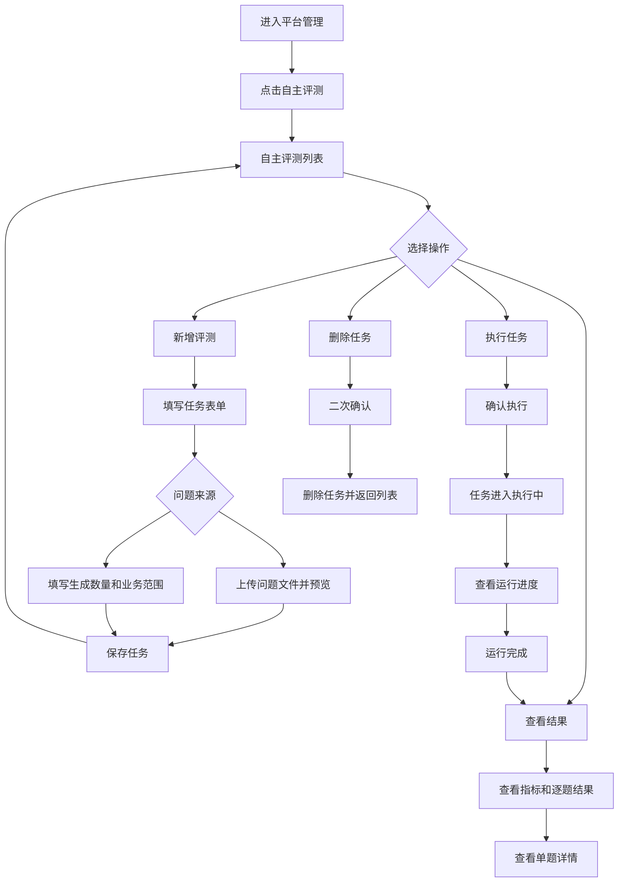

# 自主评测模块原型设计

> 本文档是“知识库问答评测 Agent”实施阶段一的独立原型设计稿。当前只确认页面结构、信息层级和交互流程，不进入接口设计、数据库设计或前端编码。

可交互 HTML 原型：[自主评测模块原型.html](自主评测模块原型.html)。

## 1. 原型目标

在“平台管理”下新增“自主评测”模块，供平台超级管理员维护评测任务，并查看每次评测的执行结果。

页面需要完整支持以下业务闭环：

```text
新增评测任务 → 执行评测 → 查看运行结果 → 查看逐题结果 → 删除评测任务
```

## 2. 访问范围

### 2.1 角色范围

| 角色                           | 菜单可见 | 页面可访问 | 新增 | 执行 | 查看结果 | 删除 |
| ------------------------------ | -------: | ---------: | ---: | ---: | -------: | ---: |
| 平台超级管理员 `p_super_admin` |       是 |         是 |   是 |   是 |       是 |   是 |
| 其他平台角色                   |       否 |         否 |   否 |   否 |       否 |   否 |
| 租户角色                       |       否 |         否 |   否 |   否 |       否 |   否 |
| 组织角色                       |       否 |         否 |   否 |   否 |       否 |   否 |
| 访客                           |       否 |         否 |   否 |   否 |       否 |   否 |

前端原型需要展示平台超级管理员及当前租户 `tenant_admin` 的正常页面，也需要定义无自主评测权限角色访问时的“无权限”页面状态。租户角色只展示当前租户任务，最终权限以服务端校验为准，原型中的按钮隐藏只代表交互层表现。

### 2.2 菜单位置

```text
平台管理
├── 平台概览
├── 用户管理
├── 租户管理
├── 组织管理
├── 自主评测
└── 开发者中心
```

自主评测作为平台管理下的一个页面，不作为左侧独立一级菜单。

## 3. 页面一：自主评测列表

### 3.1 页面布局

```text
┌──────────────────────────────────────────────────────────────────────────────┐
│ 平台管理                                                                      │
│ 平台超级管理员管理平台资源和知识库问答质量                                    │
├──────────────────────────────────────────────────────────────────────────────┤
│ 平台概览｜用户管理｜租户管理｜组织管理｜自主评测｜开发者中心                    │
├──────────────────────────────────────────────────────────────────────────────┤
│ 自主评测                                                   [新增评测]          │
│ 管理评测任务，执行知识库问答质量检查并查看每次运行结果                        │
│                                                                              │
│ 评测名称 [________________] 知识库 [____________] 执行状态 [全部▼]            │
│ 评测结论 [全部▼]                         [查询] [重置]                    │
│                                                                              │
│ 评测名称   知识库名称   问题来源   问题数量   执行状态   最新结论   最近执行时间 │
│ 产品问答   医签通指南   Agent生成  20         已完成     通过       ...          │
│ 访客测试   访客指南     外部导入   50         执行中     —          ...          │
│                                                                              │
│                                              修改  查看结果  执行  删除          │
│                                                                              │
│ 共 2 条                         上一页  1  2  下一页  每页 20 条               │
└──────────────────────────────────────────────────────────────────────────────┘
```

### 3.2 查询条件

| 查询条件 | 控件   | 说明                                           |
| -------- | ------ | ---------------------------------------------- |
| 评测名称 | 输入框 | 支持模糊查询                                   |
| 知识库   | 选择框 | 选择平台范围内的有效知识库                     |
| 执行状态 | 选择框 | 全部、未执行、待执行、执行中、已完成、执行失败、已取消 |
| 评测结论 | 选择框 | 全部、通过、不通过、无法判定                   |

查询条件标签统一使用四字名称，查询、重置按钮作为独立按钮组排列。列表必须提供分页。

### 3.3 列表字段

| 字段         | 展示规则                                 |
| ------------ | ---------------------------------------- |
| 评测名称     | 单行展示，超长省略，Tooltip 展示完整名称 |
| 知识库名称   | 单行展示，超长省略                       |
| 问题来源     | 外部导入 / Agent 生成                    |
| 问题数量     | 展示本次计划问题数                       |
| 执行状态     | 文字状态，不使用大面积彩色背景           |
| 最新结论     | 通过 / 不通过 / 无法判定 / 未执行        |
| 最近执行时间 | 使用统一时间格式                         |
| 创建人       | 展示用户名称                             |
| 创建时间     | 使用统一时间格式                         |
| 操作         | 文本按钮，不使用带背景色按钮             |

### 3.4 操作规则

- `查看结果`：进入当前任务的结果详情；没有执行记录时显示“暂无结果”。
- `修改`：仅没有任何运行记录的未执行任务展示；打开任务编辑抽屉并回填当前配置，保存后仍保持未执行状态。
- `执行`：启动一次新评测；任务执行中时按钮禁用并显示“执行中”。
- `删除`：打开二次确认；执行中的任务不允许删除。
- `新增评测`：打开右侧抽屉表单。
- 已生成过运行记录的任务只读，不提供修改按钮；包括已完成、执行失败和已取消任务，避免修改后无法解释历史结果。
- 修改提交时服务端必须再次校验任务没有运行记录，前端按钮隐藏不作为权限和状态校验依据。
- 列表加载失败显示错误状态和“重新加载”，不能使用本地演示数据替代。
- 空列表显示空状态和“新增评测”入口。

## 4. 页面二：新增评测任务抽屉

### 4.1 抽屉布局

```text
                                      ┌──────────────────────────────┐
                                      │ 新增评测任务              ×   │
                                      ├──────────────────────────────┤
                                      │ 评测名称 *                    │
                                      │ [__________________________] │
                                      │                              │
                                      │ 知识库 *                      │
                                      │ [请选择知识库              ▼] │
                                      │                              │
                                      │ 问题来源 *                    │
                                      │ ○ 外部导入   ○ Agent自主生成 │
                                      │                              │
                                      │ ...动态表单区域...           │
                                      │                              │
                                      │              取消  保存任务 │
                                      └──────────────────────────────┘
```

表单使用右侧抽屉，不使用居中弹窗。字段标签、必填标记、控件和校验提示保持统一对齐。

执行参数必须使用独立的参数面板展示。每个参数均采用“参数名称 + 控件”的固定结构，不使用仅依赖 placeholder 的无标签输入框；并发数量、单题超时和重试次数使用统一宽度的数字输入框，保持会话使用与数字控件同高的开关控件。参数面板使用统一内边距、边框、圆角和两列间距，窄屏时切换为单列。

知识库选择交互规则：打开下拉时加载第一页有效知识库；输入关键词后进行防抖远程查询，使用知识库名称模糊匹配；查询期间显示加载状态，空结果显示“暂无匹配知识库”，请求失败显示错误提示并允许重新查询。切换或清空关键词不改变已选值，最终提交数据库数字 `kb_id`，不提交知识库名称。

### 4.2 公共字段

| 字段         | 必填 | 控件             | 校验与交互                                                   |
| ------------ | ---: | ---------------- | ------------------------------------------------------------ |
| 评测名称     |   是 | 输入框           | 不能为空，限制长度，提示名称用途                             |
| 知识库       |   是 | 可远程搜索选择框 | 输入关键词后按名称远程查询，只展示当前权限范围内的有效知识库 |
| 问题来源     |   是 | 单选框           | 切换后显示对应动态区域                                       |
| 并发数量     |   是 | 带参数名称的数字输入框 | 使用合理上下限，展示默认值，控件与其他执行参数等宽             |
| 单题超时     |   是 | 带参数名称的数字输入框 | 使用秒作为单位，控件与其他执行参数等宽                         |
| 重试次数     |   是 | 带参数名称的数字输入框 | 不允许负数，控件与其他执行参数等宽                             |
| 是否保持会话 |   是 | 带参数名称的开关       | 默认关闭，与数字输入框保持同高并垂直对齐                       |

### 4.3 外部导入问题

选择“外部导入”后显示：

```text
问题文件 *
[选择文件] 支持 TXT、JSON、JSONL

文件预览
┌────────────────────────────────────────┐
│ 已识别问题数：20                        │
│ 1. 请简单介绍一下医签通                 │
│ 2. 医签通支持哪些签名方式？              │
│ 3. 扫码签名具体怎么操作？                │
└────────────────────────────────────────┘
```

交互规则：

- 文件选择后立即进行前端格式检查并展示识别数量。
- 空文件、无法解析或没有有效问题时显示明确错误。
- 预览只展示有限条数，完整问题在执行阶段形成快照。
- 保存任务前必须完成文件校验。

### 4.4 Agent 自主生成问题

选择“Agent 自主生成”后显示：

```text
生成问题数量 *
[ 20 ] 条

业务范围来源 *
○ 外部描述   ○ 知识库内容   ○ 外部描述与知识库

业务范围描述
┌────────────────────────────────────────┐
│ 客户希望了解产品能力、部署方式、使用流程 │
│ 和售后服务。                             │
└────────────────────────────────────────┘

生成补充要求
┌────────────────────────────────────────┐
│ 问题表达自然、避免重复。                  │
└────────────────────────────────────────┘
```

交互规则：

- 生成数量为必填，范围由系统配置限制。
- 选择“知识库内容”时，业务范围描述可以为空。
- 选择“外部描述”时，业务范围描述必填。
- 选择“外部描述与知识库”时，两者共同作为生成依据。
- 业务范围不使用固定产品分类，使用自然语言描述。
- 生成问题在执行阶段完成，创建任务时只保存生成配置。

### 4.5 指标门禁区域

表单默认折叠“指标门禁”，展开后展示：

```text
指标门禁（使用默认配置）                         [展开 ▼]

指标名称             比较符       阈值
成功率               >=           95%
错误率               <=           1%
降级率               <=           5%
引用率               >=           95%
P95响应时间          <=           8000 ms
```

原型中需要说明：门禁配置是评测合格标准，指标实际值会与门禁阈值比较，所有强制门禁通过后总体结论才为“通过”。任务可以使用默认门禁，也可以展开后覆盖阈值。

## 5. 页面三：评测执行过程

### 5.1 点击执行后的交互

用户点击任务列表中的“执行”后，先经过二次确认；确认成功后立即弹出“评测执行过程”居中面板，并同步将列表状态更新为“执行中”。执行过程面板不是结果页，职责是让用户明确任务已被接收、当前执行到哪一步以及关闭面板后的行为。

```text
┌──────────────────────────────────────────────────────────────┐
│ 正在执行评测                                      ×           │
│ 产品问答评测 · 第 4 次运行                                    │
├──────────────────────────────────────────────────────────────┤
│ ● 执行中    正在执行第 9 / 20 题                              │
│ ━━━━━━━━━━━━━━━━━━━━━━━━━━━━━━━━━━━━━━━  40%                 │
│                                                              │
│ 总题数 20       已完成 8       异常题 0       已用时间 00:18  │
│                                                              │
│ ✓ 准备评测问题                                                │
│ ● 执行知识库问答                                              │
│ ○ 计算指标与门禁                                              │
│ ○ 生成评测报告                                                │
│                                                              │
│ 页面会自动刷新执行状态。关闭此窗口不会中断任务，重新打开     │
│ “查看结果”可继续查看。                    最近更新：刚刚     │
├──────────────────────────────────────────────────────────────┤
│                         刷新状态       查看评测结果（禁用）  │
└──────────────────────────────────────────────────────────────┘
```

### 5.2 执行过程信息

面板必须展示：任务名称、运行编号、当前运行状态、当前阶段、总题数、已完成题数、异常题数、进度、已用时间和最近更新时间。进度优先使用后端返回的题目计数计算，不使用前端定时器伪造业务结果。

阶段按以下顺序展示：准备评测问题 → 执行知识库问答 → 计算指标与门禁 → 生成评测报告。阶段完成使用勾选，当前阶段使用强调色，未开始阶段使用灰色。

### 5.3 执行过程中的操作

| 操作 | 交互规则 |
| --- | --- |
| 关闭 | 关闭执行过程面板，不中断后端任务；列表保留“执行中”，可通过“查看结果”重新进入 |
| 刷新状态 | 立即请求运行详情和最新列表状态；请求期间按钮短暂禁用，失败保留当前信息并提示可重试 |
| 查看评测结果 | 执行未进入终态时禁用；完成、失败或取消后启用；点击后先自动关闭执行过程面板，再打开结果详情抽屉 |
| 浏览器刷新/离开页面 | 不影响后端任务；再次进入页面后通过列表和运行详情恢复当前状态 |
| 执行/删除 | 执行中列表的执行和删除按钮禁用，避免重复运行和删除运行中的任务 |

### 5.4 终态表现

- 已完成：进度 100%，所有阶段完成，显示“查看评测结果”，列表同步更新为已完成并显示结论。
- 执行失败：保留已完成题数和异常题数，显示错误摘要和“查看评测结果”；点击后关闭执行过程面板，结果抽屉展示失败原因、部分逐题结果和重新执行入口。
- 已取消：显示取消原因和已处理题数；当前版本不在执行面板提供取消按钮，只有后端提供明确取消能力后再开放该操作。
- 状态查询失败：保留上一次有效状态，显示“状态刷新失败”，提供“刷新状态”，不得把任务改写成失败或完成。

## 6. 页面四：评测结果详情

### 6.1 页面布局

```text
┌──────────────────────────────────────────────────────────────────────────────┐
│ ← 返回自主评测     产品问答评测                                               │
│ 医签通产品知识库 · 第 3 次运行                                                │
├──────────────────────────────────────────────────────────────────────────────┤
│ 执行状态：已完成       总体结论：通过       开始时间：... 结束时间：...         │
├──────────────────────────────────────────────────────────────────────────────┤
│ 评测摘要                                                                      │
│ [成功率 100%] [错误率 0%] [降级率 0%] [引用率 100%] [P95 3517ms]               │
├──────────────────────────────────────────────────────────────────────────────┤
│ 指标详情                                                                      │
│ 指标名称          实际值            门禁条件       结果                         │
│ 成功率            100%              >= 95%         合格                         │
│ 错误率            0%                <= 1%          合格                         │
│ ...                                                                          │
├──────────────────────────────────────────────────────────────────────────────┤
│ 逐题结果                                                                      │
│ 题号  问题摘要             状态       引用数   耗时       操作                  │
│ 1     请简单介绍一下...     已完成     3        1200ms     查看                  │
│ 2     扫码签名如何操作...   降级       3        2600ms     查看                  │
│                                                                              │
│                         上一页 1 2 下一页                                    │
└──────────────────────────────────────────────────────────────────────────────┘
```

### 6.2 结果信息层级

结果详情使用右侧滑块抽屉展示，不使用居中弹窗或整页跳转。抽屉从右侧滑入，宽度在桌面端保持约 960px，内容超出高度时由抽屉内部滚动。详情按“运行信息 → 总体结论 → 指标 → 逐题结果”的顺序展示，不把大量原始答案直接铺满页面。

- 运行信息：任务名称、运行编号、知识库、问题数量、执行人、开始时间、结束时间。
- 总体结论：通过、不通过、无法判定。
- 指标摘要：优先展示核心基础指标。
- 指标详情：只展示中文指标名称、实际值、门禁值、比较符、样本数和合格状态，不展示英文标识。
- 评测报告：展示本次运行的总体结论、核心发现和关键风险摘要。
- 优化建议：展示问题现象、数据证据、建议措施、影响指标、优先级、置信度和人工确认要求。
- 帮我优化：从优化建议进入候选方案抽屉，展示当前配置与建议配置差异，并支持同批问题复测、前后指标对比和保存为草稿。
- 逐题结果：支持查询状态、分页和查看单题详情。
- 失败样品：默认优先展示错误、超时、降级、引用缺失和门禁不通过的问题。

### 6.3 单题结果详情

点击逐题结果的“查看”后打开右侧详情抽屉：

```text
                                         ┌────────────────────────────┐
                                         │ 第 2 题结果             ×  │
                                         ├────────────────────────────┤
                                         │ 问题                         │
                                         │ 扫码签名具体怎么操作？       │
                                         │                              │
                                         │ 执行状态：降级               │
                                         │ 终止原因：fallback           │
                                         │ 响应耗时：2600ms             │
                                         │ 检索命中：5                  │
                                         │ 引用数量：3                  │
                                         │                              │
                                         │ 回答                         │
                                         │ ┌────────────────────────┐ │
                                         │ │ 长答案区域，可滚动查看   │ │
                                         │ └────────────────────────┘ │
                                         │                              │
                                         │ 引用资料                     │
                                         │ ┌────────────────────────┐ │
                                         │ │ 来源和片段区域，可滚动   │ │
                                         │ └────────────────────────┘ │
                                         └────────────────────────────┘
```

答案、引用资料和错误信息必须限制最大高度并提供滚动条，不能因为内容过长撑开页面。

## 7. 执行状态与异常状态

### 7.1 任务状态

| 状态     | 页面表现                       | 可执行操作                         |
| -------- | ------------------------------ | ---------------------------------- |
| 未执行   | 灰色文字“未执行”               | 修改、执行、查看配置、删除         |
| 执行中   | 动态提示“执行中”并展示进度     | 查看进度，执行和删除禁用           |
| 已完成   | 展示最新结论                   | 再次执行、查看结果、删除；任务只读 |
| 执行失败 | 红色文字“执行失败”并可查看错误 | 再次执行、查看结果、删除；任务只读 |
| 已取消   | 展示“已取消”                   | 再次执行、查看结果、删除；任务只读 |

### 7.2 页面状态

- 加载中：列表或结果区域展示加载提示，不显示空数据。
- 空数据：展示说明文字和下一步操作入口。
- 无权限：展示“暂无访问权限”，不展示任务数据。
- 执行失败：保留已完成逐题结果，展示失败原因和重新执行入口。
- 指标无法评估：显示“无法评估”，不能显示为 0 或自动判定合格。
- 删除确认：明确提示任务及其历史运行结果将从正常列表中移除。

## 8. 原型交互流程



## 9. 原型视觉和组件约束

- 页面使用 Vue 3 + TypeScript + Element Plus + Bootstrap 的既有设计体系。
- 列表、查询条件、分页和操作按钮使用平台管理已有样式。
- 表单统一使用右侧抽屉，普通控件高度约 38px，标签和控件字号使用公共规范。
- 操作列使用文本按钮，不使用大面积背景色按钮。
- 状态使用文字和颜色区分，不使用状态背景块代替状态文本。
- 列表长文本单行省略，详情中的答案和引用区域使用滚动条。
- 结果页指标卡片只展示摘要，完整指标使用表格展示，避免卡片横向溢出。
- 所有页面必须兼容加载、空数据、错误、无权限和执行中状态。

### 9.1 视觉尺寸和颜色基线

以下值是交互 HTML 和前端实现的对照基线，除非平台公共样式发生变更，不得在业务页面内随意覆盖：

| 区域           | 设计要求                                                                                           |
| -------------- | -------------------------------------------------------------------------------------------------- |
| 页面画布       | 背景 `#f5f7fb`，内容最大宽度约 1450px，桌面端左右内边距约 38px                                     |
| 平台框架       | 左侧导航约 230px，顶部栏高度约 70px；平台管理 Tab 使用底部品牌色线标识当前项                       |
| 颜色           | 面板 `#ffffff`，边框 `#e7eaf1`，正文 `#1f2937`，辅助文字 `#8490a5`，品牌色 `#536dfe`               |
| 卡片           | 圆角约 12px，边框 1px，查询区和列表区保持统一卡片层级                                              |
| 查询区         | 内边距约 18px，字段间距约 14px，单个查询字段宽度约 325px；四字标签字号 12px                        |
| 普通控件       | 高度约 38px，圆角约 7px，输入文字 14px；焦点使用品牌色边框和浅色外发光                             |
| 表格           | 表头字号 13px，正文 13px；单元格上下内边距约 15px、左右内边距约 20px；长文本单行省略并提供 Tooltip |
| 操作列         | 使用无背景文本按钮，按钮间距约 14px；危险操作使用危险色文字；执行中按钮显示“执行中”并禁用          |
| 分页           | 使用透明背景文本样式，页码、上一页、下一页和每页条数间距约 7px；当前页使用品牌色文字或轻量强调     |
| 新增抽屉       | 右侧宽度约 520px，头部和页脚内边距约 20px 24px，内容区内边距约 24px，内容超出时内部滚动            |
| 结果抽屉       | 右侧宽度约 960px，内容区左右内边距约 26px；运行信息使用 4 列信息卡，指标摘要使用 5 列卡片          |
| 结果区块       | 白色面板、1px 边框、约 12px 圆角、内边距约 20px；区块之间保持约 20px 间距                          |
| 单题和优化抽屉 | 单题详情约 560px，优化方案约 620px；答案、引用、证据和长配置内容限制最大高度并内部滚动             |
| 响应式         | 900px 以下列表允许横向滚动，查询字段改为整行；700px 以下抽屉占满宽度，指标和运行信息降为两列或一列 |

### 9.2 字体和状态表现

- 页面基础字体使用系统无衬线字体和微软雅黑回退，不在业务页面单独引入字体。
- 表单标签使用 13px、20px 行高；控件文字使用 13px～14px，表单项间距约 18px。
- 状态使用文字和颜色区分：成功使用绿色、执行中和无法判定使用黄色、未执行/待执行和已取消使用灰色。
- 列表状态不使用大面积彩色标签背景；结果报告中的总体结论可以使用轻量强调，但不能替代文字。
- 指标卡片和详情表格统一使用中文指标名称；指标卡片只承载指标名称、实际值和样本数，门禁条件、合格结果和完整指标放在详情表格中，不展示英文标识。

## 10. 原型评审清单

原型评审通过前需要确认：

1. 平台管理下“自主评测”菜单的位置和名称。
2. 任务列表查询条件、字段、分页和操作列是否完整。
3. 新增任务中外部导入和 Agent 自主生成两种表单是否清晰。
4. 默认门禁和任务级覆盖的交互是否易于理解。
5. 执行中、失败、降级、无法评估和无权限状态是否覆盖。
6. 结果详情是否能查看每次运行和逐题结果。
7. 长答案、参考资料和错误信息是否具备滚动区域。
8. 删除确认是否明确任务和历史结果的影响。
9. 页面操作与 `evaluation:create`、`evaluation:execute`、`evaluation:detail`、`evaluation:delete` 的绑定是否一致。
10. 原型评审通过后，才能进入接口、数据表、评测 Agent 和前端代码设计。

## 11. 交互原型同步基线

本设计稿与《自主评测模块原型.html》按以下内容保持一致，后续页面开发以此同步基线为准：

1. 列表包含评测名称、知识库名称、问题来源、问题数量、执行状态、最新结论、最近执行时间、创建人、创建时间和操作列；查询条件为评测名称、知识库名、执行状态和评测结论，并提供查询、重置、分页。
2. 新增和编辑评测任务均使用右侧抽屉。问题来源切换后，外部导入只展示文件选择和预览，Agent 自主生成展示生成数量、业务范围来源、业务范围描述和生成补充要求；公共执行参数使用带参数名称的统一参数面板，包含并发数量、单题超时、重试次数和保持会话。
3. 指标门禁默认折叠，展开后展示成功率、错误率、降级率、引用率和 P95 响应时间的比较符与阈值，并明确门禁是总体结论的判定依据。
4. 查看结果使用右侧宽抽屉，内容顺序为运行信息、评测报告、指标摘要、指标详情、优化建议和逐题结果。运行信息包含任务、知识库、运行编号、执行状态、总体结论、问题数量、执行人、开始时间和结束时间；指标详情包含实际值、门禁条件、样本数和结果。
5. 逐题结果支持状态筛选、分页和查看单题详情；单题详情包含问题、执行状态、终止原因、响应耗时、检索命中、引用数量、回答和引用资料，长内容使用滚动区域。
6. 任务列表和逐题结果中的状态采用文字和颜色区分，不使用大面积状态背景块；执行中的任务仍可查看结果，但执行和删除按钮禁用。
7. HTML 原型中的数据、运行结果、答案和引用资料仅用于交互比对，不代表真实后端数据；真实页面必须使用后端接口返回的数据。
8. 视觉样式以本稿第 8 章为唯一基线：页面画布、卡片、查询区、表格、文本操作按钮、分页、520px 新增抽屉、960px 结果抽屉、560px 单题抽屉、620px 优化抽屉、字体、颜色、间距和响应式规则必须同步；交互 HTML 中不得保留与该基线冲突的样式示例。
