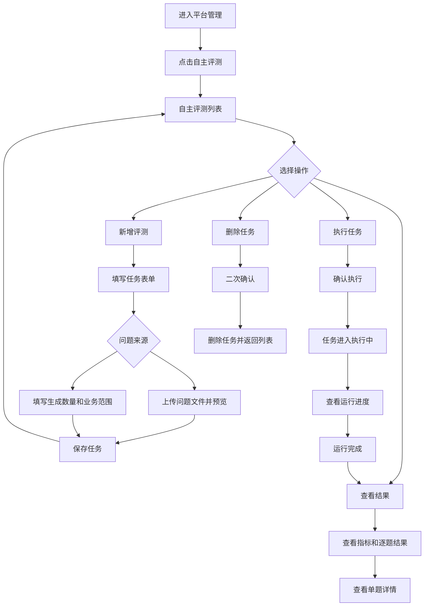

# 自主评测模块原型设计

> 本文档是“知识库问答评测 Agent”实施阶段一的独立原型设计稿。当前只确认页面结构、信息层级和交互流程，不进入接口设计、数据库设计或前端编码。

可交互 HTML 原型：[自主评测模块原型.html](自主评测模块原型.html)。

## 1. 原型目标

在“平台管理”下新增“自主评测”模块，供平台超级管理员维护评测任务，并查看每次评测的执行结果。

页面需要完整支持以下业务闭环：

```text
新增评测任务 → 执行评测 → 查看运行结果 → 查看逐题结果 → 删除评测任务
```

## 2. 访问范围

### 2.1 角色范围

| 角色 | 菜单可见 | 页面可访问 | 新增 | 执行 | 查看结果 | 删除 |
|---|---:|---:|---:|---:|---:|---:|
| 平台超级管理员 `p_super_admin` | 是 | 是 | 是 | 是 | 是 | 是 |
| 其他平台角色 | 否 | 否 | 否 | 否 | 否 | 否 |
| 租户角色 | 否 | 否 | 否 | 否 | 否 | 否 |
| 组织角色 | 否 | 否 | 否 | 否 | 否 | 否 |
| 访客 | 否 | 否 | 否 | 否 | 否 | 否 |

前端原型需要展示超级管理员的正常页面，也需要定义非超级管理员访问时的“无权限”页面状态。最终权限以服务端校验为准，原型中的按钮隐藏只代表交互层表现。

### 2.2 菜单位置

```text
平台管理
├── 平台概览
├── 用户管理
├── 租户管理
├── 组织管理
├── 自主评测
└── 开发者中心
```

自主评测作为平台管理下的一个页面，不作为左侧独立一级菜单。

## 3. 页面一：自主评测列表

### 3.1 页面布局

```text
┌──────────────────────────────────────────────────────────────────────────────┐
│ 平台管理                                                                      │
│ 平台超级管理员管理平台资源和知识库问答质量                                    │
├──────────────────────────────────────────────────────────────────────────────┤
│ 平台概览｜用户管理｜租户管理｜组织管理｜自主评测｜开发者中心                    │
├──────────────────────────────────────────────────────────────────────────────┤
│ 自主评测                                                   [新增评测]          │
│ 管理评测任务，执行知识库问答质量检查并查看每次运行结果                        │
│                                                                              │
│ 评测名称 [________________] 知识库 [____________] 执行状态 [全部▼]            │
│ 评测结论 [全部▼]                         [查询] [重置]                    │
│                                                                              │
│ 评测名称   知识库名称   问题来源   问题数量   执行状态   最新结论   最近执行时间 │
│ 产品问答   医签通指南   Agent生成  20         已完成     通过       ...          │
│ 访客测试   访客指南     外部导入   50         执行中     —          ...          │
│                                                                              │
│                                              查看结果  执行  删除                │
│                                                                              │
│ 共 2 条                         上一页  1  2  下一页  每页 20 条               │
└──────────────────────────────────────────────────────────────────────────────┘
```

### 3.2 查询条件

| 查询条件 | 控件 | 说明 |
|---|---|---|
| 评测名称 | 输入框 | 支持模糊查询 |
| 知识库 | 选择框 | 选择平台范围内的有效知识库 |
| 执行状态 | 选择框 | 全部、待执行、执行中、已完成、执行失败、已取消 |
| 评测结论 | 选择框 | 全部、通过、不通过、无法判定 |

查询条件标签统一使用四字名称，查询、重置按钮作为独立按钮组排列。列表必须提供分页。

### 3.3 列表字段

| 字段 | 展示规则 |
|---|---|
| 评测名称 | 单行展示，超长省略，Tooltip 展示完整名称 |
| 知识库名称 | 单行展示，超长省略 |
| 问题来源 | 外部导入 / Agent 生成 |
| 问题数量 | 展示本次计划问题数 |
| 执行状态 | 文字状态，不使用大面积彩色背景 |
| 最新结论 | 通过 / 不通过 / 无法判定 / 未执行 |
| 最近执行时间 | 使用统一时间格式 |
| 创建人 | 展示用户名称 |
| 创建时间 | 使用统一时间格式 |
| 操作 | 文本按钮，不使用带背景色按钮 |

### 3.4 操作规则

- `查看结果`：进入当前任务的结果详情；没有执行记录时显示“暂无结果”。
- `执行`：启动一次新评测；任务执行中时按钮禁用并显示“执行中”。
- `删除`：打开二次确认；执行中的任务不允许删除。
- `新增评测`：打开右侧抽屉表单。
- 列表加载失败显示错误状态和“重新加载”，不能使用本地演示数据替代。
- 空列表显示空状态和“新增评测”入口。

## 4. 页面二：新增评测任务抽屉

### 4.1 抽屉布局

```text
                                      ┌──────────────────────────────┐
                                      │ 新增评测任务              ×   │
                                      ├──────────────────────────────┤
                                      │ 评测名称 *                    │
                                      │ [__________________________] │
                                      │                              │
                                      │ 知识库 *                      │
                                      │ [请选择知识库              ▼] │
                                      │                              │
                                      │ 问题来源 *                    │
                                      │ ○ 外部导入   ○ Agent自主生成 │
                                      │                              │
                                      │ ...动态表单区域...           │
                                      │                              │
                                      │              取消  保存任务 │
                                      └──────────────────────────────┘
```

表单使用右侧抽屉，不使用居中弹窗。字段标签、必填标记、控件和校验提示保持统一对齐。

### 4.2 公共字段

| 字段 | 必填 | 控件 | 校验与交互 |
|---|---:|---|---|
| 评测名称 | 是 | 输入框 | 不能为空，限制长度，提示名称用途 |
| 知识库 | 是 | 远程选择框 | 只展示有效知识库 |
| 问题来源 | 是 | 单选框 | 切换后显示对应动态区域 |
| 并发数量 | 是 | 数字输入框 | 使用合理上下限，展示默认值 |
| 单题超时 | 是 | 数字输入框 | 使用秒作为单位 |
| 重试次数 | 是 | 数字输入框 | 不允许负数 |
| 是否保持会话 | 是 | 开关 | 默认关闭 |

### 4.3 外部导入问题

选择“外部导入”后显示：

```text
问题文件 *
[选择文件] 支持 TXT、JSON、JSONL

文件预览
┌────────────────────────────────────────┐
│ 已识别问题数：20                        │
│ 1. 请简单介绍一下医签通                 │
│ 2. 医签通支持哪些签名方式？              │
│ 3. 扫码签名具体怎么操作？                │
└────────────────────────────────────────┘
```

交互规则：

- 文件选择后立即进行前端格式检查并展示识别数量。
- 空文件、无法解析或没有有效问题时显示明确错误。
- 预览只展示有限条数，完整问题在执行阶段形成快照。
- 保存任务前必须完成文件校验。

### 4.4 Agent 自主生成问题

选择“Agent 自主生成”后显示：

```text
生成问题数量 *
[ 20 ] 条

业务范围来源 *
○ 外部描述   ○ 知识库内容   ○ 外部描述与知识库

业务范围描述
┌────────────────────────────────────────┐
│ 客户希望了解产品能力、部署方式、使用流程 │
│ 和售后服务。                             │
└────────────────────────────────────────┘

生成补充要求
┌────────────────────────────────────────┐
│ 问题表达自然、避免重复。                  │
└────────────────────────────────────────┘
```

交互规则：

- 生成数量为必填，范围由系统配置限制。
- 选择“知识库内容”时，业务范围描述可以为空。
- 选择“外部描述”时，业务范围描述必填。
- 选择“外部描述与知识库”时，两者共同作为生成依据。
- 业务范围不使用固定产品分类，使用自然语言描述。
- 生成问题在执行阶段完成，创建任务时只保存生成配置。

### 4.5 指标门禁区域

表单默认折叠“指标门禁”，展开后展示：

```text
指标门禁（使用默认配置）                         [展开 ▼]

指标名称             比较符       阈值
成功率               >=           95%
错误率               <=           1%
降级率               <=           5%
引用率               >=           95%
P95响应时间          <=           8000 ms
```

原型中需要说明：门禁配置是评测合格标准，指标实际值会与门禁阈值比较，所有强制门禁通过后总体结论才为“通过”。任务可以使用默认门禁，也可以展开后覆盖阈值。

## 5. 页面三：评测结果详情

### 5.1 页面布局

```text
┌──────────────────────────────────────────────────────────────────────────────┐
│ ← 返回自主评测     产品问答评测                                               │
│ 医签通产品知识库 · 第 3 次运行                                                │
├──────────────────────────────────────────────────────────────────────────────┤
│ 执行状态：已完成       总体结论：通过       开始时间：... 结束时间：...         │
├──────────────────────────────────────────────────────────────────────────────┤
│ 评测摘要                                                                      │
│ [成功率 100%] [错误率 0%] [降级率 0%] [引用率 100%] [P95 3517ms]               │
├──────────────────────────────────────────────────────────────────────────────┤
│ 指标详情                                                                      │
│ 指标中文名       英文标识          实际值       门禁条件       结果             │
│ 成功率            success_rate     100%         >= 95%         合格             │
│ 错误率            error_rate       0%           <= 1%          合格             │
│ ...                                                                          │
├──────────────────────────────────────────────────────────────────────────────┤
│ 逐题结果                                                                      │
│ 题号  问题摘要             状态       引用数   耗时       操作                  │
│ 1     请简单介绍一下...     已完成     3        1200ms     查看                  │
│ 2     扫码签名如何操作...   降级       3        2600ms     查看                  │
│                                                                              │
│                         上一页 1 2 下一页                                    │
└──────────────────────────────────────────────────────────────────────────────┘
```

### 5.2 结果信息层级

结果详情使用右侧滑块抽屉展示，不使用居中弹窗或整页跳转。抽屉从右侧滑入，宽度在桌面端保持约 960px，内容超出高度时由抽屉内部滚动。详情按“运行信息 → 总体结论 → 指标 → 逐题结果”的顺序展示，不把大量原始答案直接铺满页面。

- 运行信息：任务名称、运行编号、知识库、问题数量、执行人、开始时间、结束时间。
- 总体结论：通过、不通过、无法判定。
- 指标摘要：优先展示核心基础指标。
- 指标详情：展示中文名称、英文标识、实际值、门禁值、比较符、样本数和合格状态。
- 逐题结果：支持查询状态、分页和查看单题详情。
- 失败样品：默认优先展示错误、超时、降级、引用缺失和门禁不通过的问题。

### 5.3 单题结果详情

点击逐题结果的“查看”后打开右侧详情抽屉：

```text
                                         ┌────────────────────────────┐
                                         │ 第 2 题结果             ×  │
                                         ├────────────────────────────┤
                                         │ 问题                         │
                                         │ 扫码签名具体怎么操作？       │
                                         │                              │
                                         │ 执行状态：降级               │
                                         │ 终止原因：fallback           │
                                         │ 响应耗时：2600ms             │
                                         │ 检索命中：5                  │
                                         │ 引用数量：3                  │
                                         │                              │
                                         │ 回答                         │
                                         │ ┌────────────────────────┐ │
                                         │ │ 长答案区域，可滚动查看   │ │
                                         │ └────────────────────────┘ │
                                         │                              │
                                         │ 引用资料                     │
                                         │ ┌────────────────────────┐ │
                                         │ │ 来源和片段区域，可滚动   │ │
                                         │ └────────────────────────┘ │
                                         └────────────────────────────┘
```

答案、引用资料和错误信息必须限制最大高度并提供滚动条，不能因为内容过长撑开页面。

## 6. 执行状态与异常状态

### 6.1 任务状态

| 状态 | 页面表现 | 可执行操作 |
|---|---|---|
| 待执行 | 灰色文字“待执行” | 执行、查看配置、删除 |
| 执行中 | 动态提示“执行中”并展示进度 | 查看进度，执行和删除禁用 |
| 已完成 | 展示最新结论 | 再次执行、查看结果、删除 |
| 执行失败 | 红色文字“执行失败”并可查看错误 | 再次执行、查看结果、删除 |
| 已取消 | 展示“已取消” | 再次执行、查看结果、删除 |

### 6.2 页面状态

- 加载中：列表或结果区域展示加载提示，不显示空数据。
- 空数据：展示说明文字和下一步操作入口。
- 无权限：展示“暂无访问权限”，不展示任务数据。
- 执行失败：保留已完成逐题结果，展示失败原因和重新执行入口。
- 指标无法评估：显示“无法评估”，不能显示为 0 或自动判定合格。
- 删除确认：明确提示任务及其历史运行结果将从正常列表中移除。

## 7. 原型交互流程



## 8. 原型视觉和组件约束

- 页面使用 Vue 3 + TypeScript + Element Plus + Bootstrap 的既有设计体系。
- 列表、查询条件、分页和操作按钮使用平台管理已有样式。
- 表单统一使用右侧抽屉，普通控件高度约 38px，标签和控件字号使用公共规范。
- 操作列使用文本按钮，不使用大面积背景色按钮。
- 状态使用文字和颜色区分，不使用状态背景块代替状态文本。
- 列表长文本单行省略，详情中的答案和引用区域使用滚动条。
- 结果页指标卡片只展示摘要，完整指标使用表格展示，避免卡片横向溢出。
- 所有页面必须兼容加载、空数据、错误、无权限和执行中状态。

## 9. 原型评审清单

原型评审通过前需要确认：

1. 平台管理下“自主评测”菜单的位置和名称。
2. 任务列表查询条件、字段、分页和操作列是否完整。
3. 新增任务中外部导入和 Agent 自主生成两种表单是否清晰。
4. 默认门禁和任务级覆盖的交互是否易于理解。
5. 执行中、失败、降级、无法评估和无权限状态是否覆盖。
6. 结果详情是否能查看每次运行和逐题结果。
7. 长答案、参考资料和错误信息是否具备滚动区域。
8. 删除确认是否明确任务和历史结果的影响。
9. 页面操作与 `evaluation:create`、`evaluation:execute`、`evaluation:detail`、`evaluation:delete` 的绑定是否一致。
10. 原型评审通过后，才能进入接口、数据表、评测 Agent 和前端代码设计。
